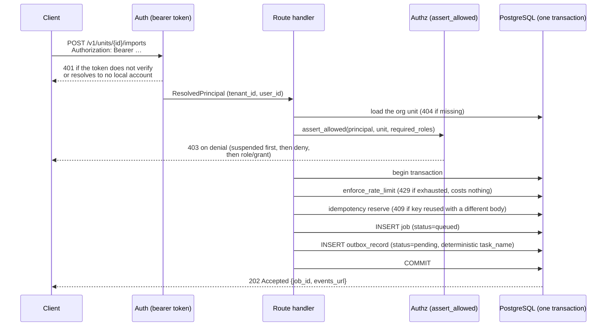
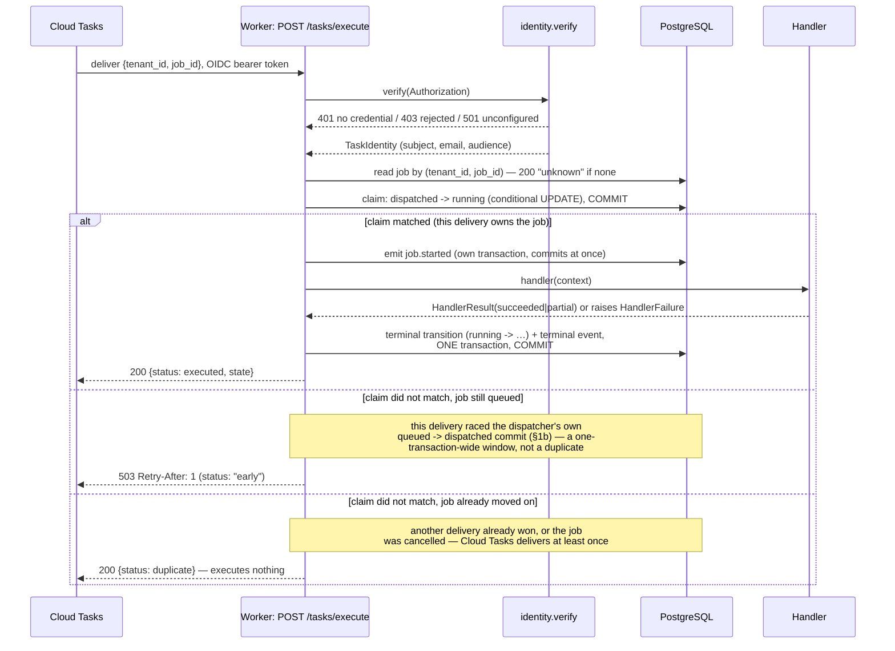
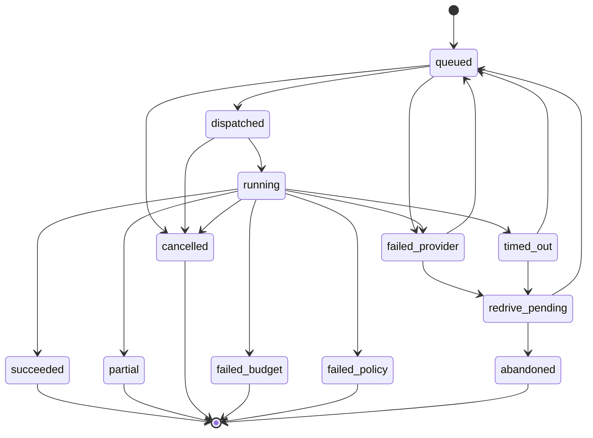
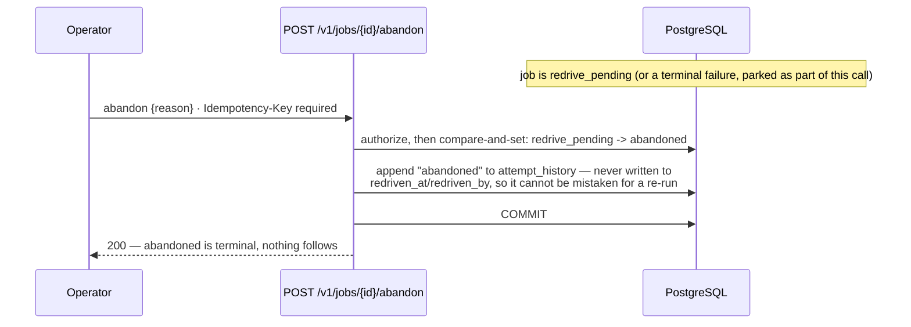

# The durable command path

**As of:** 19 August 2026, Wave B (`2cdc5a8`, `2564d33`, `b0a6a48`).

The repository had no architecture diagrams before this page. Everything below
is transcribed from the code cited beside it, not from the architecture
contract's prose — where the two disagree, the code is what runs.

One thing the diagrams cannot carry, so it is stated once here instead: **the
system's crash-recovery properties come from two specific mechanisms — the
deterministic Cloud Tasks task name (ADR-0007) and the lease/claim pattern on
the outbox and job rows — not from any arrow below.** An arrow says a
transition is *legal*; it says nothing about what happens if the process
executing it dies halfway through. Every section names, separately, what
survives a crash at that point and why.

---

## 1. The durable command path, end to end

A command's life has three phases, each with its own transaction boundary, and
splitting the diagram along those boundaries is not a layout choice — it is
the actual unit of atomicity at each stage.

### 1a. Submission — one transaction, nothing dispatched yet



Code: `services/api/smartmatch_api/dependencies.py` (auth, rate limit),
`services/api/smartmatch_api/routers/imports.py` (authz),
`services/api/smartmatch_api/commands.py::submit_command` (the transaction).

**What survives, and why.** Rate-limit consumption, the idempotency
reservation, the job row, and the outbox row commit **together, once**. A crash
before that commit means none of it happened — the client got no `job_id` and
has nothing to reconcile. A crash after it means the job and its outbox row
both exist; nothing here can leave one without the other, because there is no
commit boundary between them. This is also why a rejected idempotency conflict
still commits *before* re-raising: the quota it consumed must survive the
rollback that follows, or an attacker gets free retries against the limiter
(security finding S-008).

**What this phase deliberately never does:** call a provider, call Cloud Tasks,
or perform the command's actual work. `submit_command`'s docstring calls this
out explicitly — the request path records intent only.

### 1b. Dispatch — a lease around one network call

```mermaid
sequenceDiagram
    participant D as OutboxDispatcher.run_once
    participant DB as PostgreSQL
    participant CT as Cloud Tasks

    D->>DB: reclaim_stranded: leased rows whose lease expired<br/>AND attempts are spent -> failed + job queued -> failed_provider<br/>(one transaction, before anything is claimed)
    D->>DB: COMMIT
    D->>DB: claim_batch (FOR UPDATE SKIP LOCKED,<br/>status -> leased, lease_expires_at set)
    D->>DB: COMMIT (lease now visible to other dispatchers)
    loop each claimed row
        D->>CT: enqueue(task_name, {tenant_id, job_id})
        alt task created
            CT-->>D: created
            D->>DB: job queued -> dispatched<br/>+ outbox row -> dispatched (one transaction)
            D->>DB: COMMIT
        else TaskAlreadyExists
            CT-->>D: already exists (a crashed prior attempt succeeded)
            D->>DB: same transaction as "created" — converge, not retry
        else TaskQueueError / unexpected exception
            CT-->>D: failed
            D->>DB: mark_failed (backoff; job stays queued)
            D->>DB: on the Nth failure (MAX_DISPATCH_ATTEMPTS = 5):<br/>also job queued -> failed_provider, same transaction
        end
    end
```

Code: `services/worker/smartmatch_worker/dispatcher.py`,
`python/smartmatch_persistence/smartmatch_persistence/outbox.py`.

**What survives, and why.** The claim commits *before* the slow call to Cloud
Tasks, or two dispatcher instances could both dispatch the same row. The
enqueue call itself is deliberately outside any transaction — holding a
database transaction open across a network round trip would pin a connection
for its whole duration. If the process dies between the enqueue succeeding and
the "mark dispatched" transaction committing, **and attempts remain**, the lease
expires, another dispatcher retries the row, and **the deterministic task name is
what makes that retry safe**: Cloud Tasks rejects the duplicate name
(`TaskAlreadyExists`), the dispatcher treats that as convergence rather than
failure, and the job advances exactly once. No arrow in this diagram enforces
that — it is a property of how the name is computed (ADR-0007), not of the
sequence above.

**On the last attempt there is no retry, which is why the pass begins with a
reclaim.** `claim_batch` returns the post-increment attempt count, and the claim
predicate requires `dispatch_attempts < MAX_DISPATCH_ATTEMPTS` — strictly fewer.
So the fifth claim leaves the row at exactly 5, and if the dispatcher stops
before recording an outcome, nothing claims it again. The lease expiring changes
nothing; "another dispatcher retries the row" was never true here. That row used
to sit `leased` permanently: uncounted by the lag metric, which shares the claim
predicate deliberately so metric and behaviour cannot drift, and invisible to any
operations view built on `status = 'failed'`, with its job stuck `queued` and
therefore refused by re-drive. The only symptom was a job that never finished,
which is an absence.

The route in is not exotic. Anything that ends the process between the claim's
commit and the outcome write reaches it — a deployment, an autoscale event, an
OOM, a drained node — and so does a failure-write that itself fails, which is
what a database outage during a queue outage looks like.

`reclaim_stranded` closes it. Rows that are `leased` with an **expired** lease
and **spent** attempts are marked `failed`, their lease cleared, their
`last_error` replaced with text saying the final attempt recorded no outcome —
because the text still on the row belongs to the attempt *before* the one that
stranded it, and an operator reading it would conclude the queue had rejected the
dispatch. Each row's job moves `queued -> failed_provider` in the same
transaction, for the reason every other pairing on this path shares one: a parked
row beside a `queued` job is a state nothing would reconcile. The count surfaces
as `DispatchOutcome.reclaimed`, outside the `claimed == dispatched +
already_existed + failed` identity, because a reclaimed row was not claimed on
this pass and reached none of those three outcomes. It should be zero; a rising
count says a dispatcher is dying at the worst possible moment. ADR-0005's
amendment records the invariant this restores.

**A dispatcher that loses this race does not undo the reclaim.** An expired lease
bounds how long a dispatcher may hold a row, not how long the queue may take to
answer, so an instance can still be mid-enqueue on a row another has just written
off. `mark_dispatched` and `mark_failed` are therefore compare-and-set: they move
a row only while it is still `leased`. The late writer then reads what the row
moved to, because losing that race is two different situations: `failed` means
the sweep wrote it off and a human must re-drive it, while `dispatched` means a
healthy peer finalised it and nothing is wrong. The first is counted `failed` and
logged with that advice; the second is counted `already_existed` and logged at
`info` with none, since advising a re-drive on a job that is already running
would duplicate live work. Both writers do this, not just the dispatch one:
`mark_failed` loses to a peer as readily as to the sweep. The guard proves
liveness rather than ownership — a peer's own claim also satisfies `leased` —
which is enough against the sweep and not against a re-claiming peer; J17 tracks
that.

Reclaims are logged only after their transaction commits and only about what it
did, so a batch that rolls back part-way announces nothing, and a job that had
already moved on is not described as parked. If the claim then fails, the
committed reclaim count is logged and attached to the propagating exception as a
note rather than discarded with it. The task
it created may well be live, and will execute nothing, because
`JobRepository.claim` moves only a `dispatched` job and this one is now
`failed_provider`. Exactly-once holds through that claim, not through the task
name; a re-drive derives a *new* generation name (ADR-0007) precisely so it does
not dedupe against the original.

**A failing sweep does not stop the pass.** The reclaim call is guarded: only a
failed *claim* aborts a pass, and janitorial work on yesterday's wreckage must
not cost today's rows their dispatch. A failure is logged and `reclaimed` stays
zero.

**It rides `run_once` rather than being scheduled separately**, and J8 made that
deliberate rather than incidental. `ScheduledPass`
(`services/worker/smartmatch_worker/dispatcher.py`) calls `run_once` and nothing
narrower, so no configuration of the pass can schedule dispatch without also
scheduling the reclaim — there is nothing else to call. The coupling that leaves
is real and is the reason: a dispatcher that is not running is exactly the
condition that strands rows, and is then also the condition under which nothing
reclaims them. What drives the pass is `POST /operations/dispatch`, verified
against Cloud Scheduler's own audience and allowlist. Because a schedule that
stops silently fails twice over, the alert on it fires on the *absence* of the
pass's heartbeat log line rather than on lag, which a stalled dispatcher never
samples at all; the design is in `docs/operations/deploy-runbook.md`.

**What changed in Wave B (`2564d33`):** exhausting `MAX_DISPATCH_ATTEMPTS` used
to leave the outbox row `failed` and the job `queued` — a state nothing would
ever revisit, since no dispatcher looks at a `failed` row again and `queued`
had no route to a terminal state or to `redrive_pending`. The job now moves to
`failed_provider` in the same transaction as the outbox row's final `failed`
write, which is what makes it reachable by the re-drive command (§3).

### 1c. Delivery, claim, and execution



Code: `services/worker/smartmatch_worker/main.py`,
`services/worker/smartmatch_worker/execution.py`,
`services/worker/smartmatch_worker/identity.py`,
`python/smartmatch_persistence/smartmatch_persistence/jobs.py::JobRepository.claim`.

**What survives, and why.** Cloud Tasks delivers **at least once** — a
duplicate delivery is routine, not exceptional. `JobRepository.claim` is a
conditional `dispatched -> running` UPDATE, committed on its own before any
handler runs, so exactly one delivery can ever match it; every other delivery
of the same task is acknowledged (`200`, `duplicate`) and executes nothing.
Progress events commit as they happen (`emit`), so a client following the SSE
stream sees work in progress rather than only a final summary. The terminal
transition and the event that explains it commit **together** — a job cannot
become terminal with no event saying why, and no event can describe an outcome
the job never reached.

**The `early` outcome, added in `2cdc5a8`.** The dispatcher's `queued ->
dispatched` commit (§1b) happens in a transaction *separate from*, and after,
the Cloud Tasks enqueue call. A delivery can therefore arrive while the job
still reads `queued` — the claim then fails for a reason that has nothing to
do with duplication. Before this change that case was acknowledged like any
other failed claim, which deleted the Cloud Tasks entry with nothing left to
redeliver it and no route from `queued` to `redrive_pending` — the job was
lost silently. It now answers `503` with `Retry-After`, so Cloud Tasks retries
into a window that is at most one transaction wide.

**A worker that dies mid-execution, and what now recovers it (J9).** A worker
that dies *after* `claim` commits and *before* the terminal transition commits
leaves the job `running` with no worker behind it — invisible work, whose only
symptom is an SSE stream showing progress that will never arrive. The recovery
is a lease on the job row. `claim` writes `job.lease_expires_at` in the *same*
conditional UPDATE that takes `dispatched -> running`, never as a follow-up,
because a worker that died between two statements is the failure being fixed;
`TaskExecutor._emit` renews it on each progress event, so the lease bounds
*silence* rather than duration and a long handler that keeps reporting is never
swept; every transition out of `running` clears it. `StalledJobSweeper` then
takes `running -> timed_out` for an expired deadline, writing the `job.timed_out`
event in the same transaction and carrying the deadline that was missed, because
the row stops carrying it the moment the sweep commits. A `NULL` lease is skipped
rather than swept: that is the row a release predating J9 wrote, and terminating
live work on the strength of a column that release never set would be a defect
introduced by the fix. The sweep runs as a sibling of the dispatch inside
`ScheduledPass`, and goes *first* — a database refusing claims is the same
database whose workers are dying mid-job, so a sweep behind the dispatch would
never run in exactly the incident that needs it.

**Following the result:** `GET /v1/jobs/{id}/events` streams `job_event` rows
in order, resumable via `Last-Event-ID` against `job_event.sequence` — a
database column, not an in-memory position, so any API instance can serve a
reconnect for a stream another instance started (`services/api/smartmatch_api/routers/jobs.py`).

---

## 2. The job state machine

Transcribed directly from `TRANSITIONS` in
`python/smartmatch_domain/smartmatch_domain/jobs.py` — every arrow below is one
entry in that mapping, and nothing here is inferred from the prose elsewhere in
this document.



**Terminal states** (no outgoing transition in `TRANSITIONS`): `succeeded`,
`partial`, `cancelled`, `failed_budget`, `failed_policy`, `abandoned`. Six of
twelve states are terminal, and only two of the six failure-shaped states
(`failed_provider`, `timed_out`) have any way back — that split is the whole
point of the state machine: a handler chooses `PolicyFailure` or
`BudgetFailure` precisely to say "do not re-drive this", and chooses
`ProviderFailure` to say "this might work next time"
(`services/worker/smartmatch_worker/handlers.py`).

**`queued -> failed_provider`, added in `2564d33` (this wave).** Not a job
that ran and failed — a job the dispatcher could never hand over, after
`MAX_DISPATCH_ATTEMPTS` enqueue attempts to Cloud Tasks all failed. Without
this transition a job in that situation stayed `queued` forever: nothing
revisits a `failed` outbox row, and `queued` had no route to any terminal
state or to `redrive_pending`, so the job that most needed re-driving was the
one job the re-drive command could not reach. The state's name is deliberate —
the queue is the provider that failed here, not the handler.

**Two paths worth naming as *not yet exercised* by any code, so this diagram
is not mistaken for a claim that they are:**

* `running -> timed_out` is declared and legal, but nothing in
  `smartmatch_worker.execution` currently raises it — `HandlerResult` accepts
  only `succeeded`/`partial`, and no handler failure maps to `timed_out`. It
  exists in the domain ahead of whatever will produce it.
* `failed_provider -> redrive_pending` and `timed_out -> redrive_pending` are
  driven by exactly one caller today: the re-drive command's own parking step
  (§3), not by any automatic timeout or retry-exhaustion logic watching a
  `running` or `queued` job.

---

## 3. The re-drive cycle

Cloud Tasks has no dead-letter queue. A job that reaches `failed_provider` or
`timed_out` does not requeue itself — a human decides, and the decision is
recorded.

```mermaid
sequenceDiagram
    participant Op as Operator
    participant API as POST /v1/jobs/{id}/redrive or /abandon
    participant DB as PostgreSQL (one transaction)
    participant Out as Outbox

    Note over DB: job is failed_provider or timed_out<br/>(or already redrive_pending from an earlier parking)

    Op->>API: redrive {reason} · Idempotency-Key required
    API->>DB: authorize (suspension, tenant, explicit deny, role — no owning_unit_path exists for this resource)
    API->>DB: begin transaction
    API->>DB: park, if not already: failed_provider/timed_out -> redrive_pending<br/>(open or reuse a redrive_record; attempt history rebuilt from the outbox)
    API->>DB: compare-and-set: redrive_pending -> queued
    alt CAS won
        API->>DB: generation = count of this job's existing outbox rows
        API->>Out: enqueue with redrive_generation=generation<br/>(new, distinct task_name — see ADR-0007 amendment)
        API->>DB: append "redriven" to attempt_history (actor, reason, generation)
        API->>DB: COMMIT
        API-->>Op: 202 {generation, events_url}
        Note over Out: job re-enters §1b dispatch exactly as any<br/>other queued job — same dispatcher, same claim
    else CAS lost (another actor got there first)
        API->>DB: COMMIT anyway (quota already consumed must survive)
        API-->>Op: 409 redrive_conflict
    end
```



Code: `python/smartmatch_persistence/smartmatch_persistence/redrive.py`,
`services/api/smartmatch_api/routers/redrive.py`.

**Where the cycle re-enters.** A re-driven job does not take a shortcut back
into execution — it becomes an ordinary `queued` row with a fresh outbox
entry, and rejoins §1b exactly where any newly-submitted job would. This is
deliberate: the dispatcher, the claim, and the terminal-transition logic do
not need to know a re-drive happened. The only thing that has to differ is the
task name, because the job's original attempt already used the name a pure
`(job_id, command_type)` hash would derive again — see the ADR-0007 amendment
for why `redrive_generation` fixes that without weakening the guarantee the
dispatcher's own retries depend on.

**Where the cycle ends.** `abandoned` has no outgoing transition in
`TRANSITIONS` — an abandoned job cannot later be re-driven. That is a state
machine fact, not merely a UI convention: the domain layer itself refuses the
transition (`InvalidTransitionError`) if anything tries.

**Three different races, three different guards — worth naming because using
one guard for all three would leave the other two open:**

| Race | Guard |
|---|---|
| The caller's own request retried (network hiccup, client library retry) | `Idempotency-Key` — same key, same body, replays the original response |
| Two operators pressing re-drive on the same job | The job's own state — `redrive_pending -> queued` is a compare-and-set; the loser gets `409` |
| A job that should never be re-driven at all (succeeded, cancelled, still running) | The domain state machine — `assert_transition` rejects any state `TRANSITIONS` does not route through `redrive_pending` |

**What this command does not guard, named rather than papered over.**
Authorization here cannot call `smartmatch_authz.assert_allowed`, because a
`job` row has no owning org unit for the inherited-grant path to match against
— the same gap `docs/security/scaffold-security-review.md` records against
job *reads* (S-006) now also applies to re-driving and abandoning them: a
coordinator in one department can re-run, or permanently close, another
department's failed work. Closing it needs `job.owning_unit_id` (backlog item
A5).
