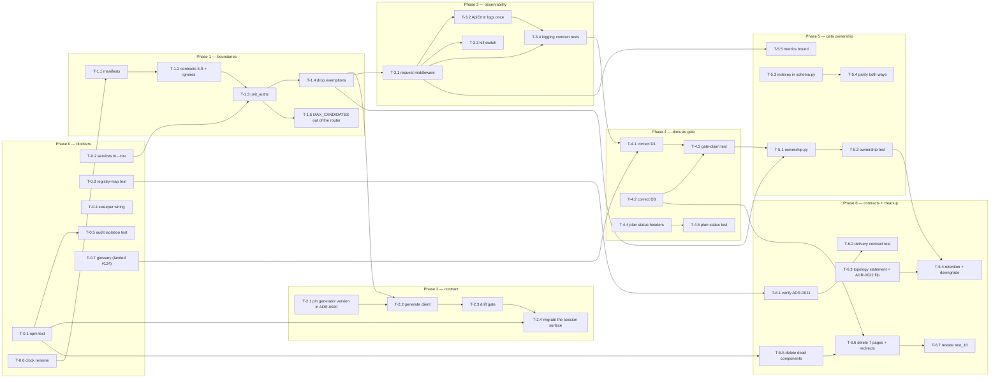

# Implementation Roadmap — Phase 0 … Phase 6

**Stage 2 plan.** Commit `c72dced`, 8 September 2026. Companion to
`MIGRATION_ROADMAP.md`: that document argues the increments M0–M8; this one
breaks them into tasks an agent can pick up, with dependencies, sizes, and
completion criteria.

Task identifiers are `T-<phase>.<n>` and are fixed. **37 tasks across seven
phases.**

**ADR status is flipped by the implementing PR, not in advance.** Every ADR this
roadmap names is written `Proposed`, because Stage 2 is planning and acceptance
is the owner's act. The PR that implements an ADR flips that ADR from `Proposed`
to `Accepted` and updates its row in `docs/architecture/decisions/README.md` in
the same commit — `tests/unit/test_adr_index.py` gates the two staying equal, so
a flip that touches only one of them is red. The tasks that implement an ADR say
so in their completion criteria.

Phases map onto increments:

| Phase | Increments | Theme |
|---|---|---|
| **0** | M0, M1 | Immediate blockers — run what exists, attach what was written |
| **1** | M2 | Boundaries |
| **2** | M3 | The contract loop |
| **3** | M4 | Observability |
| **4** | M5 | Documentation as gate |
| **5** | M6 | Data ownership and guards |
| **6** | M7, M8 | Extensibility contracts and owner-gated cleanups |

---

## Re-sequenced versus Stage 1 §18

Stage 1 §18 lists ten priorities in order and states *"Earlier items make later
ones cheaper."* Stage 2 keeps that principle and changes one thing: **the
registry-map test (§18 item 3) and the spend-sweeper wiring (§18 item 2) are
pulled into Phase 0**, alongside running the existing tests, rather than
following the boundary and contract work.

The argument, stated once and cited by both roadmaps:

1. **Priority.** R-04 and R-08 are P1. The Stage 1 *increment* sketch (M4 and M5
   respectively) placed them after a P3 rename and a glossary. §18's own
   numbered list already ranks them second and third; the increment sketch and
   the priority list disagreed, and the priority list is right.
2. **Size.** Each is a small change with no prerequisite, and **they do not
   depend on each other** — T-0.3 touches the registry composition, T-0.4 the
   pass construction, and either may go first. The registry test is a new file
   under `tests/unit/` plus one extraction in
   `services/worker/smartmatch_worker/main.py` that changes no behaviour; the
   sweeper is one constructor argument at
   `services/worker/smartmatch_worker/main.py` ~L810 plus two additive fields on
   `DispatchPassResponse` (L262). Cheap, unblocked and P1 has no argument for
   waiting.
3. **They are preconditions for anything asynchronous.** Until the registry map
   is asserted, a new command type can be submitted and terminally refused with
   no build-time signal (R-04); until the spend sweeper runs, every abandoned
   reservation stays `reserved` (R-08). Every capability still to come reaches
   the worker as a submitted command, so fixing these afterwards means fixing
   them under load.

What did **not** move: indexes stay late (Phase 5, with the ownership map),
because R-12 is P2 and its remediation is genuinely large — 33 declarations
mirrored into `schema.py` and a parity comparison extended both ways — and
because it belongs beside the other statement about `schema.py`, so the file is
opened once.

---

## The two owner answers, and what they settled

Both questions the roadmap was written around were answered by the program owner
on **8 September 2026**. The conditional phrasing is gone; what follows is the
settled state, and every task below is written under it.

### OQ-S2-001 — is the pilot VM live with real users? **NO.**

The pilot VM holds **synthetic data only**. No real user reaches it. Four
consequences, all of them loosening, and none of them a licence to skip a gate:

1. **Phases 1–3 may batch into fewer PRs.** Concretely: **T-1.1 and T-1.2 land
   as one PR** (declare the manifests and the contract together — M2's commit 1
   was already two edits to two files); **T-2.2 and T-2.3 land as one PR** (a
   generated tree nothing consumes and the gate that consumes it have no
   independent value); and **T-3.1, T-3.2 and T-3.3 land as one PR** (middleware,
   the `ApiError` log call and its kill switch are one observable behaviour).
   T-2.4 may migrate two or three surfaces in one PR rather than one, chosen to
   exercise different response shapes. Everything else stays as written. The
   rule *"migrate the pattern, not 48 files"* (Stage 1 reported 49; recounted
   2026-09-08) survives: it was always about
   reviewability as much as blast radius, and batching is now a review-effort
   decision rather than a risk one. **Each PR is still independently
   reversible** — that is non-negotiable and batching does not touch it.
2. **Rollback windows shorten to "revert the PR".** Every rollback act named
   below assumed a window in which a user could have hit the bad state. There is
   no such window: a bad change is reverted on the next push and the exposure is
   the CI duration. `SMARTMATCH_REQUEST_LOG_ENABLED` (T-3.3) stays — a runtime
   kill switch costs one config field — but it is no longer the reason T-3.1 is
   shippable.
3. **T-5.5's bound is chosen, not measured**, and T-5.5 names the chosen values
   (30 requests/min, 500 rows). There is no traffic to measure because the pilot
   is synthetic, so Phase 3's request logs cannot inform the number. **Phase 5 is
   therefore no longer hard-dependent on Phase 3**; T-5.5's dependency on T-3.1
   is advisory and Phase 5 could precede Phase 3 if scheduling favours it.
4. **T-6.6's page deletions need no notice period and no redirect scheme.** No
   one holds a bookmark to a synthetic pilot. A plain route redirect to the
   corresponding `/v1` page is enough, and it is there for coherence rather than
   for continuity.

Nothing tightens under this answer, and **nothing in Phase 0 changes at all** —
a reason it goes first: it was correct under either answer.

### OQ-S2-002 — disposition of the seven legacy pages? **Delete them now.**

Delete the seven pages and redirect their routes to the `/v1` pages. **T-6.6 is
unblocked**, and so is M8. The scope is stated in T-6.6 and no longer contains a
per-page deliberation.

---

## Phase summary

| Phase | Tasks | Increments | Risks closed | Aggregate size | Gate on exit |
|---|---|---|---|---|---|
| **0** | T-0.1 … T-0.7 (7) | M0, M1 | R-09, R-10, R-04, R-08, R-19, R-11(b) | 7–13 files · 6–11 h | `npm test` in `web`; six `--cov` flags; registry-map test red on a removed handler |
| **1** | T-1.1 … T-1.5 (5) | M2 | R-05, R-06, DR-7 | 11–16 files · 10–17 h | Six `root_packages`; five new contracts (5–9); no router→router import; no `ignore_imports` naming a router; no `tools/` module importing a router |
| **2** | T-2.1 … T-2.4 (4) | M3 | R-02 | generated tree + 4–6 files · 10–16 h | Drift check red on an un-regenerated contract change |
| **3** | T-3.1 … T-3.4 (4) | M4 | R-03 | 4–5 files · 6–10 h | One structured line per request; every `EXCEPTION_HANDLERS` entry logs once |
| **4** | T-4.1 … T-4.5 (5) | M5 | R-15, R-16 | 3 code + ~40 docs · 5–9 h | Gate-claim test red on a reopened gate; every plan has a status |
| **5** | T-5.1 … T-5.5 (5) | M6 | R-20, R-12, R-07 | 6–8 files · 14–22 h | Parity red on a dropped index; ownership red on an unmapped table |
| **6** | T-6.1 … T-6.7 (7) | M7, M8 | R-01, R-18, R-13, R-14, R-17, R-06b | 12–17 files · 9–16 h | ADR index green; two status flips; delivery contract test red on changed duplicate behaviour; no `/api/*` call anywhere in `src` |

Hour ranges assume an agent already holding this repository's conventions in
context, and include writing the tests and getting `make check`
(`format-check lint typecheck imports test scan memory licenses infra-check`)
green. They are not a schedule.

---

## Dependency graph

Edges are hard dependencies — the tail must be merged before the head starts.
Tasks with no inbound edge inside a phase are parallelizable on day one of that
phase.

---

## Phase 0 — Immediate blockers (M0, M1)

Phase 0 makes CI tell the truth and attaches the two P1 pieces of code that were
written and never connected. It contains no refactor and no new capability.

### T-0.1 — Run the frontend test suite in the `web` job

- **Scope.** Add a step invoking `npm test` to the `web` job in
  `.github/workflows/verify.yml`, between *Install locked dependencies* and
  *Typecheck and build*. Mirror it into `Makefile`'s `test` target.
- **Motivation.** **R-09 (P0).** Eight files under
  `apps/web/legacy-frontend/tests/` exist and no workflow runs them;
  `apps/web/legacy-frontend/package.json` defines
  `"test": "node --test tests/*.test.ts"`. The impact is not the missing guard —
  it is that the team believes the guard is present.
- **Dependency.** None. This is the roadmap's entry point.
- **Affected modules.** `.github/workflows/verify.yml` (`web` job); `Makefile`.
- **Risk of the change itself.** **Low.** Additive workflow step. The one way it
  goes wrong is a test that has rotted since it was written, which is a finding
  the step exists to surface — fix it in the same PR, never skip the file and
  never make the step advisory.
- **Complexity.** **S** — 1–3 h including fixing whatever the first run reveals.
- **Required tests.** The eight existing files, newly executed. No new test.
- **Completion criteria.** The `web` job contains a step running `npm test`; a
  deliberately broken assertion on a scratch branch turns the job red; no
  `continue-on-error` or `|| true` was added.

### T-0.2 — Measure `services/` coverage

- **Scope.** Add `--cov=smartmatch_api --cov=smartmatch_worker` to the *Tests*
  step of the `python` job and to `Makefile`'s `test` target. Record the baseline
  percentages in the PR body.
- **Motivation.** **R-10 (P2).** The step names four `python/` packages;
  `services/api` (14k L) and `services/worker` (7k L) are exercised by the same
  run and unmeasured, so a coverage regression there is invisible.
- **Dependency.** None.
- **Affected modules.** `.github/workflows/verify.yml`; `Makefile`.
- **Risk of the change itself.** **Low.** Measurement only. The trap is adding a
  `fail_under` in the same change — that converts a number nobody has seen into
  a gate. Do not.
- **Complexity.** **S** — 1 h.
- **Required tests.** None new.
- **Completion criteria.** Six `--cov=` flags in the step; two percentages
  recorded in the PR body; no threshold set.

### T-0.3 — The command registry map, as a test

- **Scope.** Create `tests/unit/test_command_registry_map.py`. Derive statically
  the command types any router can submit via
  `smartmatch_api.commands.submit_command`, and assert each is handled by **the
  registry the worker actually runs** or is on an explicit intentionally-refused
  list with a reason.

  **Sub-step, and it is production code rather than test code.** Factor
  `services/worker/smartmatch_worker/main.py`'s registry composition — the
  `registry_is_ours` branch at `:468`, `with_outreach_send` at `:470` and the
  ceiling-conditional `with_paid_extraction` at `:492` — into
  `build_production_registry(settings, session_factory)`, and have `create_app`
  (`main.py:321`) call it. **Behaviour is unchanged**: the same handlers are
  composed in the same order under the same conditions, and the function is
  extracted, not rewritten. This is ADR-0023's stated preference, and it is what
  lets the test build the registry *exactly* as `create_app` does rather than
  re-deriving the composition in test code — a re-derivation would be a second
  copy of the rule, which is the failure the test exists to prevent.
- **Motivation.** **R-04 (P1), AP-05, ADR-0023.** `default_registry()`
  (`services/worker/smartmatch_worker/handlers.py` ~L1349) returns three
  handlers. Two further executors are composed at the root —
  `with_outreach_send` at `services/worker/smartmatch_worker/main.py:470`
  (unconditional when `registry_is_ours`) and `with_paid_extraction` at
  `main.py:492` (only when spend ceilings are configured). The map is complete
  today and nothing asserts it, and the root-composed half is invisible from
  `default_registry()`. This is the hardest question in the codebase for a future
  agent to answer, and the test *is* the answer.
- **Dependency.** T-0.2, so the new worker code paths the test exercises are
  measured. **Not T-0.4.** An earlier draft had this task wait on the sweeper
  wiring on the theory that the pass construction's shape had to settle first;
  it does not. T-0.4 changes `ScheduledPass` and `DispatchPassResponse`, and this
  task changes the *registry* composition — disjoint code, disjoint tests. The
  two are independent and may be worked in either order or in parallel.
- **Affected modules.** `tests/unit/test_command_registry_map.py` (new);
  `services/worker/smartmatch_worker/main.py` (the extraction of
  `build_production_registry`, and `create_app` calling it). Read-only against
  `services/api/smartmatch_api/routers/*`,
  `services/worker/smartmatch_worker/handlers.py`, `.../outreach.py`,
  `.../paid_extraction.py`.
- **Risk of the change itself.** **Low** to the runtime — the one production
  change is an extraction that composes the same handlers in the same order —
  but **medium in design**. Two ways to get it wrong: testing
  `default_registry()` alone (which would report `outreach.send` unregistered and
  "confirm" Stage 1's wrong count), and excusing idempotency-scope-only names on
  the refusal list instead of excluding them from the derivation.
  `speaker_contact.create` (`routers/cba_contacts.py:302,1097`), `job.redrive`
  and `job.abandon` (`routers/redrive.py:388,527,589`) are `_reserve`-only: they
  never create a job or an outbox row, so they are not submissions and must not
  appear anywhere in the test's data.
- **Complexity.** **M** — 5–7 h, the extra hour being the extraction and
  re-verifying that `create_app` composes what it composed before.
- **Required tests.** The task *is* the test. Model it on
  `tests/unit/test_adr_index.py`: compare both directions, and state in the
  module docstring what cannot be checked. Model the refusal list's own
  self-checks on `tests/unit/test_forbidden_scanner.py`
  (`test_every_allowlist_entry_has_a_reason`,
  `test_every_allowlist_entry_names_a_real_rule`).
- **Completion criteria.** Removing `MATCH_RUN_COMMAND_TYPE` from
  `default_registry()` turns it red. **Removing `with_outreach_send` from
  `main.py` also turns it red** — this is the criterion that proves the
  root-composition case was implemented rather than restated. Adding a
  `submit_command("thing.new", …)` to any router turns it red.
  `build_production_registry(settings, session_factory)` exists and `create_app`
  calls it; the test calls the same function rather than re-composing.
  **Completion includes flipping ADR-0023 to Accepted** and updating its
  `decisions/README.md` row.

### T-0.4 — Wire `SpendReservationSweeper` into the dispatch pass

- **Scope.** Give the scheduled pass a `SpendReservationSweeper` alongside its
  `StalledJobSweeper`, and report what it swept in `DispatchPassResponse`.
- **Motivation.** **R-08 (P1).**
  `python/smartmatch_persistence/smartmatch_persistence/spend_sweeper.py:107`
  has no production caller; `grep -rn SpendReservationSweeper` returns the module
  and two test files. The job-lease analogue *is* wired —
  `sweep_expired_leases` at
  `services/worker/smartmatch_worker/execution.py:573`. Abandoned reservations
  stay `reserved` forever instead of becoming `expired_spent` (ADR-0015
  Amendment A1). The failure mode is under-charging and stuck rows, not data
  loss.
- **Dependency.** T-0.2 (so the newly-exercised worker path is measured).
- **Affected modules.** `services/worker/smartmatch_worker/main.py` —
  `DispatchPassResponse` (L262–299), `_pass_response` (L818), the `ScheduledPass`
  construction ~L810; `services/worker/smartmatch_worker/execution.py` — the pass
  body near L573.
- **Risk of the change itself.** **Medium.** It is the only Phase 0 task that
  changes production behaviour, and the first pass after deploy will settle every
  reservation stuck since the sweeper was written. Predict the count from a
  production `SELECT count(*) … WHERE status = 'reserved'` and state it in the PR
  body, so the first pass's numbers are expected rather than alarming. Two design
  constraints: run it in the same position and for the reason `main.py:670`
  gives for the job sweep being first, and isolate its failure the way
  `execution.py:567-570` argues — *"a sweeper that reported zero when it had
  failed would be indistinguishable from a healthy one"*.
- **Complexity.** **M** — 3–5 h.
- **Required tests.** `tests/unit/test_spend_sweeper.py` (existing) extended with
  a pass-level assertion that the sweeper is invoked and its counts reach the
  response; `tests/integration/test_spend_reservation.py` (existing) extended
  with a case where an abandoned reservation becomes `expired_spent` **through a
  dispatch pass** — this closes R-11(b), the spend sweep's production behaviour,
  previously untestable because there was no production path.

  **R-11(a) needs no task — it is resolved in tree (OBSERVED 2026-09-08).**
  Whether `MaxBodySizeMiddleware`'s chunked / lying-`Content-Length` branch
  (`services/api/smartmatch_api/main.py` ~`:107`, docstring branch 2) is covered
  was left UNKNOWN by Stage 1. It is covered:
  `tests/contract/test_max_body_size.py::test_a_streamed_body_is_rejected_the_moment_the_running_total_crosses_the_cap`
  sends a body with no `content-length` header in three chunks, the second of
  which crosses the cap, and asserts exactly two `receive()` calls, that the
  wrapped application is never invoked, and a 413 `request_body_too_large`;
  `test_a_streamed_body_under_the_cap_is_replayed_to_the_downstream_app_unmodified`
  covers the accept half. No open question is filed and no increment carries it
  (`MIGRATION_ROADMAP.md` §"R-11(a) — resolved in tree";
  `TARGET_ARCHITECTURE.md` §7).
- **Completion criteria.** `grep -rn SpendReservationSweeper services/` returns a
  non-test call site; `DispatchPassResponse` carries `spend_swept` and
  `spend_sweep_failed`, reporting a failed count distinctly from zero; an
  integration test observes the transition via a pass.

### T-0.5 — Confirm the principal-isolation test asserts what its name claims

- **Scope.** Read `apps/web/legacy-frontend/tests/queryClient.principal-isolation.test.ts`
  and establish whether it actually asserts that one principal's cached data
  cannot reach another. If it does not, make it — or record precisely what it
  does cover and open the gap as a finding.
- **Motivation.** **R-09's second sentence.** The remediation is two acts: *"Add
  `npm test` to the `web` job. One line. **Then confirm the isolation test
  actually asserts what its name claims.**"* T-0.1 does the first. A test that
  runs and asserts nothing is worse than one that does not run, because it is now
  green.
- **Dependency.** T-0.1 — the audit is only meaningful once a failing assertion
  changes a build result.
- **Affected modules.** `apps/web/legacy-frontend/tests/queryClient.principal-isolation.test.ts`;
  possibly `apps/web/legacy-frontend/src/lib/queryClient.ts`.
- **Risk of the change itself.** **Low** if the test is adequate; **medium** if
  it is not, because strengthening it may reveal a real cache-isolation defect —
  which is the point. A defect found here is a P0-shaped finding and gets its own
  PR with its own argument, not a quiet fix inside this task.
- **Complexity.** **S** if adequate, **M** if it must be rewritten — 2–5 h.
- **Required tests.** The file itself. At minimum: a query cached under principal
  A is not served to principal B after a principal change, and the mechanism that
  guarantees it (key scoping, or a cache reset on principal change) is named in
  the test rather than implied.
- **Completion criteria.** The test names its mechanism; breaking that mechanism
  in `src` turns the test red; the PR body states what the test covered before
  and after.

### T-0.6 — Rename `utils.py` to `clock.py`

- **Scope.** `git mv services/api/smartmatch_api/utils.py
  services/api/smartmatch_api/clock.py` and update the 25 importers. No shim
  module.
- **Motivation.** **R-19 (P3).** 18 lines, one function (`utc_now`), 25
  consumers. The content and its rationale are right — one clock, one patch
  point, motivated by defect F-003, and the docstring says so. The *name* is the
  seed of a dumping ground: the next homeless helper lands here because the
  import is already everywhere.
- **Dependency.** None, but it must precede T-1.1. It is in Phase 0 rather than
  later for a reason worth stating: **it is a pure rename with no behaviour
  change, it is trivially reversible, and it is a strict prerequisite for Phase
  1's diff being readable.** Phase 1 moves authorization code between modules; a
  25-file rename inside that commit would make a bisect over a broken import
  useless. Renaming late is the same work plus a worse diff — there is no
  argument for deferring it, only for not letting it become an increment of its
  own, which is why it rides in Phase 0 rather than owning a phase.
- **Affected modules.** `services/api/smartmatch_api/utils.py` → `clock.py`; 25
  importers.
- **Risk of the change itself.** **Low.** Mechanical, and
  `mypy python/ services/` in the `python` job proves the importer set is
  complete. A compatibility re-export would recreate the dumping ground the
  rename exists to prevent, so there is none.
- **Complexity.** **S** — 1–2 h.
- **Required tests.** None new; the existing suite plus `mypy` is the proof.
- **Completion criteria.**
  `grep -rn 'smartmatch_api.utils\|from smartmatch_api import utils'` returns
  nothing; `utc_now`'s docstring and its F-003 rationale are unchanged;
  `make check` green.

### T-0.7 — `GLOSSARY.md` — landed in the Stage 2 docs PR

- **Scope.** **Nothing to write.** `docs/architecture/GLOSSARY.md` was published
  from `domain-model.md` §4 in the **Stage 2 docs PR (#124)** and is in the tree.
  No Phase 0 work remains except keeping it current as later phases change the
  prose around it.
- **Motivation.** Terminology drift between the domain language and the table
  names is real, and the standing anti-pattern forbids renaming tables. The
  glossary is the alternative: it records what the existing names mean.
- **Dependency.** None.
- **Affected modules.** `docs/architecture/GLOSSARY.md` (existing).
- **Risk of the change itself.** **None** — the task carries no change. The one
  way the file goes wrong later is proposing a rename; it must not.
- **Complexity.** **0 h.** The task ID is kept so citing documents stay valid.
- **Required tests.** None. (It comes under Phase 4's status and prose gates
  only insofar as it lives in `docs/architecture/`, not `docs/plans/`.)
- **Completion criteria.** Already met: the file exists, covers the terms
  `domain-model.md` §4 names, and renames no table.

---

## Phase 1 — Boundaries (M2)

Phase 1 brings `smartmatch_api` and `smartmatch_worker` — 28,080 lines, 40% of
production Python — under enforced import discipline. It lands as **two green
commits**: declare the contract with exemptions, then remove the exemptions by
promoting the shared helpers.

### T-1.1 — Declare `smartmatch-persistence` in both service manifests

- **Scope.** Add `smartmatch-persistence` to `dependencies` in
  `services/api/pyproject.toml` and `services/worker/pyproject.toml`, **and add
  the test that keeps the manifests honest**:
  `tests/unit/test_service_manifests_declare_imports.py` parses each
  `services/*/pyproject.toml` and asserts that every `smartmatch_*` package
  imported anywhere under that service is declared in its `dependencies`. This
  is AP-01's assertable half — without it, this task fixes today's two omissions
  and nothing stops the third.
- **Motivation.** **R-05 (P1).** 33 files under `services/api` and 10 under
  `services/worker` import it; neither manifest lists it. It works only because
  the *Install pinned dependencies* step runs `pip install --no-deps -e` over all
  four `python/` packages and pytest's `pythonpath` adds every source root —
  `services/api/smartmatch_api/main.py:47` opens with
  `from smartmatch_persistence.engine import create_session_factory`. The
  manifests do not describe the real graph, and this is the mechanical
  prerequisite for R-06: import-linter resolves what the manifests declare.
- **Dependency.** T-0.6 (rename already done, so this phase's diff is boundary
  work only).
- **Affected modules.** Two `pyproject.toml` files;
  `tests/unit/test_service_manifests_declare_imports.py` (new).
- **Risk of the change itself.** **Low.** CI installs all four packages
  regardless, so the install step cannot break. It makes a future
  `uv sync --frozen` or slim container correct instead of accidentally working.
  The test's one design trap is the same one `tools/scan_forbidden.py` solved:
  a name imported only inside a `TYPE_CHECKING` block or a test fixture under
  the service is still an import, and an exclusion needs a reason — assert every
  exclusion has one, as `test_forbidden_scanner.py` does.
- **Complexity.** **S** — 2 h, the manifests being 30 min of it and the test the
  rest.
- **Required tests.** `tests/unit/test_service_manifests_declare_imports.py` —
  new, and the deliverable that outlives the fix. Both directions, in the
  `test_adr_index.py` shape: every imported `smartmatch_*` package is declared,
  and every declared `smartmatch_*` dependency is actually imported.
- **Completion criteria.** Both manifests list `smartmatch-persistence`; deleting
  either declaration turns
  `tests/unit/test_service_manifests_declare_imports.py` red; the `python` job
  green.

### T-1.2 — Add both services to `root_packages` with the five new contracts

- **Scope.** Add `"smartmatch_api"` and `"smartmatch_worker"` to
  `[tool.importlinter].root_packages`, plus the **five new contracts**
  `DEPENDENCY_RULES.md` §3 defines and ADR-0018 records: **5** `The API sits
  above the inner packages, never beneath them` (`layers`), **6** `The worker
  sits above the inner packages, never beneath them` (`layers`), **7** `The API
  and the worker are independent services` (`independence`), **8** `Routers are
  independent of one another` (`independence`), **9** `Shared API modules must
  not import routers` (`forbidden`). The two `ignore_imports` entries for the
  known violations live **on contract 8**, each carrying an inline comment
  naming T-1.4 as what removes it. **This is commit 1 of M2, and it must be
  green on its own.**

  **OBSERVED 2026-09-08.** The full draft block was executed against the tree
  with `PYTHONPATH` carrying the four inner packages plus `services/api` and
  `services/worker`: **`Contracts: 9 kept, 0 broken`** with the two ignores; with
  them removed, **contract 8 BROKEN**, naming exactly `outreach_contacts →
  outreach` and `cba_contact_channels → cba_contacts`, all others KEPT
  (`DEPENDENCY_RULES.md` §5).
- **Motivation.** **R-06 (P1), AP-01.** `root_packages` lists four packages; the
  two services are ungoverned, and convention is already broken twice — both on
  contract 8. Declaring the contract before enforcing it means a **third** lateral import fails the
  *Architecture import boundaries* step on the day it is written, months before
  anyone gets to the promotion.
- **Dependency.** T-1.1.
- **Affected modules.** `pyproject.toml` `[tool.importlinter]`.
- **Risk of the change itself.** **Medium.** Two new `root_packages` will surface
  violations beyond the two known ones. Each is a finding: fix it, or
  `ignore_imports` it **with a comment naming the increment that removes the
  exemption** — never silently, and never by weakening the contract's scope.
  `include_external_packages = true` is already set, which is what lets
  contracts 5–9 name modules across package roots. The 2026-09-08 execution
  above found no violation beyond the two known ones.
- **Complexity.** **M** — 3–5 h, dominated by triaging whatever the first run
  finds.
- **Required tests.** The *Architecture import boundaries* step is the regression
  test. Verify it on a scratch branch by adding a lateral import and observing
  red.
- **Completion criteria.** Six `root_packages` entries; **five new contracts
  (5–9)** under the names `DEPENDENCY_RULES.md` §3 gives them; exactly the
  documented exemptions on contract 8, each commented; `lint-imports` green.
  **Completion includes flipping ADR-0018 to Accepted** and updating its
  `decisions/README.md` row — the contract it decides now exists in
  `pyproject.toml`.

### T-1.3 — Promote the shared authorization helpers into `unit_authz.py`

- **Scope.** Create `services/api/smartmatch_api/unit_authz.py` holding
  `_authorize_outreach`, `_authorize_speaker_contacts` and `READ_RATE_LIMIT` as
  public names; update the four routers to import from it.
- **Motivation.** **R-06 (P1), AP-02.**
  `routers/cba_contact_channels.py:131` imports `_authorize_speaker_contacts`
  from `routers/cba_contacts.py`; `routers/outreach_contacts.py:109` imports
  `READ_RATE_LIMIT` and `_authorize_outreach` from `routers/outreach.py`. Both
  are documented and both are *right about the behaviour and wrong about the
  location* (`dependency-analysis.md` §3b): reaching across a sibling module for
  an underscore-prefixed name makes the router layer's public surface
  undefinable, and a rename in `outreach.py` silently breaks
  `outreach_contacts.py`. `services/api/smartmatch_api/job_authz.py` is the
  consolidation pattern, and its docstring already makes the argument — *"a
  second copy of a rule is a rule with two places to drift"*.
- **Dependency.** T-1.2 (the contract exists, so the promotion is measured
  against it) and T-0.2 (`services/` coverage is measured before authorization
  code moves).
- **Affected modules.** `services/api/smartmatch_api/unit_authz.py` (new);
  `routers/outreach.py`, `routers/outreach_contacts.py`, `routers/cba_contacts.py`,
  `routers/cba_contact_channels.py`; `main.py`'s router-table comments.
- **Risk of the change itself.** **Medium.** It is a move of authorization code.
  The mitigation is a hard rule: **the existing authorization tests must pass
  unchanged.** If a test has to change, the promotion changed behaviour, and it
  should not have.
- **Complexity.** **M** — 4–6 h.
- **Required tests.** Existing outreach and speaker-contact authorization tests,
  unchanged. New `tests/unit/test_unit_authz.py` testing the promoted functions
  directly — they were previously reachable only through two routers.
- **Completion criteria.** `unit_authz.py` exists with a `job_authz.py`-shaped
  docstring naming what the previous arrangement made possible; the four routers
  import from it; no authorization test was edited.

### T-1.4 — Remove the exemptions and update the arguing comments

- **Scope.** Delete both `ignore_imports` entries; update the router-table
  comments in `main.py` to point at `unit_authz`. **Commit 2 of M2.**
- **Motivation.** The contract is only enforced once the exemptions are gone. The
  reason the comments give — *"one question about a unit's outreach with one
  answer"* — is still correct and now names the module holding the answer.
- **Dependency.** T-1.3.
- **Affected modules.** `pyproject.toml`; `services/api/smartmatch_api/main.py`.
- **Risk of the change itself.** **Low.** Pure deletion; if T-1.3 is complete,
  `lint-imports` proves it.
- **Complexity.** **S** — 1 h.
- **Required tests.** None new.
- **Completion criteria.**
  `grep -rn 'from smartmatch_api.routers' services/api/smartmatch_api/routers/`
  returns nothing; no `ignore_imports` entry names a router; a scratch-branch
  import from `smartmatch_worker` into `smartmatch_api` fails the boundaries step.

### T-1.5 — Move `MAX_CANDIDATES` out of the router and re-point `tools/`

- **Scope.** Move `MAX_CANDIDATES` from
  `services/api/smartmatch_api/routers/match_runs.py:248` to an **owned
  non-router module** — `smartmatch_api.match_run_limits`, or beside
  `units.MAX_SUBTREE_UNITS`, which is already the repository's home for a bound
  that several callers share — re-point `tools/generate_pilot_dataset.py:209`,
  and add the test that keeps `tools/` off the router layer.
- **Motivation.** **DEPENDENCY_RULES.md DR-7, AP-02.**
  `tools/generate_pilot_dataset.py:209` reads
  `from smartmatch_api.routers.match_runs import MAX_CANDIDATES` — a reach into
  the router layer from outside the service, and the same failure T-1.3 fixes
  between routers, one layer further out. It is not hypothetical: the constant
  has five other referents that already avoid the import and cite it in prose
  instead (`routers/cba_contacts.py:267`,
  `routers/speaker_requests.py:182`), which is the shape a constant takes when
  it lives somewhere nobody can import from cleanly.
  `tests/unit/test_pilot_generator_match_run.py:54` imports it the same way and
  moves with it.
- **Dependency.** T-1.3 — `unit_authz.py` establishes the promotion pattern and
  the argument for it, and this is the same move with a smaller subject.
- **Affected modules.** `services/api/smartmatch_api/match_run_limits.py` (new,
  or `units.py` if the reviewer prefers the existing home);
  `routers/match_runs.py`; `tools/generate_pilot_dataset.py`;
  `tests/unit/test_pilot_generator_match_run.py`; the two prose citations in
  `routers/cba_contacts.py` and `routers/speaker_requests.py`.
- **Risk of the change itself.** **Low.** One integer, no behaviour: the same
  value bounds the same request field and the same generator check
  (`generate_pilot_dataset.py:1183`). The one thing to preserve is the constant's
  docstring and the reason it is 200 — a moved constant that loses its argument
  is worse than one in the wrong module.
- **Complexity.** **S** — 2–3 h.
- **Required tests.** A manifest/tools review test —
  `tests/unit/test_tools_do_not_import_routers.py` — asserting no module under
  `tools/` imports `smartmatch_api.routers.*`. Both directions is not available
  here (the rule is one-way), so state that in the module docstring, and exempt
  by path with a reason if a tool ever genuinely needs a router, exactly as
  `test_forbidden_scanner.py` does. `tests/unit/test_pilot_generator_match_run.py`
  passes with only its import line changed.
- **Completion criteria.**
  `grep -rn 'from smartmatch_api.routers' tools/` returns nothing;
  `MAX_CANDIDATES` is defined in a non-router module with its rationale intact;
  re-adding the router import on a scratch branch turns the new test red.

---

## Phase 2 — The contract loop (M3)

### T-2.1 — Pin `openapi-typescript`; write ADR-0020

- **Scope.** **ADR-0020 already exists** as `Proposed`, landed in the Stage 2
  docs PR (#124), and it already names **`openapi-typescript`** with the argument
  below. What remains is narrow: **pin the exact version in the web lockfile**
  the way every other tool here is pinned, and **record that version string in
  ADR-0020**. Three reasons it is the choice, and they are the reasons ADR-0020
  argues: it emits **types only**, so it adds
  **zero runtime dependency** to a bundle users download — the alternative
  generators ship a fetch client and a runtime, which is a production dependency
  acquired for a build-time problem; its output is **deterministic** for a given
  input and version, which is what makes a byte-comparison drift gate possible at
  all; and its input is the committed JSON document, so it chains onto the
  existing *OpenAPI contract is current* step instead of needing a live app.
- **Motivation.** **R-02 (P1), AP-07.** This is the roadmap's one new external
  tool, and it is build-time, not runtime. The repository pins actions to
  immutable SHAs and dependencies to hashes; a generator chosen without a pin
  would be the loosest thing in the tree.
- **Dependency.** None inside Phase 2; the phase depends on T-1.4 through T-2.2.
- **Affected modules.**
  `docs/architecture/decisions/ADR-0020-generated-typescript-client-and-drift-gate.md`
  (existing — the pinned version string is added to it); the relevant lock.
- **Risk of the change itself.** **Low.** A pin plus one recorded string.
- **Complexity.** **S** — 1 h.
- **Required tests.** `tests/unit/test_adr_index.py` gates the index row's
  format, title, status and date.
- **Completion criteria.** ADR-0020 — already `Proposed` in the tree — names
  `openapi-typescript` **and its exact pinned version**, matching the web
  lockfile, and states the drift gate it enables — regenerate in CI, then `git diff --exit-code clients/typescript`;
  the index row passes the ADR index test. ADR-0020 is flipped to `Accepted` by
  **T-2.3**, the task that makes the gate real, not by this one.

### T-2.2 — Generate `clients/typescript` and add the make targets

- **Scope.** Generate into `clients/typescript` with `openapi-typescript` from
  the **committed**
  `contracts/openapi/smartmatch.json`; commit the output; add `make client` and
  `make client-check` beside `openapi` and `openapi-check`
  (`Makefile:193,198`).
- **Motivation.** **R-02.** `clients/` does not exist while
  `services/api/smartmatch_api/main.py:214` publishes the claim *"the TypeScript
  client is generated from it and never hand-maintained"* in the OpenAPI document
  itself, and `pyproject.toml`'s ruff `extend-exclude` already names
  `clients/typescript` (D5, the fossil of the intent).
- **Dependency.** T-2.1; T-1.4 (the service's dependencies are declared, so the
  export path is not pythonpath-dependent).
- **Affected modules.** `clients/typescript/` (new, generated, committed);
  `Makefile`.
- **Risk of the change itself.** **Low.** Nothing consumes it yet. Generating
  from the committed contract rather than a live app chains the two gates: the
  existing *OpenAPI contract is current* step already proves the document is
  fresh.
- **Complexity.** **M** — 3–5 h.
- **Required tests.** None yet; T-2.3 supplies the gate.
- **Completion criteria.** `clients/typescript` is committed; `make client`
  reproduces it byte-for-byte; `extend-exclude` now names a path that exists.

### T-2.3 — Add the drift gate and update the deferred list

- **Scope.** Add a drift-check step to the `web` job: run `make client` to
  regenerate with the pinned `openapi-typescript`, then
  `git diff --exit-code clients/typescript`, printing the diff on failure.
  Remove *"generated TypeScript client drift check (needs
  clients/)"* from the deferred list at the bottom of `verify.yml` and add it to
  the *"Implemented since this list was written"* block.
- **Motivation.** **R-02, AP-07.** Today a backend field rename passes every gate
  in `verify.yml` and reaches a user as a runtime `undefined`, because the
  producing side is gated and the consuming side is not.
- **Dependency.** T-2.2.
- **Affected modules.** `.github/workflows/verify.yml` (`web` job and the
  trailing comment block).
- **Risk of the change itself.** **Low.** Print the diff, not `diff -q` — the
  *Dependency locks are current* step's own comment records that `diff -q` cost a
  wrong guess on PR #2, and the fix was to print what differs.
- **Complexity.** **S** — 2 h.
- **Required tests.** The gate is the test. Verify on a scratch branch: add a
  field to a response model, regenerate the OpenAPI document, leave the client
  stale, observe red.
- **Completion criteria.** The step exists, runs `git diff --exit-code
  clients/typescript` after regeneration, and goes red on drift; the deferred
  list no longer names this gate; leaving the list stale would itself be a fresh
  R-15, so the move is part of the task. **Completion includes flipping ADR-0020
  to Accepted** and updating its `decisions/README.md` row — the drift gate the
  ADR decides is now running.

### T-2.4 — Migrate the session surface as the pattern

- **Scope.** The surface is chosen: **`apps/web/legacy-frontend/src/lib/session.ts`
  and its consumer `apps/web/legacy-frontend/src/app/hooks/useSession.tsx`**,
  which between them own the single `GET /v1/me` call. Replace the transcribed
  principal shape and the inline `fetch` with the generated types and call.
  Write a short `clients/typescript/README.md` section describing how the next
  surface is migrated.
- **Motivation.** **R-02.** 42 `/v1` endpoints are consumed by hand across 48
  files, with response types transcribed per page, and
  `apps/web/legacy-frontend/src/lib/api.ts` is 4,238 hand-written lines. **Do not
  migrate 48 files at once.** The deliverable is a reviewable pattern.

  **Why this surface.** Two properties make it the best first migration, and
  both are about what the pattern demonstrates rather than what is easiest.
  First, **one endpoint consumed by every page**: `session.ts` is the browser's
  only source of authenticated identity (`session.ts:2`), so a transcription
  error in the principal shape is a defect on every screen — the highest-value
  place in the app for the type to be generated rather than retyped, and the
  clearest demonstration to the next migrator of what the client buys. Second,
  **no form state**: the surface reads, memoizes and exposes; there is no
  submission, no optimistic update and no validation to re-express, so the diff
  is the type change and nothing else, which is what makes it reviewable as a
  pattern. The nested-array response shape stays out of scope on purpose — the
  follow-up candidate for it is
  `apps/web/legacy-frontend/src/app/pages/student/StudentEvents.tsx`, named here
  so the next migrator does not have to re-derive the choice. **It is not part of
  this task.**
- **Dependency.** T-2.3; T-0.1 (the frontend suite runs, so the migrated page's
  regressions are visible).
- **Affected modules.** `apps/web/legacy-frontend/src/lib/session.ts`;
  `apps/web/legacy-frontend/src/app/hooks/useSession.tsx`;
  `apps/web/legacy-frontend/src/lib/api.ts` only where that surface's helpers
  become unused; `apps/web/legacy-frontend/tests/`.
- **Risk of the change itself.** **Low.** OQ-S2-001 is **NO** (8 September 2026),
  so no user reaches the pilot and a regression's exposure is the CI duration.
  The one real hazard is specific to this surface and survives the answer:
  `session.ts` is the identity path, and `/v1/me` admits a suspended caller on
  purpose (`session.ts:44`). The generated type must not be allowed to collapse
  that distinction — the existing `unreachable` and suspended states are
  behaviour, not transcription, and they stay.
- **Complexity.** **M** — 4–6 h.
- **Required tests.** A test for the migrated surface's data path in
  `apps/web/legacy-frontend/tests/`, running under the lane T-0.1 created,
  covering the suspended and `unreachable` outcomes as well as the ordinary one.
- **Completion criteria.** `session.ts` imports its principal type from the
  generated client and transcribes nothing; `grep -rl '/v1/'` over `src` returns
  47 files, one fewer than today's 48; the frontend suite green.

---

## Phase 3 — Observability (M4)

### T-3.1 — Request-logging middleware with a correlation id

- **Scope.** Write `services/api/smartmatch_api/request_log.py`: a correlation id
  read from an inbound header or generated, held in a `contextvar` and echoed on
  the response, plus one structured line per request carrying method, **path
  template**, status and duration. Register it in `main.py` with an ordering
  comment.
- **Motivation.** **R-03 (P1), AP-09.** 20 logging references in 10 files across
  ~70k lines; 22 of 25 router modules log nothing; no structured logging, no tracing, no
  metrics export. An authz refusal, a rate-limit rejection or a 500 in a
  synchronous router leaves no trace, and diagnosis means reading `job_event`
  rows — which only job work writes.
- **Dependency.** T-1.4 — the module should be born under the import contract
  rather than retrofitted into it.
- **Affected modules.** `services/api/smartmatch_api/request_log.py` (new);
  `services/api/smartmatch_api/main.py` (one `add_middleware`, ordered against
  `MaxBodySizeMiddleware` at L108/L244).
- **Risk of the change itself.** **Medium.** Two reasons. First, ordering:
  `MaxBodySizeMiddleware` is documented as *"the outermost ASGI layer"*, and a
  413 refusal is a refusal that should be logged, so request logging goes
  outside it — the existing comment asserts outermost-ness and must be updated
  to say it was reconsidered, not overlooked. Second, disclosure: log the path
  **template**, never the raw path; log no body, no `Authorization` header, no
  credential, no email address. The `secrets` job scans the tree, not the
  runtime.
- **Complexity.** **M** — 3–5 h.
- **Required tests.** Supplied by T-3.4.
- **Completion criteria.** One structured line per request with a correlation id;
  the id echoed on the response; the ordering decision argued in a comment;
  `grep -rn 'opentelemetry\|structlog\|datadog\|sentry'` returns nothing.

### T-3.2 — Every `ApiError` path logs once with its code

- **Scope.** Add exactly one log call to each handler in
  `services/api/smartmatch_api/errors.py`, carrying the error code and the
  correlation id.
- **Motivation.** **R-03, AP-09.** `errors.py` is the single place every refusal
  already passes — `ApiError` at L47 and eight handlers from L104 to L226,
  consumed via `EXCEPTION_HANDLERS` in `main.py` — and it is silent.
- **Dependency.** T-3.1 (the correlation id must exist to be logged).
- **Affected modules.** `services/api/smartmatch_api/errors.py`.
- **Risk of the change itself.** **Low.** The constraint is **once, not twice**:
  the middleware logs the request and the handler logs the refusal's code; a
  refusal must not appear as two unrelated events.
- **Complexity.** **S** — 2 h.
- **Required tests.** Supplied by T-3.4.
- **Completion criteria.** Every entry in `EXCEPTION_HANDLERS` emits exactly one
  line carrying its code and the correlation id.

### T-3.3 — Kill switch

- **Scope.** Add `SMARTMATCH_REQUEST_LOG_ENABLED` to
  `services/api/smartmatch_api/config.py`, defaulting to on.
- **Motivation.** A runtime kill switch costs one config field and turns the
  rollback of a noisy or expensive log into unsetting one variable with no
  redeploy. With OQ-S2-001 answered **NO** it is no longer what makes Phase 3
  shippable — reverting the PR is — but the field is cheap and the day the pilot
  stops being synthetic it is the mechanism that was already there.
- **Dependency.** T-3.1.
- **Affected modules.** `services/api/smartmatch_api/config.py`.
- **Risk of the change itself.** **Low.**
- **Complexity.** **S** — 1 h.
- **Required tests.** One case in T-3.4 asserting the flag silences the
  middleware and leaves every other test green.
- **Completion criteria.** Setting the flag false produces no request lines and
  breaks nothing.

### T-3.4 — Logging contract tests

- **Scope.** `tests/contract/test_request_logging.py` (new) and a parametrized
  test over `EXCEPTION_HANDLERS`.
- **Motivation.** **R-03.** Logging that is not asserted is logging that
  regresses silently, which is the failure mode this phase exists to remove.
- **Dependency.** T-3.1, T-3.2.
- **Affected modules.** `tests/contract/test_request_logging.py`;
  `tests/unit/test_errors.py`.
- **Risk of the change itself.** **Low.**
- **Complexity.** **M** — 3–4 h.
- **Required tests.** A request produces exactly one request line; the response's
  correlation id matches the line; an inbound correlation id is honoured; the 413
  path from `MaxBodySizeMiddleware` is logged (this is what proves the reordering
  in T-3.1); no `Authorization` value and no request body reaches the log; each
  handler logs once — **parametrized over `EXCEPTION_HANDLERS`**, so a ninth
  handler added later is covered without editing the test, the same both-ways
  discipline `tests/unit/test_adr_index.py` uses.
- **Completion criteria.** All of the above assert; deleting a log call turns a
  test red.

---

## Phase 4 — Documentation as gate (M5)

### T-4.1 — Correct D1

- **Scope.** Rewrite the fourth bullet of
  `services/api/smartmatch_api/main.py`'s module docstring.
- **Motivation.** **R-15 (P2).** It says *"Match-run, discovery, and send
  commands — each waits on its gate: G1 for the factor registry, G3 for agent
  controls, G4 for consent-origin policy"* while `match_runs.router`,
  `outreach.router` and `cba_invitations.router` are all mounted in
  `CAPABILITY_SCOPED_ROUTERS` (`main.py:275`, applied at `main.py:466`) and
  `factor_registry.py:149` reads `"approved"`. In a repository where docstrings
  are the primary architecture record, a false one is worse than in a normal
  codebase.
- **Dependency.** T-0.7 (the glossary gives the corrected prose a referent).
  D2 in the same section is **not** a task here: T-2.4 makes it true rather than
  Phase 4 editing it, which is why Phase 2 precedes Phase 4.
- **Affected modules.** `services/api/smartmatch_api/main.py`.
- **Risk of the change itself.** **Low.** Keep the bullet's *argument* — *"a
  route that exists before its gate closes is a route someone will call"* — which
  is AP-11, a principle, not a stale fact.
- **Complexity.** **S** — 1 h.
- **Required tests.** T-4.3.
- **Completion criteria.** The bullet states what is true: mounted,
  capability-scoped, registry approved.

### T-4.2 — Correct D3

- **Scope.** Rewrite `CALENDAR_FEED_RETIRED_REASON` and the surrounding text in
  `apps/web/legacy-frontend/src/app/pages/Calendar.tsx:80-95`.
- **Motivation.** **R-15, and R-17's sharpest edge.** The text claims
  `routers/events.py` declares no handlers and the contract exposes no event
  operation; the router is 571 lines and the contract publishes
  `GET /v1/units/{u}/events` and `…/invite.ics`. The page renders an honest
  retirement state — correct under ADR-0011 and DESIGN.md §1.2 — for a reason
  that is false. **The page is deleted at T-6.6** (OQ-S2-002 answered), so this
  pre-empts nothing: the correction is kept as a **one-hour interim** because
  T-4.3's gate-claim test scans frontend source, and correcting the text is what
  makes that gate green from the day it lands rather than exempting a file that
  is scheduled for deletion.
- **Dependency.** None inside Phase 4.
- **Affected modules.** `apps/web/legacy-frontend/src/app/pages/Calendar.tsx`.
- **Risk of the change itself.** **Low.** Text only; the retired state's
  behaviour is unchanged.
- **Complexity.** **S** — 1 h.
- **Required tests.** The frontend suite (T-0.1) stays green.
- **Completion criteria.** No claim in the file contradicts
  `contracts/openapi/smartmatch.json`.

### T-4.3 — The gate-claim test

- **Scope.** `tests/unit/test_gate_claims.py` — fail if a docstring or frontend
  source claims a named gate is open while the corresponding constant says
  otherwise.
- **Motivation.** **R-15, AP-06.** D1 and D3 share a shape: prose written while a
  gate was open, not revisited when it closed. The repository has no mechanism
  tying a prose claim to a gate's value — and
  `factor_registry.REGISTRY_STATUS` *already exists as a constant to be asserted
  against* (`capability-inventory.md` §4).
- **Dependency.** T-4.1, T-4.2 (the tree must be correct before the gate turns
  green, or the first run is red on purpose and nobody knows why).
- **Affected modules.** `tests/unit/test_gate_claims.py` (new).
- **Risk of the change itself.** **Medium in design.** A test that reads prose has
  a false-positive surface: documents that *quote* a stale claim while discussing
  it, including `capability-inventory.md` §4 and both Stage 2 roadmaps. Exempt by
  path with a reason, exactly as `tools/scan_forbidden.py` exempts prose
  (`test_forbidden_scanner.py::test_prose_naming_a_forbidden_pattern_is_not_a_violation`),
  and assert every exemption has a reason
  (`::test_every_exclusion_has_a_reason`). Make the gate↔constant pairing a
  **table**, so a second gate constant is added to data rather than to logic.
- **Complexity.** **M** — 3–5 h.
- **Required tests.** The task is the test; its module docstring must state what
  it cannot check, as `test_adr_index.py` does for the "Decides" column.
- **Completion criteria.** Setting `REGISTRY_STATUS = "draft"` with the corrected
  docstring in place turns it red; restoring the old docstring text with the
  status at `"approved"` also turns it red.

### T-4.4 — Status headers on `docs/plans`, and archive the settled

- **Scope.** Add a one-line status (`ACTIVE` / `LANDED` / `SUPERSEDED BY …` /
  `ABANDONED`) to every document under `docs/plans/`; move non-`ACTIVE` ones to
  `docs/plans/archive/`; fix the links.
- **Motivation.** **R-16 (P2), AP-13.** 40+ documents with no status field,
  several describing resolved conditions. The visible git history begins
  2026-09-05 while plans date from 2026-08-28, so history cannot resolve which
  landed (**OQ-S2-005**). Every future agent pays the cost of reading the corpus
  to find what is current.
- **Dependency.** None.
- **Affected modules.** `docs/plans/**`; `docs/plans/archive/` (new).
- **Risk of the change itself.** **Low**, with one discipline: where a status is
  genuinely unknowable because it predates the visible history, write `ACTIVE`
  and note the uncertainty. **Never invent a `LANDED`.**
- **Complexity.** **M** — 3–4 h, dominated by reading 40 documents.
- **Required tests.** T-4.5.
- **Completion criteria.** Every file carries a status from the vocabulary; every
  `SUPERSEDED BY` names a file that exists; no link is broken.

### T-4.5 — The plan-status test

- **Scope.** `tests/unit/test_plan_status_headers.py`.
- **Motivation.** **AP-13.** A convention without a test is a convention that
  lasts until the next hurried PR. `tests/unit/test_adr_index.py` is the model:
  it is what turned the ADR index from *a statement about what someone
  remembered* into *a statement about the directory*.
- **Dependency.** T-4.4.
- **Affected modules.** `tests/unit/test_plan_status_headers.py` (new).
- **Risk of the change itself.** **Low.**
- **Complexity.** **S** — 2 h.
- **Required tests.** Every `.md` under `docs/plans/` has a status from the fixed
  vocabulary; a `SUPERSEDED BY` names a real file; both directions. State the
  silent failure mode in the docstring: no test can tell whether an `ACTIVE`
  document is *still* active.
- **Completion criteria.** Adding a statusless plan document turns it red;
  `make check` green.

---

## Phase 5 — Data ownership and guards (M6)

### T-5.1 — Write `ownership.py`

- **Scope.** `python/smartmatch_persistence/smartmatch_persistence/ownership.py`
  — `OWNERSHIP: Final[Mapping[str, TableOwner]]`, where `TableOwner` is a frozen
  dataclass of `context: str`, `repository: str`, `writers: tuple[str, ...]` and
  `reason: str | None` — the `reason` **required whenever `len(writers) > 1`** —
  covering all 44 tables (Stage 1 reported 43; recounted 2026-09-08) from
  `tenant` (`schema.py:106`) to `student_speaker_feedback` (`schema.py:2593`).
  Each entry declares **one owning bounded context**, **one owning repository
  module** in `smartmatch_persistence` (the single module that issues SQL against
  that table), and a **writing-service set** derived from which service package
  calls that repository's mutating methods.

  **Five tables declare two services, by design.** `job`, `job_event`,
  `outbox_record`, `idempotency_record` and `spend_reservation` each name both
  `smartmatch_api` and `smartmatch_worker` with the reason **"API records intent
  / worker transitions state (ADR-0005; ADR-0015 A1)"** — `JobRepository`'s
  mutating methods are called from `commands.py`, `pipeline_provisioning.py` and
  `routers/cba_contacts.py` as well as `execution.py` and `dispatcher.py`;
  `OutboxRepository`'s from `commands.py` and `routers/cba_invitations.py` as
  well as `dispatcher.py`; the idempotency and spend repositories likewise
  (`routers/redrive.py`, `worker/paid_extraction.py` among them). `match_run`
  stays worker-only. Every other table declares exactly one service.

  **Plus the checked-in helper that derives it: `tools/derive_table_writers.py`.**
  It makes **two** syntactic passes. **Pass 1** walks the AST of
  `python/smartmatch_persistence`: for each `schema.<table>` it records the module
  issuing `insert()`/`update()`/`delete()` against it — the owning repository
  module — and collects that module's mutating method names. **Pass 2** walks
  `services/api` and `services/worker` for call sites of those method names, by
  attribute name, attributing each to its service package. Pass 2 exists because
  **an AST scan of `services/` for `insert(schema.x)` finds nothing** — every
  write goes through a repository — so the writing *service* is invisible at the
  statement level. Matching by attribute name over-approximates, which is the
  safe direction: a false positive becomes a discrepancy someone has to explain,
  never a silent pass. The tool prints
  `table → repository module → {services}`. Its output **seeds** `ownership.py` —
  the 44 entries are reviewed and argued by a human, not pasted — and **T-5.2
  re-runs it**, diffing both halves against the declared map, so the map cannot
  rot: a new writing service appears as a red test rather than as a stale line in
  a mapping nobody re-reads. This is the direct answer to why the Stage 1
  `match_run` reading was wrong. A hand reading inferred per feature; a walker
  reports per table, which is the granularity the map is stated at.
- **Motivation.** **R-20 (P3, structural), AP-03, ADR-0019.** `schema.py` is
  2,691 lines and nothing states which context or service owns which table.
  **The evidence is the Stage 1 audit's own error.** `data-architecture.md` §8,
  `domain-model.md` §6 and `dependency-analysis.md` §4 record `routers/match_runs.py`
  as writing `match_run` rows alongside `worker/handlers.py::handle_match_run_create`
  — "two writers, no declared owner". Verified 2026-09-08, the router writes
  nothing: `routers/match_runs.py:18-30` states nothing there inserts a `match_run`
  row and nothing there could, `job_id` being a `NOT NULL` FK to `job`; its only
  repository calls are reads (`:1035`, `:1175`). The worker handler (~`:1109`) is
  the sole writer, via the insert-only `smartmatch_persistence.match_runs`. The
  audit inferred a second writer because the API really does write `job`,
  `outbox_record`, `idempotency_record` and the
  `match_weight_setting`/`match_weight_setting_revision` rows around a run —
  inference *per feature*, which gets the *per table* answer wrong. Splitting
  `schema.py` is currently impossible to do well for the same reason: there is no
  ownership statement to split along, only a reading that has already proved
  unreliable.
- **Dependency.** T-1.4 (new module born under contract), T-4.3 (documentation-
  as-gate is an established pattern by then).
- **Affected modules.**
  `python/smartmatch_persistence/smartmatch_persistence/ownership.py` (new);
  `tools/derive_table_writers.py` (new).
- **Risk of the change itself.** **Low** to runtime — it is a mapping of strings
  — but **medium in accuracy.** Derive each entry from the repository module that
  writes the table and from the services that call its mutating methods, never
  from a feature's write footprint; where pass 2 finds two services, that is a
  finding to investigate and then either refute (as `match_run` was) or declare
  explicitly with its reason (as the five command-path tables are). It is a Python module rather than a YAML file
  under `docs/` for three reasons: the test compares it against
  `schema.METADATA.tables` by import; it lives beside what it describes, among
  the repository modules that already import `schema.py`; and it is the artifact a future
  `schema.py` split would be performed along, which a document in `docs/` cannot
  be.
  **`match_run` is a single-service entry — `repository="match_runs"`,
  `writers=("smartmatch_worker",)`** —
  and it is the pattern the map records. What Stage 1 read as two writers of one
  table is two *tables* written at two lifecycle points: **the API writes the
  request** (`routers/match_runs.py:947` submits `MATCH_RUN_COMMAND_TYPE`, which
  in one transaction writes the `job`, `outbox_record` and `idempotency_record`
  rows) and **the worker writes the result** (`handle_match_run_create` solves
  the portfolio and inserts the `match_run` snapshot — the only row carrying
  provenance under ADR-0011 and the only thing `scoring_mode` from migration
  `0032` describes). One command path, two lifecycle points: the substrate rows
  are the declared two-service tables and the snapshot is worker-only.
  `match_run`'s comment names the API-side rows so the next reader does not
  repeat the inference.
- **Complexity.** **L** — 8–10 h: 6–8 h for the 44 researched entries, plus ~2 h
  for `tools/derive_table_writers.py`. The helper pays for itself inside this
  task by removing 44 hand greps, and again in every later one by making T-5.2's
  assertion possible at all.
- **Required tests.** T-5.2.
- **Completion criteria.** All 44 tables mapped, each declaring one context, one
  owning repository module and a writing-service set — one service unless the
  entry names more and carries a reason. `job`, `job_event`, `outbox_record`,
  `idempotency_record` and `spend_reservation` name both services with the
  ADR-0005 reason; `match_run`'s writer is `smartmatch_worker` alone and its
  comment names the API-side `job`, `outbox_record` and `idempotency_record`
  rows. `tools/derive_table_writers.py` is checked in, makes both passes, and its
  derivation — repository module and service set — agrees with the declared map
  for all 44 tables.
  **Completion includes flipping ADR-0019 to Accepted** and updating its
  `decisions/README.md` row.

### T-5.2 — The ownership test

- **Scope.** `tests/unit/test_table_ownership.py`.
- **Motivation.** **AP-03.** A 44-row table maintained by hand drifts the first
  time someone adds a table — the exact failure `test_adr_index.py` exists to
  prevent for ADRs.
- **Dependency.** T-5.1.
- **Affected modules.** `tests/unit/test_table_ownership.py` (new).
- **Risk of the change itself.** **Low.**
- **Complexity.** **S** — 2 h.
- **Required tests.** Every table in `schema.METADATA.tables` appears exactly
  once; every mapped name is a real table; every `context` is from the fixed
  vocabulary; **the declared owning repository equals the derived one**; **the
  declared writing-service set equals the derived one**; and **a `reason` is
  present if and only if the entry names more than one service**. The test
  **re-runs `tools/derive_table_writers.py`** and diffs both halves against the
  declaration, which is what stops the map rotting the first time someone routes
  a write through a repository from a new service. The test therefore never
  asserts "one writer" — it asserts declaration. The writer half is derived and
  declared at **module** granularity (`smartmatch_api.routers.attendance`), with
  the service set as its projection, because ADR-0013's invariant — registration
  never writes `attendance_record` — separates two routes inside one service and
  is invisible at service granularity. Declared that way, the invariant is
  asserted, not assumed: `attendance_record`'s writer modules exclude
  `smartmatch_api.routers.student_events`.
- **Completion criteria.** Adding a table to `schema.py` without mapping it turns
  it red; adding an **undeclared second service** to a single-service table turns
  it red — and it turns red because pass 2 saw the call site, not because someone
  remembered.

### T-5.3 — Declare the 33 indexes in `schema.py`

- **Scope.** Add `sa.Index(...)` declarations beside their tables, names copied
  verbatim from migrations `0001`–`0033`. **No table definition changes.**
- **Motivation.** **R-12 (P2), AP-10.** `schema.py` declares zero indexes; all 33
  live in migrations; `tests/integration/test_schema_matches_migration.py`'s
  docstring says *"Index sets are not compared because `schema.py` declares no
  indexes on purpose"*. Dropping `ix_outbox_claimable` passes every gate and
  degrades the dispatcher's `SKIP LOCKED` claim to a sequential scan — a silent,
  progressive production slowdown with green CI.
- **Dependency.** None inside Phase 5; parallel with T-5.1.
- **Affected modules.**
  `python/smartmatch_persistence/smartmatch_persistence/schema.py`.
- **Risk of the change itself.** **Low.** **No migration is written and no
  database changes**: the indexes already exist, created by `0001`–`0033`;
  `schema.py` gains declarations of live objects. Names must match exactly —
  the comparison is by name. One knock-on to verify rather than assume:
  declaring an index makes it visible to `METADATA.create_all`, which nothing in
  production calls (migrations shape the database, ADR-0009) but which some test
  fixture may.
- **Complexity.** **M** — 4–6 h.
- **Required tests.** T-5.4.
- **Completion criteria.** 33 `sa.Index` declarations; `make check` green;
  no new Alembic revision.

### T-5.4 — Compare index sets both ways, and rewrite the excusing docstring

- **Scope.** Extend `tests/integration/test_schema_matches_migration.py` to
  compare index name sets in both directions, and rewrite the docstring paragraph
  that currently excludes them.
- **Motivation.** **R-12, AP-10.** The file's own stated discipline is *"Every
  check below iterates the schema and reports both directions, so a new table or
  constraint is covered the day it lands rather than the day someone remembers to
  extend a list."* Indexes were the one exception, and T-5.3 removes its
  premise. Leaving the docstring saying indexes are excluded on purpose would be
  a fresh R-15 in the very file that argues against hard-coded lists.
- **Dependency.** T-5.3.
- **Affected modules.** `tests/integration/test_schema_matches_migration.py`.
- **Risk of the change itself.** **Low.** Keep
  `test_ltree_paths_have_gist_indexes` — the file already argues why some things
  are asserted absolutely as well as symmetrically, and that argument still holds
  for the two `ltree` GiST indexes.
- **Complexity.** **S** — 2 h.
- **Required tests.** Dropping `ix_outbox_claimable` from a migration on a
  scratch branch turns the parity test red; adding an index to a migration
  without declaring it in `schema.py` also turns it red.
- **Completion criteria.** Both directions asserted; the docstring no longer says
  index sets are not compared.

### T-5.5 — Rate-limit and bound the metrics drill-down

- **Scope.** Apply `enforce_rate_limit` to
  `services/api/smartmatch_api/routers/metrics.py`, drill-down at minimum, and
  bound the returned row count with a module-level `Final[int]`.

  **The values are chosen, not measured, and here they are.** OQ-S2-001 is
  answered **NO** (8 September 2026): the pilot VM holds synthetic data only, so
  M4's request logs carry no real call rate to derive a limit from. Deriving one
  from synthetic traffic would be a number with a measurement's authority and a
  guess's basis, so the roadmap states the guess as a guess:

  - **Rate: 30 requests/min per caller.** This is the repository's existing
    write-tier value, used verbatim by nine routers —
    `matching_weights.py:157`, `pipeline.py:135`, `cba_contacts.py:259`,
    `cba_contact_channels.py:157`, `cba_handoff.py:114`,
    `outreach_contacts.py:127`, `speaker_requests.py:174`,
    `student_events.py:182`, `student_speaker_feedback.py:199`. The drill-down is
    a read, but it is a read whose cost is a write's, and reusing a value the
    codebase already reasons about beats inventing a tenth number. The read-tier
    120/min (`matching_weights.py:154`) is the wrong reference: it is sized for a
    form-backing read, not a database-heavy scan.
  - **Bound: 500 rows**, as a `MAX_DRILL_DOWN_ROWS: Final[int] = 500` with a
    comment citing `units.MAX_SUBTREE_UNITS`.

  **The bound truncates; it does not refuse.** Return at most 500 rows together
  with a `truncated: true` field and the **total** count, rather than a 4xx.
  ADR-0011's discipline decides this: a drill-down exists to show the rows behind
  an aggregate, so silently returning a subset would make the page display rows
  that no longer explain the number above them — a provenance failure of exactly
  the kind ADR-0011 forbids. **The drill-down must say it was truncated**, and
  the total tells the reader how much they are not seeing. A 4xx would be
  defensible for a write; for a read whose purpose is explanation, refusing to
  explain at all is worse than explaining partially and saying so.
- **Motivation.** **R-07 (P2), AP-12.**
  `GET /v1/units/{u}/metrics/{name}/drill-down` returns *"the rows behind the
  number"* — authenticated, database-heavy, unbounded work, in one of the seven
  routers without rate limiting, against a shared database.
  `services/api/smartmatch_api/units.py:31` already establishes the pattern with
  `MAX_SUBTREE_UNITS: Final[int] = 50`.
- **Dependency.** T-3.1, **advisory only**. It was a hard dependency while
  OQ-S2-001 was assumed YES, because the limit was to be set from observed call
  rates. With the answer **NO** there is no real traffic to observe, the values
  above are chosen, and Phase 5 could run before Phase 3. The dependency is kept
  as advisory because a request log still makes the first days of the new limit
  legible if it turns out to be wrong.
- **Affected modules.** `services/api/smartmatch_api/routers/metrics.py`.
- **Risk of the change itself.** **Medium.** It changes behaviour for an existing
  authenticated caller. Mitigation: if the limit proves too tight, raise the
  constant — one integer — rather than removing the decorator, so the guard stays
  and the bound relaxes.
- **Complexity.** **M** — 3–4 h.
- **Required tests.** The drill-down refuses past 30 requests/min; a drill-down
  over more than 500 rows returns exactly 500 **with `truncated: true` and the
  total count**, and a drill-down under the bound reports `truncated: false`; the
  e2e case `test_08c_a_metric_drill_down_shows_the_rows_behind_the_number` stays
  green.
- **Completion criteria.** `routers/metrics.py` calls `enforce_rate_limit` at
  30/min and bounds its rows at `MAX_DRILL_DOWN_ROWS: Final[int] = 500`, with a
  comment citing `MAX_SUBTREE_UNITS` and recording that the value is chosen —
  the pilot being synthetic (OQ-S2-001, 8 September 2026) — rather than measured;
  a truncated response carries `truncated: true` and the total.

---

## Phase 6 — Extensibility contracts and owner-gated cleanups (M7, M8)

### T-6.1 — Verify ADR-0021 against the worker docstring

- **Scope.** **No writing.** `ADR-0021-worker-task-delivery-contract.md` exists
  as `Proposed`, with its index row, from the Stage 2 docs PR (#124); it was
  promoted from `services/worker/smartmatch_worker/main.py`'s module docstring —
  `200` on duplicate, `503` on race, `401`/`403`/`501`/`500` semantics, OIDC
  verified before the body is read. This task **re-reads the ADR against that
  docstring at implementation time** and records that they still agree, so T-6.2
  exercises a contract that matches the code. The task ID is kept rather than
  merged into T-6.2 so every citing document stays valid.
- **Motivation.** **R-01 (P1).** Live Cloud Tasks, Routes, Resend and the
  JWKS-to-real-issuer wiring have never executed;
  `providers/registry.py:196,243,258,303` are four *"not implemented in the
  Foundation scaffold"* refusals. At the moment any one is switched on, retry
  semantics, deduplication, bounce handling and claim mapping become live at
  once. The remediation is explicit: **do not pre-build; do write the contract**,
  so the adapter is measured rather than improvised.
- **Dependency.** T-0.3 — a delivery contract is a statement about a registry
  whose completeness is now asserted.
- **Affected modules.** none changed;
  `docs/architecture/decisions/ADR-0021-worker-task-delivery-contract.md` is read.
- **Risk of the change itself.** **None.** A verification pass, no edit. If the
  docstring and the ADR have diverged, that divergence is a finding and gets its
  own commit with an argument.
- **Complexity.** **S** — 0.5 h.
- **Required tests.** `tests/unit/test_adr_index.py` already gates the row:
  format, title equal to the `# ADR-NNNN — Title` heading, status and date equal
  to the `**Status:**` / `**Date:**` lines, numbers contiguous, status from
  {Accepted, Proposed, Rejected, Superseded, Deprecated}. The stale "Reserved
  numbers" entry claiming ADR-0016 is reserved with no file **was corrected in
  PR #124**; nothing remains here.
- **Completion criteria.** ADR-0021 and the worker docstring agree, and that is
  stated in the PR body; the ADR index test passes. ADR-0021 is flipped to
  `Accepted` by **T-6.2**, the task that exercises the contract, not by this one:
  an ADR nothing exercises is prose, and prose is not `Accepted`.

### T-6.2 — The delivery-contract test against the fixture queue

- **Scope.** `tests/contract/test_task_delivery_contract.py`.
- **Motivation.** **R-01.** An ADR nothing exercises is prose. The fixture queue
  can prove the contract's *shape* today, which is what the live adapter will be
  held to tomorrow.
- **Dependency.** T-6.1.
- **Affected modules.** `tests/contract/test_task_delivery_contract.py` (new).
- **Risk of the change itself.** **Low**, with one honesty requirement: state in
  the ADR and in the test docstring that passing against `FixtureTaskQueue` is
  **not** evidence that a live queue's semantics match — only that the contract
  is expressible and currently held.
- **Complexity.** **M** — 4–5 h.
- **Required tests.** A duplicate task name yields `200`; a lease race yields
  `503`; an unverified caller yields `403` and an absent credential `401`; and
  **OIDC verification happens before the body is read** — the security-relevant
  ordering, and the one an adapter author is most likely to invert.
- **Completion criteria.** All five assert; changing the fixture queue's
  duplicate behaviour turns the test red. **Completion includes flipping
  ADR-0021 to Accepted** and updating its `decisions/README.md` row.

### T-6.3 — ADR-0022 and the topology statement

- **Scope.** **ADR-0022 already exists** as `Proposed`, with its index row, from
  the Stage 2 docs PR (#124). The remaining work is the **statement in
  `docs/architecture/current-system-topology.md` §1** — the appliance is the
  current production topology, Terraform a forward design record — **plus the
  status flip**.
- **Motivation.** **R-18 (P2).** Two topologies, one executable: GCP Cloud Run is
  documented across 7 Terraform modules and 4 environments, all deliberately
  non-applyable and asserted so by the *Terraform environments share no
  identifiers* step; the Docker Compose appliance is what CI builds, probes and
  deploys. The repository does not say which is current, so the appliance reads
  as interim scaffolding beneath an architecture that does not exist.
- **Dependency.** None inside Phase 6.
- **Affected modules.** `docs/architecture/current-system-topology.md` §1;
  `docs/architecture/decisions/ADR-0022-…` and
  `docs/architecture/decisions/README.md` — **existing, status cell only**.
- **Risk of the change itself.** **Low.** The constraint is the standing
  anti-pattern: **build nothing for GCP.** Answer the three questions
  `deploy.yml` already answers for the appliance and nothing answers for GCP —
  where logs go, how a rollback is performed, when a migration runs relative to a
  deploy.
- **Complexity.** **S** — 1–2 h.
- **Required tests.** None; its check is that `deploy.yml` and
  `docker-compose.vm.yml` still describe what it claims. `test_adr_index.py`
  gates the row.
- **Completion criteria.** The topology document states the appliance is
  production and Terraform a forward design record; no GCP code was written.
  **Completion includes flipping ADR-0022 to Accepted** and updating its
  `decisions/README.md` row — this ADR's implementation *is* the statement, so
  the task that writes it is the task that accepts it.

### T-6.4 — Record retention and the downgrade decision

- **Scope.** Record the intended retention for `job_event`, `delivery_event`,
  `contact_channel_transition`, `pilot_login_attempt` and `match_run` snapshots,
  and record whether migration downgrade is a supported operation.
- **Motivation.** **R-13, R-14 (both P3).** Five append-only tables grow without
  bound and no retention logic exists; 33 revisions are forward-tested from empty
  on every PR (`alembic upgrade head`) and no `downgrade()` is known to have run.
- **Dependency.** T-5.2 (every table now has a declared owner, which is *who the
  retention period is asked of*) and T-6.3 (log retention is an appliance
  question and belongs with the topology statement).
- **Affected modules.** `docs/architecture/data-architecture.md`; the OQ file
  `docs/plans/open-questions/architecture-stage-2-deferred.md` (writer F).
- **Risk of the change itself.** **Low. Implement nothing.** Pending
  **OQ-S2-003**, record the question and the safe default — retain indefinitely
  at pilot volume — rather than a number nobody chose. Pending **OQ-S2-004**, if
  downgrade is unsupported, say so and stop writing `downgrade()` bodies that
  will never work; if supported, the follow-up is an upgrade→downgrade→upgrade
  case in the integration harness, which is follow-up work and not this task.
- **Complexity.** **S** — 2 h.
- **Required tests.** None. No deletion job, no partitioning, no data touched, no
  `downgrade()` run.
- **Completion criteria.** Each of the five tables has a recorded retention
  position or a cited OQ with a safe default; the downgrade decision is stated.

### T-6.5 — Delete the three dead frontend components

- **Scope.** Delete `OutreachWorkflowModal.tsx`, `AgenticOutreachPanel.tsx` and
  `FeedbackForm.tsx`.
- **Motivation.** **R-06b (P2), AP-08.** They are referenced by nothing in `src`,
  and `AgenticOutreachPanel` names an "agentic" capability **ADR-0003 excludes
  from Foundation** — a live invitation for a future agent to wire it up against
  a standing decision.
- **Dependency.** T-0.1 (the frontend suite runs, so any fallout is caught).
  It was never blocked on OQ-S2-002, and with that question answered nothing in
  Phase 6's cleanup is.
- **Affected modules.** three files under
  `apps/web/legacy-frontend/src/components/`.
- **Risk of the change itself.** **Low.** Zero references, no route reaches them,
  `git` retains them.
- **Complexity.** **S** — 1 h.
- **Required tests.** The frontend suite green; a reference scan over `src`
  returning nothing beforehand.
- **Completion criteria.**
  `grep -rn 'OutreachWorkflowModal\|AgenticOutreachPanel\|FeedbackForm'` over
  `apps/web/legacy-frontend/src` returns nothing.

### T-6.6 — Delete the seven legacy pages and redirect their routes

- **Scope.** **OQ-S2-002 is answered (8 September 2026): delete them.** For
  `Dashboard`, `Opportunities`, `Volunteers`, `Pipeline`, `Calendar`, `Outreach`
  and `AIMatching` — delete the seven pages; delete the **24 `/api/*` call sites
  in `apps/web/legacy-frontend/src/lib/api.ts`** that only they used; add a
  **route redirect from each deleted route to the corresponding `/v1` page**;
  and update the `test_16` expectation (that update is T-6.7). There is no
  per-page deliberation left and no "keep the notice" branch: a corrected notice
  was only ever the least-bad way to keep a page that cannot work, and the owner
  chose not to keep them. `git` retains every deleted file, which is what makes
  this reversible by a revert rather than by a rewrite.
- **Motivation.** **R-17 (P2).** Between them `lib/api.ts` calls 24 `/api/*`
  paths that no service serves, asserted by the repository itself in
  `tests/e2e/…::test_16_the_portal_pages_have_no_backend_in_this_repository`.
  Users reach pages that cannot work. Doing nothing is the one actively
  misleading option.
- **Dependency.** **No longer blocked** — OQ-S2-002 is answered. T-6.5 (the dead
  components go first, so the reference scan for the pages is read against a
  settled `src`) and T-4.2 (the `Calendar.tsx` text was corrected in Phase 4, so
  the tree never carried a page whose *stated reason* was false while waiting to
  be deleted — an interim state that mattered and cost one hour). T-2.4 is
  **no longer a dependency**: it existed so *"port"* could be estimated against a
  migrated page, and nothing is being ported.

  **Kept in Phase 6, not moved to Phase 0.** It is now unblocked and its
  remaining prerequisites are short, so moving it early was considered and
  rejected on two grounds. First, `test_16` is a gate over the seven pages, and
  T-6.7 must restate it in the same increment — restating a gate is the most
  delicate act in the roadmap (non-negotiable 13) and it belongs after the
  frontend lane has been running for five phases, not on day two when T-0.1 has
  just turned it on and nobody has yet seen it catch anything. Second, T-4.2's
  correction of the `Calendar.tsx` notice is what makes the interim honest; run
  the deletion first and Phase 4 is correcting text in a file that no longer
  exists, which is churn, not sequencing. The task ID also stays `T-6.6`: task
  IDs are fixed, `T-0.7` is the glossary, and renumbering a published identifier
  to express a schedule change would cost every citing document more than the
  move is worth.
- **Affected modules.** seven files under
  `apps/web/legacy-frontend/src/app/pages/`;
  `apps/web/legacy-frontend/src/lib/api.ts` (the 24 `/api/*` call sites); the
  route table that gains the redirects.
- **Risk of the change itself.** **Low.** OQ-S2-001 is **NO** — the pilot is
  synthetic, nobody holds a bookmark, and no notice period is owed. The redirects
  are added for coherence rather than continuity: a route that silently 404s
  after having rendered something is a worse answer than one that lands on the
  working `/v1` page. Delete each page and its `lib/api.ts` helpers **together**,
  so no orphan helper survives; an orphaned helper is how a deleted page comes
  back.
- **Complexity.** **M** — 4–6 h. It was **L** while ports were on the table;
  deletion plus redirects is bounded work.
- **Required tests.** The frontend suite (T-0.1) green after the deletions; a
  reference scan over `src` returning nothing for the seven page modules; a test
  that each redirected route lands on its `/v1` page. `test_16` is restated by
  T-6.7.
- **Completion criteria.** The seven page modules are gone; the 24 `/api/*` call
  sites are gone from `lib/api.ts`; every deleted route redirects to a `/v1`
  page; no page in the tree shows a notice whose stated reason is false.

### T-6.7 — Restate `test_16`

- **Scope.** Update
  `tests/e2e/…::test_16_the_portal_pages_have_no_backend_in_this_repository` to
  assert whatever is now true.
- **Motivation.** **Non-negotiable 13 — never weaken a gate.** The test currently
  asserts the portal pages have no backend *in this repository*. Once T-6.6 has
  deleted all seven, its subject is gone — and a test whose subject vanished is
  precisely where a gate gets deleted "because it does not apply any more". It
  does apply: restate it as **no module under `src` calls an `/api/*` path**,
  which is the same claim with the pages removed from it, and is strictly
  stronger than the enumeration it replaces because it also catches a
  reintroduction under a new name.
- **Dependency.** T-6.6.
- **Affected modules.** `tests/e2e/`.
- **Risk of the change itself.** **Medium** — this is the task where a gate could
  be quietly loosened. The reviewer's check is that the assertion is *narrower in
  scope and equally strict*, never `pytest.skip`, never an `xfail`, never a
  removed case.
- **Complexity.** **S** — 1–2 h.
- **Required tests.** The restated `test_16` itself; it must fail if any module
  under `src` acquires an `/api/*` call, and fail if one of the seven deleted
  pages returns.
- **Completion criteria.** `test_16` names the true current state; no assertion
  was deleted; the `pilot e2e` job green.
