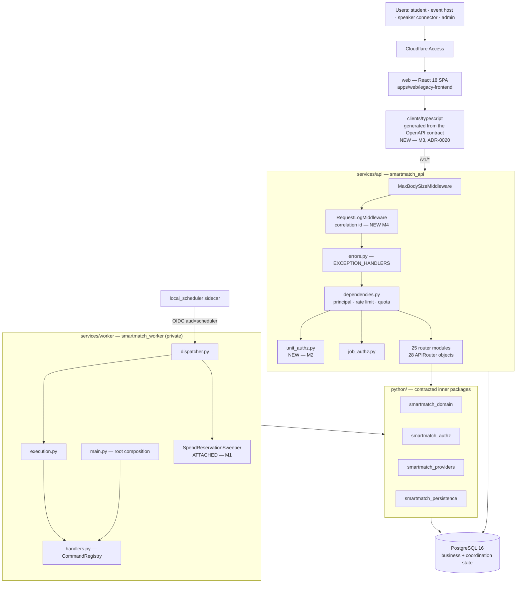
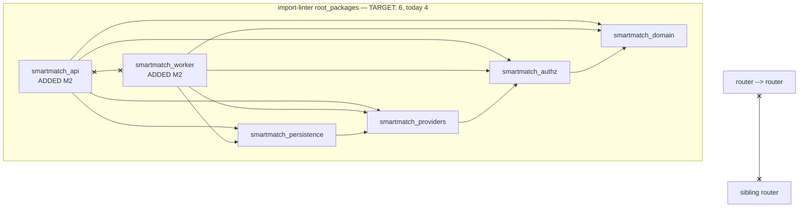
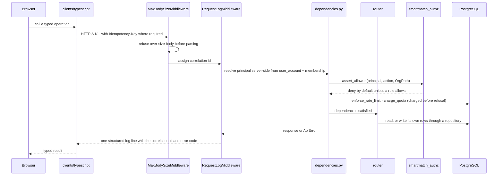
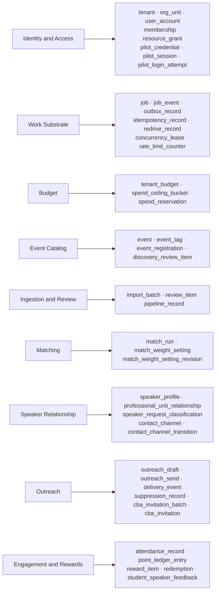
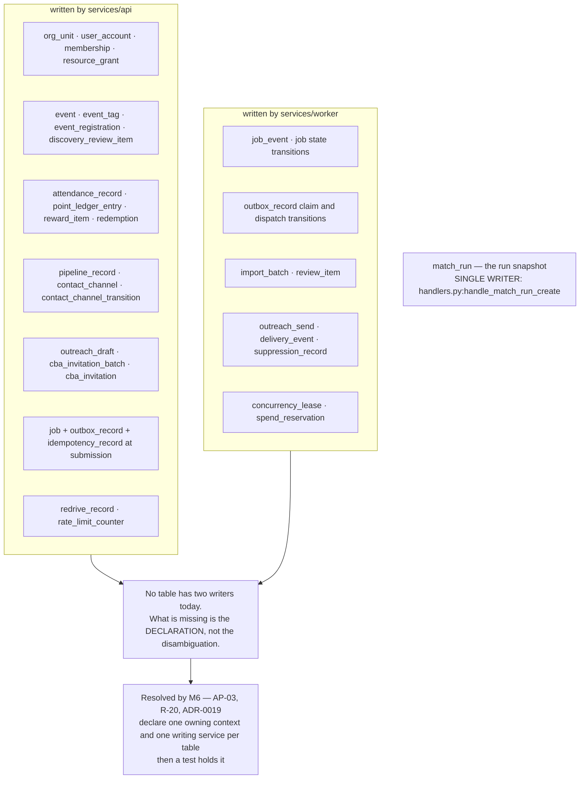
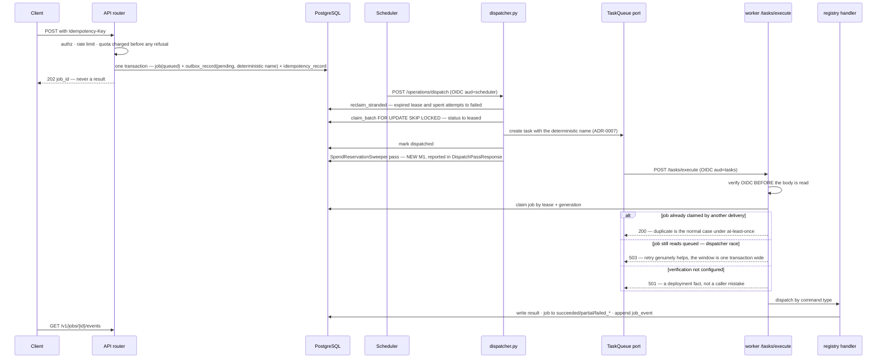

# Target Architecture

**Stage 2, writer A.** 8 September 2026. Companion to `OPUS_AUDIT_HANDOFF.md`,
`CURRENT_ARCHITECTURE_AUDIT.md` and `risk-register.md`. Principles are `AP-NN`
(owner: writer B). Increments are `M-n` (owner: writer D). ADRs `ADR-0018`…
`ADR-0023` (owner: writer E) are **Proposed**.

Classifications: **OBSERVED** · **INFERRED** · **RISK** · **RECOMMENDATION** ·
**UNKNOWN**.

---

## 0. What this document is

**This system is running.** A Docker Compose appliance on a VM, deployed by
`deploy.yml` over IAP and probed through Cloudflare Access, with 21 implemented
capabilities, 57 published API paths, 44 `sa.Table` definitions, 119 check
constraints, 3,807 test functions and a 26-step e2e walk against a live
instance (`OPUS_AUDIT_HANDOFF.md` §1). Whether it is serving *real users today*
is OQ-S2-001; the safe default is that it is.

So the target architecture is **the current architecture with the outer
boundaries made as real as the inner ones**. Nothing here is a redesign. Every
delta below is one of three shapes:

1. **Declare what is already true** (manifests, table ownership, topology).
2. **Attach what is already written** (the sweeper, `npm test`, the registry map).
3. **Extend an existing mechanism to a surface it does not yet cover**
   (import-linter to `services/*`, the parity test to indexes, the OpenAPI
   contract to its consumer).

There is no fourth shape. If a proposal here requires a new mechanism, it is
wrong.

### 0.1 What stays identical (handoff §3)

These are load-bearing, tested, and out of scope for every increment. Changing
them costs more than it returns.

| Untouched | Why |
|---|---|
| The command path — outbox, `SKIP LOCKED` CTE claim, deterministic task names (ADR-0007), lease + generation, 12 job states, idempotency records, redrive | 44 tests including crash-window cases (`test_outbox_dispatcher.py`); `command-path.md` §1a–1c argues each transaction boundary |
| Authorization — `evaluate` / `assert_allowed`, `ltree` scope, GiST indexes, composite tenant-safe keys | Complete coverage across all 25 router modules (Stage 1 reported 26; recounted 2026-09-08); `test_policy_matrix.py` (41 tests); ADR-0004 |
| The four import-linter contracts and `tools/scan_forbidden.py` | The reason the codebase is clean. **AP-01 extends `root_packages`; it never relaxes a contract** (non-negotiable 13) |
| Database integrity — 119 checks, 68 `RESTRICT` FKs, zero `SET NULL`, whole-schema parity guard | `data-architecture.md` §2 |
| ADR-0011 accountable numbers, enforced in scanner + e2e + UI | The product's defining commitment |
| Capability gating **by absence** — a gated-off capability owns no router | `main.py:CAPABILITY_SCOPED_ROUTERS`; AP-11; non-negotiable 12 |
| PostgreSQL as the only store, business **and** coordination | ADR-0005, v1.1 §2.4, `smartmatch_persistence/__init__.py` |
| ADR-0013 attendance-only points; ADR-0015 quota-before-refusal; ADR-0009 one transaction per migration | Recorded decisions with reasoning |
| The functional-core domain: 85 frozen value objects, 5 state machines, no IO | ADR-0002, contract 1 (`os` and `pathlib` forbidden) |

**The test pyramid is not restructured.** M0 runs lanes that already exist; it
adds no framework.

---

## 1. Component topology (target)

**Delta from today.** Three boxes are new or moved: `clients/typescript`
(R-02, M3, AP-07, ADR-0020), `RequestLogMiddleware` (R-03, M4, AP-09),
`unit_authz.py` (R-06, M2, AP-02). One edge is new: `dispatcher → sweeper`
(R-08, M1, AP-08). Everything else is the topology `current-system-topology.md`
§2 already traced.

---

## 2. Dependency direction (target)

**Contracts 1–4 are unchanged.** Three are added by M2 (ADR-0018):

| # | New contract | Type | Forbids | Fixes |
|---|---|---|---|---|
| 5 | Services do not import each other | `forbidden` | `smartmatch_api` ↔ `smartmatch_worker` | R-06 §3c, AP-01 |
| 6 | Routers are leaves | `forbidden` | `smartmatch_api.routers.*` → `smartmatch_api.routers.*` | R-06 §3b, AP-02 |
| 7 | Services sit above the four inner layers | `layers` | any upward edge from `python/*` into `services/*` | AP-01 |

Contract 6 cannot be declared while `cba_contact_channels.py:131` imports
`_authorize_speaker_contacts` from `cba_contacts.py` and
`outreach_contacts.py:109` imports `READ_RATE_LIMIT` / `_authorize_outreach`
from `outreach.py`. **The promotion is the prerequisite, not the consequence**
— `job_authz.py` is the pattern, and its docstring records the identical
history (two routers, two divergent subsets of one policy, consolidated).

**RECOMMENDATION — the new module is `smartmatch_api/unit_authz.py`.** Named
for its subject (the unit and the roster hanging off it), not for its callers.
`utils.py` at 18 lines and fan-in 25 is the counter-example, and M1 renames it
to `clock.py` for exactly that reason (R-19).

---

## 3. Per-component specification

Each component below is fixed on the same nine axes. **Delta rows cite the risk
and name the increment and principle.**

### 3.1 `smartmatch_domain`

| Axis | Target |
|---|---|
| Responsibility | The functional core: 85 frozen value objects, 5 state machines, pure decision functions (`score_candidate`, `fold_balance`, `apply_availability_filter`) |
| Ownership | Domain rules and closed vocabularies. Owns no table and no transaction |
| Public interface | Module-level types and functions; `StrEnum` values are the wire form |
| Internal boundary | `factors/` behind `factor_registry`; parsers behind `events` |
| Permitted deps | `smartmatch_domain` only |
| Forbidden deps | `fastapi`, `starlette`, `sqlalchemy`, `alembic`, `pydantic_settings`, `httpx`, `requests`, `google`, `boto3`, `os`, `pathlib`, `socket`, `subprocess`, `smartmatch_providers` (contract 1, ADR-0002) |
| Persistence ownership | **None.** By construction |
| Failure behaviour | Raises typed domain errors (`ConsentViolationError`, `AuthorizationError` in authz); `assert_registry_approved()` fails closed |
| Testing | Unit, in `--cov` today. No change |
| Observability | None, and that is correct — a pure function that logs has an IO dependency |

**Delta: none.** This layer is finished.

### 3.2 `smartmatch_authz`

| Axis | Target |
|---|---|
| Responsibility | Deny-by-default policy over an `ltree` scope |
| Ownership | `OrgPath`, `Principal`, `Membership`, `ResourceGrant`, `AccessDecision`, `evaluate`, `assert_allowed` |
| Public interface | `evaluate()` returns a decision; `assert_allowed()` raises |
| Internal boundary | Policy only; no IO, no session |
| Permitted deps | `smartmatch_domain` |
| Forbidden deps | contract 2's list (same shape, narrower) |
| Persistence ownership | None. `membership` / `resource_grant` rows are Identity & Access's (§5) |
| Failure behaviour | Deny by default. A missing rule denies; it never defaults open |
| Testing | `tests/authz/test_policy_matrix.py` (41), `test_tenant_isolation.py` |
| Observability | None directly. **A refusal becomes visible at the API boundary** — M4, AP-09, R-03 |

**Delta: none inside the package.** The delta is that its refusals stop being
invisible (M4).

### 3.3 `smartmatch_providers`

| Axis | Target |
|---|---|
| Responsibility | Ports plus fixture/local adapters: `TaskQueue`, `EmailProvider`, `RouteMatrixProvider`, `TokenVerifier`, classification, topic semantics |
| Ownership | The seam. Not the live clients |
| Public interface | `build_token_verifier`, `registry.py` builders |
| Internal boundary | One module per port; live clients refuse at construction (`registry.py:196,243,258,303`) |
| Permitted deps | `smartmatch_domain` |
| Forbidden deps | storage, `fastapi` |
| Persistence ownership | None |
| Failure behaviour | **Refuse at construction, never at call time.** With nothing configured, `build_task_verifier` returns a verifier that refuses everything and the endpoint answers `501` |
| Testing | Port contract tests against the fixture. `test_static_jwks_verifier.py` (52) for the unwired A1b verifier |
| Observability | Provider outcomes surface as `job_event` rows written by the handler, not by the adapter |

**Delta — M7, ADR-0021, R-01.** Write down **what an adapter must satisfy**
before any is built: the `200`-on-duplicate / `503`-on-race delivery contract
from `worker/main.py`'s docstring, expressed as a test the fixture queue passes
today and a live Cloud Tasks client must also pass. **Do not pre-build the live
clients** (anti-goal, handoff §7). The contract is the deliverable; the adapter
is measured against it rather than improvised.

### 3.4 `smartmatch_persistence`

| Axis | Target |
|---|---|
| Responsibility | 44 hand-written `sa.Table` definitions plus 26 repositories over SQLAlchemy Core |
| Ownership | The schema and every SQL statement. ADR-0004: hand-written, composite tenant-safe keys |
| Public interface | The repository classes re-exported in `__init__.py` (`JobRepository`, `OutboxRepository`, `IdempotencyRepository`, `RedriveRepository`, `create_session_factory`) |
| Internal boundary | `schema.py` is imported by all 26 repositories; the benign `__init__` re-export cycle is **acceptable — note it, do not refactor** (`dependency-analysis.md` §2) |
| Permitted deps | `smartmatch_domain`, `smartmatch_authz`, `sqlalchemy` |
| Forbidden deps | `httpx`, `requests`, `subprocess`, `smartmatch_providers`, `fastapi` (contract 4) |
| Persistence ownership | **All of it — and that is the problem.** §5 |
| Failure behaviour | Constraint violations surface as database errors; 119 checks and 68 `RESTRICT` FKs refuse bad states below the application |
| Testing | `test_check_constraints.py` (43), `test_event_schema_constraints.py` (54), `test_schema_matches_migration.py` (whole-schema, symmetric) |
| Observability | None. The store is not the narrator |

**Delta 1 — M6, AP-03, R-20, ADR-0019.** A table→context→writing-service map
declared **as data** in this package, with a test asserting every table appears
exactly once and every named context exists. The map is the artifact; the
`schema.py` split is an **optional** follow-up after M6 and never before
(anti-goal: no splitting on line count).

**Delta 2 — M6, AP-10, R-12.** Declare the 33 indexes in `schema.py` beside
their tables and extend `test_schema_matches_migration.py` to compare index
names **both directions**. Today the parity guard is blind to indexes and
dropping `ix_outbox_claimable` passes every gate in `verify.yml` while
degrading the dispatcher's `SKIP LOCKED` claim to a sequential scan.

**Delta 3 — M1, AP-08, R-08.** `SpendReservationSweeper` gains a production
caller (§3.6).

### 3.5 `services/api` (`smartmatch_api`)

14k lines. Governed by **no** import contract today; that is the single change
with the widest downstream effect (handoff §8).

| Axis | Target |
|---|---|
| Responsibility | The HTTP boundary: authenticate, authorize, rate-limit, charge quota, then either write its own rows or **submit a command** |
| Ownership | The OpenAPI contract (`contracts/openapi/smartmatch.json`, 57 paths) and the error envelope |
| Public interface | The published `/v1` paths plus `/api/health`, `/u/{token}`, the invitation response page |
| Internal boundary | See sub-layers below |
| Permitted deps | all four `python/` packages |
| Forbidden deps | `smartmatch_worker` (contract 5, M2); router→router (contract 6, M2) |
| Persistence ownership | Every table whose writing service is `api` in the M6 map. **`match_run` is not one of them** — the API writes the `job`, `outbox_record` and `idempotency_record` rows that carry the *request*; the worker writes the `match_run` snapshot (§5, §7) |
| Failure behaviour | `ApiError` → one envelope through `EXCEPTION_HANDLERS`. Quota is charged **before** the refusal (ADR-0015). A body over `MAX_REQUEST_BODY_BYTES` is refused before parsing, on both the honest-`Content-Length` branch and the buffering branch |
| Testing | Contract + integration + e2e. **Delta — M0, R-10:** `services/api` enters `pytest --cov`; record the baseline, set no threshold in the same change |
| Observability | **Delta — M4, AP-09, R-03:** one structured request log line with a correlation id, from a middleware beside `MaxBodySizeMiddleware`; every `ApiError` path logs once with its code. **No tracing vendor** |

#### Sub-layers

| Sub-layer | Responsibility | Interface | May import | May not import |
|---|---|---|---|---|
| `routers/*` (25 modules, 28 `APIRouter` objects) | One capability's HTTP surface. **Leaves of the graph** | FastAPI `APIRouter` | shared modules, `python/*` | another router (contract 6, M2) |
| `dependencies.py` (fan-in 26) | Principal resolution, `enforce_rate_limit`, `charge_quota` | FastAPI dependencies | `python/*`, `config`, `errors` | routers |
| `errors.py` (fan-in 26) | `ApiError`, `error_response`, `EXCEPTION_HANDLERS` — one envelope | exceptions + handlers | — | routers |
| `units.py` (fan-in 18) | `load_unit_or_404` — the 404-vs-403 decision, made **once**; `MAX_SUBTREE_UNITS` | functions | `python/*` | routers |
| `job_authz.py` (fan-in 4) | Job-read authorization, consolidated out of `jobs.py` and `redrive.py` | functions | `python/*` | routers |
| **`unit_authz.py` (NEW)** | The unit- and roster-scoped authorization helpers currently private to `outreach.py` and `cba_contacts.py`, plus `READ_RATE_LIMIT` | functions + constants | `python/*` | routers |
| `commands.py` (fan-in 7) | `submit_command` — the one seam onto the outbox | function | `python/*` | routers |
| `clock.py` (was `utils.py`) | `utc_now()`. One clock, one patch point (defect F-003) | one function | — | everything else |
| `config.py` | Settings, `capability_enabled`, Edition assertions | settings object | — | routers |

**Delta — M2, AP-02, R-06.** `unit_authz.py` is created by *moving* two
already-correct implementations. The behaviour is right; the location is wrong
(`dependency-analysis.md` §3b). **Delta — M1, AP-08, R-19:** `utils.py` →
`clock.py`, purely preventive: a module named `utils` with fan-in 25 is the
textbook seed of a dumping ground.

**Delta — M2, AP-01, R-05.** `smartmatch-persistence` is added to
`services/api/pyproject.toml`, which imports it in 33 files and declares it in
none. It works only because CI installs with `--no-deps -e` and pytest adds
every source root to `pythonpath`.

**The synchronous/asynchronous rule is stated, not invented (AP-04).** A router
may write its own rows in-request; it may **not** perform provider IO
(`scan_forbidden.py:136`, v1.1 §1.6). Today that rule lives in one docstring and
one regex. AP-04 names it so an agent reads it before writing a router rather
than after CI fails.

### 3.6 `services/worker` (`smartmatch_worker`)

7k lines, private, two callers kept apart all the way down.

| Axis | Target |
|---|---|
| Responsibility | Execute commands Cloud Tasks delivered; run the dispatch pass Cloud Scheduler drives |
| Ownership | Job execution, lease/generation, the `job_event` stream |
| Public interface | Four endpoints: health, `POST /tasks/execute`, `POST /operations/dispatch`, the heartbeat read |
| Internal boundary | Registry ← execution ← dispatcher ← root composition (below) |
| Permitted deps | all four `python/` packages |
| Forbidden deps | `smartmatch_api` (contract 5, M2) |
| Persistence ownership | `job`, `job_event`, outbox transitions, and every table whose writing service is `worker` in the M6 map |
| Failure behaviour | **The status codes are the contract** (ADR-0021): `200` handled *including a duplicate delivery*; `503` the dispatcher-race window; `401` no credential; `403` credential did not verify, undifferentiated on purpose; `501` verification or queue not configured — a deployment fact, not a caller's mistake; `500` PostgreSQL unreachable. An unregistered command type is a **terminal refusal**, not a crash |
| Testing | `test_outbox_dispatcher.py` (44) incl. crash windows. **Delta — M0, R-10:** into `--cov` |
| Observability | `job_event` is already the strongest signal in the system. No change needed |

#### Sub-layers

| Sub-layer | Target |
|---|---|
| `handlers.py` — `default_registry()` | Registers `test.noop`, `import.create`, `match-run.create`. Its docstring rule stands: *a command type appears here only once something can genuinely execute it or genuinely refuse it* |
| `dispatcher.py` | `reclaim_stranded` then `claim_batch` (`FOR UPDATE SKIP LOCKED`), deterministic task name, mark dispatched. **Delta — M1, R-08:** also calls `SpendReservationSweeper`, and `DispatchPassResponse` reports what it swept |
| `execution.py` | Claim by lease + generation; `TaskExecutor._emit` renews the lease per progress event; `sweep_expired_leases` |
| `main.py` — root composition | Verifies OIDC **before reading the body**; composes `with_outreach_send` unconditionally when `registry_is_ours`, and the paid-extraction handler only when spend ceilings are configured |

**Delta — M1, AP-05, R-04, ADR-0023.** A test asserting every submittable
command type is registered *or* on an explicit intentionally-refused list.
**The test is the missing map.** Root-composed handlers must be visible in it —
see §7.

### 3.7 Web SPA + generated client

| Axis | Target |
|---|---|
| Responsibility | The product surface. Coordinator ×8, student ×6, volunteer ×6, legacy ×7 pages |
| Ownership | Presentation and navigation. `productScope.ts` reads the *same* named capability decisions as the API; neither invents its own |
| Public interface | Routes under `routes.tsx` behind `PortalGate` / `SessionGate` |
| Internal boundary | **Target: all `/v1` access through `clients/typescript`.** Today: inline `fetch` across 49 files plus a 4,238-line hand-written `lib/api.ts` |
| Permitted deps | the generated client |
| Forbidden deps | hand-transcribed response types for a `/v1` endpoint |
| Persistence ownership | None |
| Failure behaviour | ADR-0011 at the render boundary: a `null` score renders as unknown, **never** as `0`, and never as a percentage |
| Testing | **Delta — M0, R-09, P0:** `npm test` runs in the `web` job. Eight test files exist, including `queryClient.principal-isolation.test.ts` — a cross-principal cache-isolation guard everyone believes runs. One line. Then confirm the isolation test asserts what its name claims |
| Observability | Correlation id from M4 echoed on failure, so a user report maps to a server log line |

**Delta — M3, AP-07, R-02, ADR-0020.** Generate into `clients/typescript`;
enable the drift gate already named at the bottom of `verify.yml` (*"generated
TypeScript client drift check (needs clients/)"*); **migrate one page as the
pattern.** Do not migrate 49 files at once. Until then a backend field rename
passes every gate and reaches users as a runtime `undefined`.

**Delta — M8, R-17 / R-06b.** Per-page decision on the seven legacy pages,
blocked on OQ-S2-002; the three dead components (`OutreachWorkflowModal`,
`AgenticOutreachPanel`, `FeedbackForm`) are deleted unconditionally —
`AgenticOutreachPanel` names a capability **ADR-0003 excludes from Foundation**.

### 3.8 PostgreSQL

| Axis | Target |
|---|---|
| Responsibility | The only store. Business data **and** coordination state |
| Ownership | Per the M6 table→context→writer map |
| Public interface | The schema; migrations `0001`→`0033`, linear |
| Internal boundary | Composite tenant-safe keys; `ltree` + two GiST path indexes |
| Permitted deps | — |
| Forbidden deps | Redis, Pub/Sub, BigQuery — deferred with objective triggers (ADR-0005, v1.1 §2.4) |
| Persistence ownership | Total |
| Failure behaviour | `500` from the worker is the one failure it cannot record |
| Testing | Applies from empty on every PR (`alembic upgrade head`); parity guard both directions. **UNKNOWN — downgrade** (R-14, OQ-S2-004) |
| Observability | `job_event` |

**Delta — M6/M7 only.** Indexes into `schema.py` (R-12); retention per
append-only table **recorded as a decision, implemented nothing** (R-13,
OQ-S2-003); the downgrade question answered explicitly (R-14, OQ-S2-004) — if
downgrade is not supported, say so and stop writing `downgrade()` bodies that
will never work.

### 3.9 `tools/` gates and CI

| Axis | Target |
|---|---|
| Responsibility | Turn eleven specific legacy defects into build failures; enforce boundaries, terminology, env isolation, supply chain |
| Ownership | `scan_forbidden.py`, `scan_cba_terminology.py`, `env_isolation_check.py`, `agent_memory_check.py`, `supply_chain.py`, `export_openapi.py` |
| Public interface | `make check` = format-check lint typecheck imports test scan memory licenses infra-check |
| Internal boundary | Each scanner is itself tested (`test_forbidden_scanner.py`) |
| Permitted deps | `smartmatch_domain`, `smartmatch_persistence` |
| Forbidden deps | — |
| Persistence ownership | None |
| Failure behaviour | Fail the build. **Never weaken a gate to make a migration easier** (non-negotiable 13) |
| Testing | The gates are under test — a repository property worth naming |
| Observability | CI output |

**Delta — M5, AP-06, R-15.** Correct D1 (`main.py` says match-run/discovery/send
commands "wait on G1/G3/G4" while mounting all three and while
`factor_registry.REGISTRY_STATUS == "approved"`), D2 (the OpenAPI `description`
claiming a generated client), D3 (`Calendar.tsx:80-95` claiming `events.py`
declares no handlers — it is 571 lines and the contract publishes two event
paths). Then add the gate-claim test: no docstring may claim G1 is open while
the constant reads `"approved"`. **The gate constant already exists to be
asserted against** — that is the whole of AP-06.

**Delta — M5, AP-13, R-16.** A one-line status header
(`ACTIVE` / `LANDED` / `SUPERSEDED BY …` / `ABANDONED`) on each of the 40+
`docs/plans` documents; non-active ones move to `docs/plans/archive/`. The
visible git history begins 2026-09-05 while plans date from 2026-08-28, so
history cannot resolve them (OQ-S2-005).

**Delta — M0, R-09/R-10.** `npm test` in the `web` job; `services/*` in
`--cov`.

---

## 4. Request and data flow — the synchronous path

**Two things are new and both are M4/M3.** The client is typed (AP-07); the
refusal leaves a trace (AP-09). Everything else — including *identity is never
caller-supplied* and *quota before refusal* — is today's behaviour, restated so
it is designed against rather than rediscovered.

---

## 5. Domain boundaries and persistence ownership

Now the writing service — the axis nothing in the repository states today.

**OBSERVED, 2026-09-08 — and this corrects Stage 1.** `data-architecture.md` §8,
`domain-model.md` §6 and `dependency-analysis.md` §4 all record `match_run` as a
*two-writer* table. It is not. `routers/match_runs.py:18-30` says in as many
words that nothing there inserts a `match_run` row and nothing there could,
because the table's `job_id` is a `NOT NULL` foreign key to `job`; the router's
only repository calls are reads (`:1035` reads `schema.job.c.payload`; `:1175`
`_match_runs.get`). The sole writer is
`smartmatch_worker.handlers.handle_match_run_create` (~`:1109`), through
`smartmatch_persistence.match_runs`, which is insert-only. ADR-0019 states this
correctly; the Stage 1 documents do not. **No table in `schema.py` has two
writers today.**

**R-20 is not softened by that — it is sharpened.** The API *does* write rows
related to a match run: the `job`, `outbox_record` and `idempotency_record` rows
`submit_command` creates in one transaction, and the
`match_weight_setting`/`match_weight_setting_revision` rows the run reads. A
reader reasoning *per feature* therefore concludes "the API writes match-run
things", and Stage 1's audit did exactly that and got the writer set wrong. That
is the evidence for AP-03: ownership must be declared **per table**, not inferred
per feature, and the audit's own error is the proof that inference is
insufficient. M6 declares ownership before anything touches `schema.py`.

**`attendance_record` is the counter-example worth protecting.** One writer
today (`routers/attendance.py`), three readers, and ADR-0013's invariant —
attendance is the only input to points — depends on that staying true.
`student_events.py` deliberately writes `event_registration` and never
`attendance_record`. The M6 map is what turns "nothing prevents a second
writer" into "a test prevents a second writer".

---

## 6. The asynchronous command flow (target)

**Why the order is the control.** `/tasks/execute` takes the body as a raw
`Request` rather than a declared model precisely so an unauthenticated caller
with a malformed body is not answered `422` — a validation error that tells
them something about a service they should never have reached.

**Why `503` and not `200`.** Acknowledging the race would delete the task and
strand the job: nothing else re-delivers it, and `queued` has no route to
`redrive_pending`. This asymmetry is the substance of ADR-0021 (M7) and it is
the first thing a live Cloud Tasks adapter must be measured against (R-01).

---

## 7. Where Stage 2 disagrees with Stage 1

### U1 — the command-type → handler map (RESOLVED IN TREE, 2026-09-08)

Stage 1 recorded *"three registered handlers, eight submitting routers, no
assertion tying them"* (`risk-register.md` R-04,
`current-system-topology.md` §3). **The count is wrong.** OBSERVED:

| Command type | Submitting router(s) | Executor | Registered where |
|---|---|---|---|
| `import.create` | `routers/imports.py:296` | `handle_import_create` | `default_registry()` ~L1358 |
| `match-run.create` (`MATCH_RUN_COMMAND_TYPE`, `domain/match_run.py:75`) | `routers/match_runs.py:947` | `handle_match_run_create` | `default_registry()` |
| `outreach.send` (`OUTREACH_SEND_COMMAND_TYPE`, `domain/outreach.py:126`) | `routers/outreach.py:679`, `routers/cba_invitations.py:1112` | `build_outreach_send_handler` | **root composition**, `worker/main.py` ~L451-489 via `with_outreach_send`, unconditionally when `registry_is_ours` |
| `test.noop` | none over HTTP | `handle_noop` | `default_registry()` |
| `extraction.paid_pages` (`worker/paid_extraction.py:123`) | none over HTTP | `build_paid_extraction_handler` | root composition, only when spend ceilings are configured (`worker/main.py` ~L491); otherwise meets the registry's terminal refusal |

Idempotency-scope names only — they reserve a key and never create a job or an
outbox row, so no handler is expected: `speaker_contact.create`
(`routers/cba_contacts.py:302,1097`), `job.redrive` and `job.abandon`
(`routers/redrive.py:388,527,589`, `_reserve` only).

Routers whose docstrings *mention* `submit_command` and deliberately do not use
it, synchronous by design: `routers/review.py:40`,
`routers/speaker_requests.py:25`.

**So: 4 routers submit, 3 command types reach the worker, every one has an
executor.** Stage 1's "eight submitting routers" counted docstring mentions and
idempotency-only reservations.

**R-04 does not go away; it sharpens.** The map is complete *today* and
**nothing asserts it**, and two of the five executors are composed at the root
and therefore **invisible to a reader of `default_registry()`**. The AP-05 test
(M1, ADR-0023) must assert over the composed registry the worker actually
serves, not over `default_registry()` alone — otherwise it would fail on
`outreach.send`, which works, and pass on a future root-composed handler that
does not.

**Consequence for the target.** `current-system-topology.md` §3's INFERRED
paragraph ("either reuse one of the three types, or hit the miss path") is
superseded by the table above. §4's two write-style lists remain correct.

### Disagreement 2 — `match_run` has ONE writer, not two

Stage 1 (`data-architecture.md` §8, `domain-model.md` §6,
`dependency-analysis.md` §4) records `match_run` as written by both
`routers/match_runs.py` and `worker/handlers.py:handle_match_run_create` — "two
writers, no declared owner". **Verified 2026-09-08: the router writes nothing.**
`routers/match_runs.py:18-30` states that nothing there inserts a `match_run`
row and nothing there could, `job_id` being a `NOT NULL` FK to `job`; its only
repository calls are reads (`:1035`, `:1175`). `handle_match_run_create`
(~`handlers.py:1109`) is the sole writer, via the insert-only
`smartmatch_persistence.match_runs`. ADR-0019 already records this correctly;
§5 above and the M6 design in `MIGRATION_ROADMAP.md` / `IMPLEMENTATION_ROADMAP.md`
are aligned to it here.

**This strengthens R-20 rather than weakening it.** The API writes `job`,
`outbox_record`, `idempotency_record` and the
`match_weight_setting`/`match_weight_setting_revision` rows around a run, which
is exactly why a reader inferring ownership *per feature* — as the Stage 1 audit
did — gets the writer set wrong. The audit's own error is the argument for a
declared, per-table map (AP-03, ADR-0019). The M6 test therefore asserts that
**every table has exactly one declared writer**; a future two-writer table is
permitted only by an explicit declaration naming both writers and the reason.

### Disagreement 3 — R-11(a) is resolved in tree, not deferred

Stage 1 left open whether `MaxBodySizeMiddleware`'s chunked / lying-`Content-Length`
branch (`main.py` ~`:107`, docstring branch 2) is tested. **It is.**
`tests/contract/test_max_body_size.py::test_a_streamed_body_is_rejected_the_moment_the_running_total_crosses_the_cap`
drives a body with no `Content-Length` through three queued chunks and asserts
the middleware stops reading after two `receive()` calls, never invokes the
downstream application, and returns 413 `request_body_too_large`. The companion
`test_a_streamed_body_under_the_cap_is_replayed_to_the_downstream_app_unmodified`
proves the accept path replays verbatim. No open question is needed; the
roadmaps' R-11(a) rows record the resolution instead.

### Disagreement 4 — the ADR reserved-number note

`docs/architecture/decisions/README.md` "Reserved numbers" says ADR-0016 is
reserved with no file. **ADR-0016 exists** (CBA scoring policy). The note is
stale. Writer E owns the correction; recorded here because a target
architecture that cites the ADR index should not cite it wrong.

### Disagreement 5 — the table and router counts

Stage 1 reports **43** tables (`CURRENT_ARCHITECTURE_AUDIT.md` §1,
`data-architecture.md` §2). `grep -c "= sa.Table(" schema.py` returns **44**
today, and `data-architecture.md` §3's ownership map lists 44 names. Stage 1
likewise reports **26 routers**; `ls services/api/smartmatch_api/routers/*.py`
less `__init__.py` returns **25** modules, exporting **28** `APIRouter` objects
(`outreach`, `cba_invitations` and `student_speaker_feedback` each export two —
`MODULE_BOUNDARIES.md` §1). Stage 2 uses **44 tables** and **25 router modules
(28 `APIRouter` objects)** throughout (Stage 1 reported 43 / 26; recounted
2026-09-08). Minor, but the M6 ownership map is generated *from* the table list
and contract 6 is written against the module list, so both counts have to be
read from the tree and not from the audit.

---

## 8. What this target deliberately does not contain

Each row is ruled out by evidence, not by taste.

| Not in the target | Evidence ruling it out |
|---|---|
| **A rewrite, or any big-bang increment** | A running pilot with a deployed appliance and a 26-step e2e walk (handoff §1, §7). Every M-n is independently shippable **and** reversible |
| **A service split, event bus, CQRS, broker, or microservices** | Nothing in the repository exerts that pressure. PostgreSQL-as-coordinator is a recorded decision *with stated adoption triggers* (ADR-0005, `smartmatch_persistence/__init__.py`). One transaction spanning "record the intent" and "enqueue the work" is exactly what makes the outbox sound |
| **Redis / Pub/Sub / BigQuery** | Deferred with objective triggers, v1.1 §2.4. The triggers have not fired |
| **Splitting `schema.py` on line count** | `dependency-analysis.md` §5 and `data-architecture.md` §8: there is no ownership statement to split *along*. M6 declares ownership; the split is the optional consequence, never the prerequisite |
| **A points-ledger snapshot scheme** | `fold_balance` is correct at this scale and ADR-0011's reproducibility depends on the ledger staying the source of truth (`data-architecture.md` §6, §7) |
| **Table renames to fix terminology** | ADR-0004 composite tenant-safe keys, 33 migrations naming tables, and a terminology scanner that is deliberately *scoped* so it does not demand renaming the authz `membership` row. `GLOSSARY.md` instead (M1, domain-model §4) |
| **Multi-region, a public third-party API, ML matching, websockets, event sourcing beyond the ledger** | `CURRENT_ARCHITECTURE_AUDIT.md` §17 "Speculative — do NOT design for it now". None is implied by anything in the repository |
| **Agents anywhere in Foundation** | ADR-0003. `AgenticOutreachPanel` is deleted in M8 (R-06b) precisely so a future agent cannot "just wire it up" |
| **A speculative GCP build** | `env_isolation_check.py` makes the Terraform non-applyable *by design*. M7 writes down what the adapters must satisfy (ADR-0021) and states the appliance is production (ADR-0022) |
| **A tracing vendor** | R-03's remediation is explicit: structured request logging with a correlation id, one middleware. Adopt no vendor yet |
| **`if enabled:` capability branches** | `main.py:CAPABILITY_SCOPED_ROUTERS` — a gated-off capability owns **no router**, so there is no dead branch to enable by accident (AP-11) |
| **Any weakening of an existing gate** | Non-negotiable 13. Every increment is additive to `make check` |
| **Generic architecture principles** | AP-01…AP-13 each name the risk they close and the file that proves it. A principle that cites nothing is not a principle here |

---

## 9. Increment-to-delta index

Every target-state delta above, with its risk, principle and increment.

| Delta | Risk | Principle | Increment |
|---|---|---|---|
| `npm test` in the `web` job | R-09 (P0) | AP-08 | M0 |
| `services/*` into `pytest --cov` | R-10 | AP-08 | M0 |
| Registry-map test over the **composed** registry | R-04, U1 | AP-05 | M1 (ADR-0023) |
| Sweeper called from the dispatch pass; reported in `DispatchPassResponse` | R-08 | AP-08 | M1 |
| `utils.py` → `clock.py` | R-19 | AP-08 | M1 |
| `GLOSSARY.md` published | — (domain-model §4) | AP-13 | M1 |
| `smartmatch-persistence` in both service manifests | R-05 | AP-01 | M2 |
| Both services in `root_packages`; contracts 5–7 | R-06 | AP-01 | M2 (ADR-0018) |
| `unit_authz.py` promotion; router→router forbidden | R-06 | AP-02 | M2 |
| `clients/typescript` + drift gate + one migrated page | R-02 | AP-07 | M3 (ADR-0020) |
| Request-logging middleware with correlation id; `ApiError` logs once | R-03 | AP-09 | M4 |
| D1–D3 corrected; gate-claim test | R-15 | AP-06 | M5 |
| Status headers on `docs/plans` | R-16 | AP-13 | M5 |
| Table→context→writer map as data, with a test | R-20 | AP-03 | M6 (ADR-0019) |
| Indexes in `schema.py`; parity both ways | R-12 | AP-10 | M6 |
| Metrics drill-down rate-limited and bounded | R-07 | AP-12 | M6 |
| Adapter delivery contract test against the fixture queue | R-01 | AP-04 | M7 (ADR-0021) |
| Appliance-is-production topology statement | R-18 | — | M7 (ADR-0022) |
| Retention and downgrade recorded as decisions | R-13, R-14 | — | M7 (OQ-S2-003/004) |
| Seven legacy pages; three dead components deleted | R-17, R-06b | AP-08 | M8 (OQ-S2-002) |

**Optional, after M6 and never before:** splitting `schema.py` along the
declared ownership boundary.

**Not scheduled, by decision:** every row in §8.
