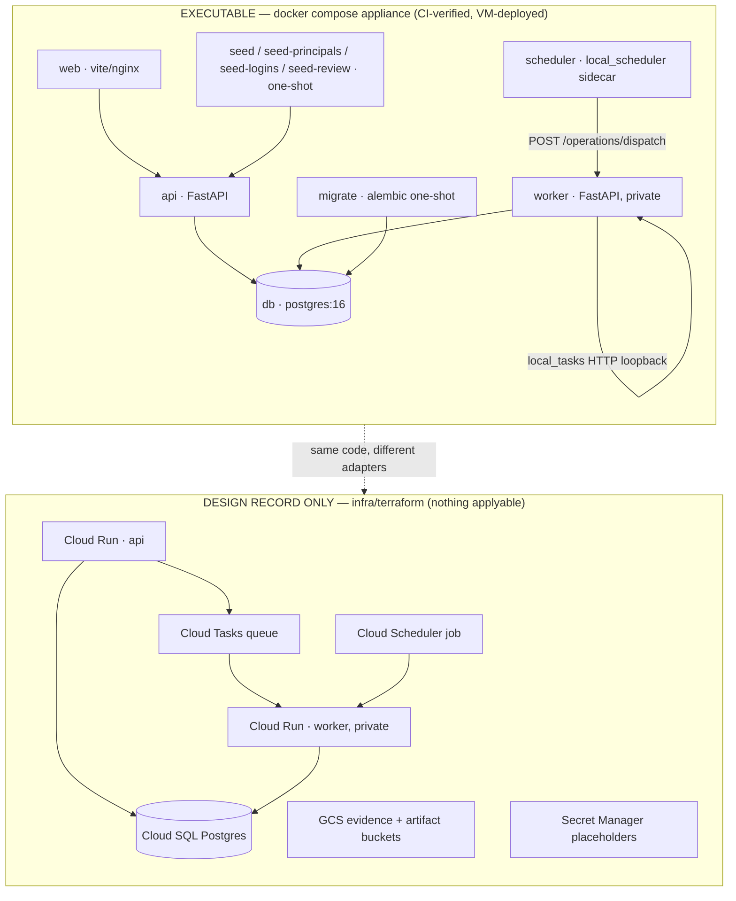
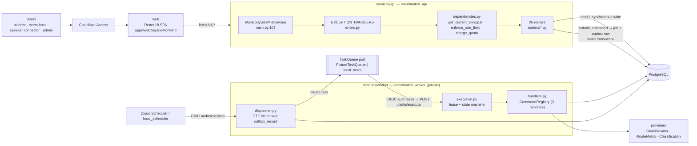
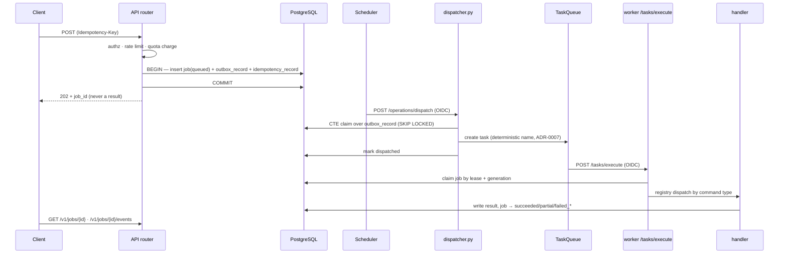
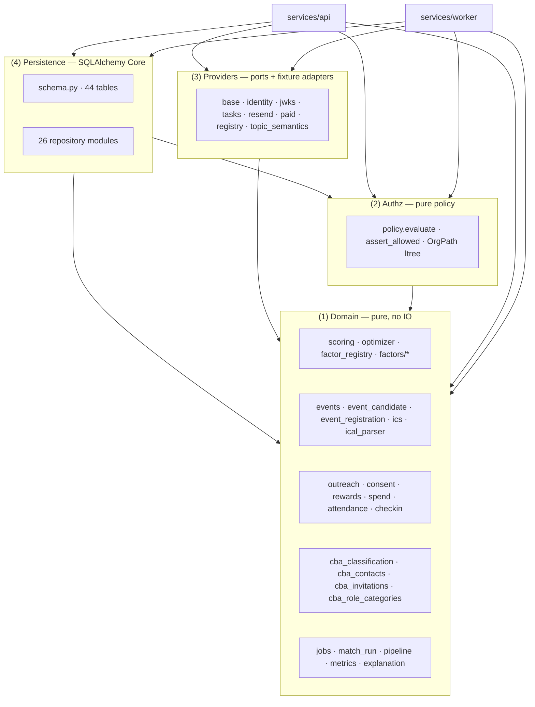
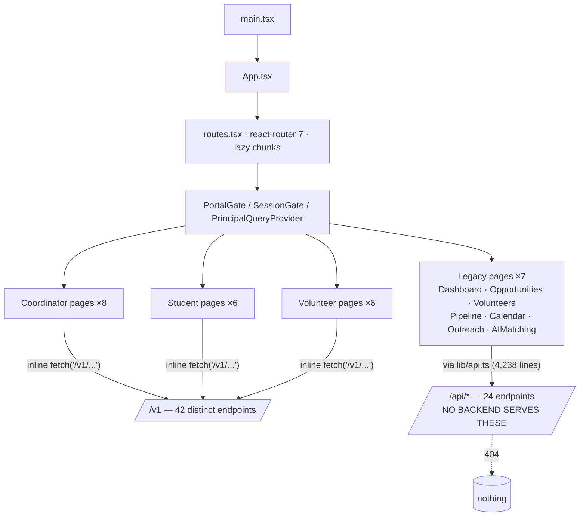

# Current System Topology

**Stage 1 §1.** What actually runs, traced from the outside in. Commit `c72dced`.

---

## 1. The headline: two topologies, one executable

**OBSERVED.** The repository describes a GCP Cloud Run architecture and ships a
Docker Compose appliance. Only the appliance runs.

Evidence:
- Executable: `docker-compose.yml` (12 services), `docker-compose.vm.yml`,
  `.github/workflows/build.yml` jobs `images` / `compose smoke` / `pilot e2e`,
  `.github/workflows/deploy.yml` (deploy over IAP to a pilot VM, then probe the
  public URL through Cloudflare Access), `smartmatch.sh` / `smartmatch.ps1`.
- Design record: `infra/terraform/envs/dev/main.tf:1` states in its first line
  that nothing there is applied; `tools/env_isolation_check.py` fails CI if a
  `provider`, `backend`, `resource`, `module`, or `data` block, committed state,
  a plan, a `.tfvars`, or a non-placeholder identifier appears.

**RISK (R-01).** The abstractions that let the same code run in both places —
`TaskQueue`, `TokenVerifier`, `RouteMatrixProvider`, `EmailProvider` — have
been exercised **only** through fixture and local implementations. The live
Cloud Tasks client, the live Routes client, and the JWKS-to-real-issuer wiring
have never run. The seam is designed but unproven.

---

## 2. Runtime request topology (the real one)

### The three trust boundaries (OBSERVED)

| # | Boundary | Control | Evidence |
|---|---|---|---|
| 1 | Internet → API | Cloudflare Access, then bearer token → `get_current_principal`, then `smartmatch_authz.assert_allowed`, then per-route rate limit and quota | `dependencies.py:119,170,245`; `authz/policy.py:405` |
| 2 | Cloud Tasks → worker `/tasks/execute` | OIDC verified **before the body is read**, audience `tasks`, its own SA allowlist | `worker/main.py` docstring §"Order of operations, which is the security property"; `worker/identity.py` |
| 3 | Cloud Scheduler → worker `/operations/dispatch` | OIDC, audience `scheduler`, *different* SA allowlist. "Cloud Tasks may deliver work and may not drive dispatch; Cloud Scheduler may drive dispatch and may not deliver work." | `worker/main.py` docstring |

**OBSERVED.** With nothing configured, `build_task_verifier` returns a verifier
that refuses every request and the endpoint answers `501`. The default posture
is closed, not open (`worker/main.py` docstring, resolving security finding S-001).

---

## 3. The command path (asynchronous work)

This is the architecture's spine. Architecture v1.1 §1.6, recorded in
`docs/architecture/command-path.md` and ADR-0005.

**OBSERVED — the registry is deliberately small.** `default_registry()`
(`worker/handlers.py:1349`) registers exactly **three** command types:

| Command | Handler | Line |
|---|---|---|
| `test.noop` | `handle_noop` | `handlers.py:287` |
| `import.create` | `handle_import_create` | `handlers.py:433` |
| `match_run.create` (`MATCH_RUN_COMMAND_TYPE`) | `handle_match_run_create` | `handlers.py:1109` |

The docstring states the rule: *"A command type appears here only once
something can genuinely execute it or genuinely refuse it — a handler added
ahead of its gate is a handler someone will trigger."*

**OBSERVED — but eight routers submit commands.** `submit_command` /
`commands.` appears in `imports.py`, `match_runs.py`, `redrive.py`,
`review.py`, `outreach.py`, `speaker_requests.py`, `cba_contacts.py`,
`cba_invitations.py`.

**INFERRED.** Since only three command types have handlers, commands submitted
by the other routers either (a) reuse one of the three types, or (b) reach the
worker and hit the registry's documented miss behaviour. `handlers.py:11`
describes that miss path explicitly — an unregistered command is a *terminal
refusal*, not a crash. This is a fail-closed design, but it means the mapping
"router → command type → handler" is **not derivable from the registry alone**
and is the single most important thing a future agent must check before adding
an async path. See `wip-analysis.md` §2 and `risk-register.md` R-04.

---

## 4. Synchronous vs. asynchronous writes

**OBSERVED.** Two write styles coexist in the API, and the split is not stated
anywhere as a rule:

| Style | Routers | Evidence |
|---|---|---|
| **Command (async)** — request records intent, worker performs | `imports`, `match_runs`, `redrive`, `review`, `outreach`, `speaker_requests`, `cba_contacts`, `cba_invitations` | `grep -l submit_command` |
| **Direct (sync)** — router writes through a repository in-request | `attendance`, `calendar`, `events`, `match_runs`, `metrics`, `review`, `rewards`, `student_events` | `grep -lE '\.execute\(\|sa\.insert'` |

Note that `match_runs` and `review` appear in **both** lists.

**The actual invariant** — read from `main.py`'s docstring — is narrower than
"all writes are async". It is: *"Any handler that calls a provider inline —
prohibited by v1.1 §1.6."* A router may write its own rows synchronously; it
may not perform provider IO. `scan_forbidden.py:136` enforces exactly that
with a regex over route decorators.

**RECOMMENDATION.** The rule is real, enforced, and correct — but it lives in
one module docstring and one scanner regex. It should be a named architecture
principle so an agent reads it before writing a router, not after CI fails.
Carried into Stage 2 as **AP-04**.

---

## 5. Domain topology inside the API

Dependency direction is enforced downward by import-linter for layers (1)–(4).
It is **not** enforced for `services/*` — see `dependency-analysis.md` §3.

---

## 6. Frontend topology

**OBSERVED.** The SPA is named `legacy-frontend` and contains two generations
of code that do not share an access layer.

**OBSERVED.** `apps/web/legacy-frontend/src/lib/api.ts` calls 24 distinct
`/api/*` paths (`/api/crawler/start`, `/api/matching/score`,
`/api/data/pipeline`, `/api/outreach/agentic-workflow/stream`, `/api/qr/generate`, …).
`contracts/openapi/smartmatch.json` publishes 57 paths and **none of them
begins with `/api/` except `/api/health`.** The repository states this itself:
`tests/e2e/…::test_16_the_portal_pages_have_no_backend_in_this_repository`.

**OBSERVED.** The newer pages bypass `api.ts` entirely and call `fetch` with
`/v1/...` inline — 42 distinct `/v1` paths across 49 files. There is no shared
client, and no generated one: `contracts/openapi/smartmatch.json` exists and is
CI-gated for freshness, `pyproject.toml` excludes `clients/typescript` from
ruff, and `main.py` advertises *"the TypeScript client is generated from it and
never hand-maintained"* — but **`clients/` does not exist**
(`ls: cannot access 'clients'`).

This is the most consequential documentation-versus-reality gap in the
repository. See `risk-register.md` R-02 and `wip-analysis.md` §3.

---

## 7. Scheduled and background work

| Job | Trigger | Status |
|---|---|---|
| Outbox dispatch pass | Cloud Scheduler → `/operations/dispatch`; locally `smartmatch_worker.local_scheduler` | Operational (compose + `tests/integration/test_outbox_dispatcher.py`, 44 tests) |
| Dispatch heartbeat read | `GET` on worker | Operational (`worker/main.py:732`) |
| Spend sweeper | `smartmatch_persistence/spend_sweeper.py` (244 lines) | **Module exists; no scheduler entry found.** See `wip-analysis.md` §4 |
| Task execution | Cloud Tasks → `/tasks/execute` | Operational via `local_tasks` loopback only |

---

## 8. Observability topology

**OBSERVED.** Thin. Across ~70,000 lines of `python/` + `services/` code:

- 20 total references to `logging` / `getLogger`; **no** `structlog`, **no**
  `opentelemetry`, **no** metrics exporter, **no** tracing.
- Loggers exist in 6 worker modules and 4 API modules
  (`review`, `redrive`, `job_authz`, `pipeline_provisioning`). The other
  22 routers log nothing.
- `GET /api/health` is liveness only and deliberately exposes no dependency
  detail (`main.py:health` docstring, v1.1 §1.11). Readiness is described as
  "a separate private endpoint" — the audit found no such endpoint on the API.
- The one genuine operational signal is `job_event` (`schema.py:274`) plus
  `GET /v1/jobs/{id}/events`: a per-job durable event stream.

**INFERRED.** Diagnosing a production failure today means reading `job_event`
rows out of PostgreSQL. Anything that fails *outside* a job — an authz refusal,
a rate-limit rejection, a 500 in a synchronous router — leaves no structured
trace at all. See `risk-register.md` R-03.
