# SmartMatch System Process & Architecture Diagrams — 2026-09-04

> **Scope and authority.** This is a descriptive, point-in-time map of the repository. It decides nothing, fills no owner field, authorizes no live data or provider, and makes no production-readiness claim. Statuses were checked against the 2026-09-04 working tree; older documents are retained as historical evidence where code has moved ahead of them.

## Legend (status captions)

- **✅ COMPLETE** — shipped in the main working tree and covered by tests.
- **🟡 IN PROGRESS** — partial behavior, a separate worktree, or schema plus only part of the required behavior.
- **📋 PLANNED** — documented design or backlog, not implemented.
- **🚫 BLOCKED _reference_** — stopped by the named decision, gate, or release control.

Status applies to the exact scope named in a box. For example, fixture event ingest is complete while live crawling remains blocked. “Complete” never means deployed or production-ready.

### Verified baseline and documentation drift

- The committed OpenAPI contract contains **18 paths and 19 operations**. `/v1/units/{unit_id}/redemptions` has both `GET` and `POST`.
- The committed migration head is **`0019_redemption_durability`**. Migration `0020_pilot_login_credentials` and its login/session behavior exist only in `_worktrees/login-recovery`, so they are **in progress**, not part of the main migration chain.
- Matching is implemented: both approved Stage B factors have `implemented=True`; `scoring.py`, explanations, the deterministic CP-SAT optimizer, the match-run worker handler, immutable snapshot, and two match-run API operations are present and tested.
- Review acceptance calls `pipeline_provisioning.provision_on_accept`; accepted synthetic professional rows create/link identities, and accepted in-list event rows open provenance-labelled pipeline journeys.
- Rewards behavior is shipped: server catalog and ledger fold, redemption request/self-read/coordinator decision routes, durable redemption storage, and fulfilment debit.
- Event fixture ingest and event/tag-quarantine reads are shipped. There is no live fetch or crawl trigger.
- `engagement.py` remains an empty router shell.
- Runtime user authentication still selects `FixtureTokenVerifier`; institutional sign-in remains blocked by **P2**. The separate pilot-login recovery worktree is not a substitute for P2.
- Terraform leaf/platform modules exist, but environment files are deliberately non-applicable skeletons; no provider/backend/root composition has been applied. `ALLOW_CLOUD_DEPLOY=false`; cloud deployment remains blocked by **F5**.
- The legacy frontend is authorized only for a synthetic pilot. The new product UI remains on hold behind **D-1–D-11**.
- `README.md`, `apps/web/DESIGN.md`, and the 2026-09-04 audit report lag the verified code on matching, migrations, rewards, events, pipeline writers, OpenAPI size, and the compose web service.

## 1. Grand system map (all processes + data stores + external systems)

```mermaid
flowchart TB
  subgraph People["People and browser surfaces"]
    COORD["Coordinator / admin users<br/>✅ COMPLETE — authorized roles"]
    STUDENT["Student user<br/>✅ COMPLETE — rewards role"]
    VOLUNTEER["Volunteer / professional user<br/>🟡 IN PROGRESS — legacy fixture-backed portal"]
    LEGACY["Legacy React/Vite portals<br/>🟡 IN PROGRESS — synthetic authorized"]
    NEWUI["New product UI<br/>🚫 BLOCKED D-1–D-11 — design on hold"]
    PILOTLOGIN["Pilot password + server session login<br/>🟡 IN PROGRESS — 0020 in login-recovery worktree"]
  end

  subgraph Boundary["FastAPI boundary — 18 paths / 19 operations"]
    HEALTH["Health + unsubscribe<br/>✅ COMPLETE"]
    ME["me router<br/>✅ COMPLETE"]
    IMPORTS["imports router<br/>✅ COMPLETE"]
    JOBS["jobs + resumable SSE router<br/>✅ COMPLETE"]
    REDRIVE["redrive / abandon router<br/>✅ COMPLETE"]
    REVIEW["review decision router<br/>✅ COMPLETE"]
    METRICS["metrics + drill-down router<br/>✅ COMPLETE"]
    MATCHAPI["match-runs create / read router<br/>✅ COMPLETE"]
    EVENTSAPI["events + tag quarantine router<br/>✅ COMPLETE"]
    REWARDSAPI["rewards + redemptions router<br/>✅ COMPLETE"]
    ENGAGEMENTAPI["engagement router<br/>📋 PLANNED — empty shell"]
    AUTHZ["Principal resolution + deny-by-default authz<br/>✅ COMPLETE — fixture identity"]
    LIMITS["Body limits, rate limits, idempotency<br/>✅ COMPLETE"]
  end

  subgraph Commands["Durable command plane"]
    COMMAND["Command submission<br/>✅ COMPLETE — persisted intent + payload"]
    OUTBOX["Transactional outbox<br/>✅ COMPLETE"]
    DISPATCH["Scheduled dispatcher + stranded-row reclaim<br/>✅ COMPLETE — local/worker code"]
    TASKQ["Fixture / local PostgreSQL HTTP task queue<br/>✅ COMPLETE — dev only"]
    WORKER["Task verification, claim, lease, execution<br/>✅ COMPLETE — dev verifier"]
    HANDLERS["Handlers: import.create, match-run.create, test.noop<br/>✅ COMPLETE"]
    JOBRECOVERY["Timeout sweep, park, redrive, abandon<br/>✅ COMPLETE"]
    LIVESCHED["Cloud Tasks + Scheduler + OIDC delivery<br/>🚫 BLOCKED F5 / S-001"]
  end

  subgraph Domain["Pure domain services"]
    INGEST["Header normalization + import validation<br/>✅ COMPLETE"]
    COLUMNS["Ratified columns.yaml contract + URL shape checks<br/>✅ COMPLETE"]
    CONSENT["Contact confidence + send eligibility<br/>✅ COMPLETE"]
    ELI["Engagement Load Index<br/>✅ COMPLETE"]
    FACTORS["Factor registry + topic relevance + travel burden<br/>✅ COMPLETE"]
    ELIGIBILITY["Availability eligibility filter<br/>✅ COMPLETE"]
    SCORING["Stage B scoring + explanations<br/>✅ COMPLETE"]
    OPTIMIZER["Deterministic OR-Tools CP-SAT optimizer<br/>✅ COMPLETE"]
    MATCHPINS["Registry / input / solver pinning<br/>✅ COMPLETE"]
    EVENTDOMAIN["iCal + JSON-LD parse, temporal model, tag vocabulary<br/>✅ COMPLETE"]
    REWARDS["Ledger fold + reward / redemption state machine<br/>✅ COMPLETE — D7 still tentative"]
    PIPELINEDOMAIN["Pipeline stage invariants<br/>✅ COMPLETE"]
    FEEDBACK["Shadow feedback → weight proposals<br/>✅ COMPLETE"]
    ICS["RFC 5545 ICS generation<br/>✅ COMPLETE"]
    OUTREACHDRY["Deterministic outreach dry-run artifacts<br/>🟡 IN PROGRESS — no send"]
  end

  subgraph Application["Application and persistence services"]
    REVIEWREPO["Import batch + review repository<br/>✅ COMPLETE"]
    PROVISION["Review-accept pipeline provisioning<br/>✅ COMPLETE — synthetic provenance"]
    PROFESSIONALS["Professional identity / unit linking<br/>✅ COMPLETE — synthetic path"]
    PIPELINEREPO["Pipeline repository + stage writers<br/>✅ COMPLETE"]
    MATCHREPO["Immutable match-run repository<br/>✅ COMPLETE"]
    EVENTINGEST["Fixture event-ingest seam<br/>✅ COMPLETE — direct operator/test call"]
    EVENTREPO["Event, tag, discovery-review repository<br/>✅ COMPLETE"]
    REWARDREPO["Rewards / redemption repository<br/>✅ COMPLETE"]
    ATTENDANCE["Attendance writer + credit source<br/>✅ COMPLETE — synthetic/demo path"]
    SPEND["Spend reservation + abandoned sweeper<br/>✅ COMPLETE — synthetic only"]
  end

  subgraph Data["PostgreSQL 16 data plane — migration head 0019"]
    ORGDB[("tenant, org_unit, user_account,<br/>membership, resource_grant<br/>✅ COMPLETE")]
    JOBDB[("job, job_event, outbox_record,<br/>idempotency_record, redrive_record<br/>✅ COMPLETE")]
    CONTROLDB[("tenant_budget, rate_limit_counter,<br/>concurrency_lease, spend_ceiling_bucket,<br/>spend_reservation<br/>✅ COMPLETE")]
    IMPORTDB[("import_batch, review_item<br/>✅ COMPLETE")]
    PIPEDB[("professional_unit_relationship,<br/>pipeline_record<br/>✅ COMPLETE")]
    MATCHDB[("match_run immutable snapshots<br/>✅ COMPLETE")]
    EVENTDB[("event, event_tag,<br/>discovery_review_item<br/>✅ COMPLETE")]
    REWARDDB[("attendance_record, point_ledger_entry,<br/>reward_item, redemption<br/>✅ COMPLETE")]
    LOGINDB[("pilot_credential, pilot_session,<br/>pilot_login_attempt<br/>🟡 IN PROGRESS — worktree 0020")]
  end

  subgraph Providers["Inputs, providers, and adapters"]
    INLINEROWS["Inline JSON rows / pilot CSV transformed to rows<br/>✅ COMPLETE"]
    FIXTURES["Committed synthetic fixtures + seed tools<br/>✅ COMPLETE"]
    FIXTUREEVENTS["Fixture iCal / JSON-LD documents<br/>✅ COMPLETE"]
    FIXTURETOKEN["FixtureTokenVerifier<br/>✅ COMPLETE — dev only"]
    STRAIGHTLINE["Straight-line travel estimate<br/>✅ COMPLETE — visibly coarse"]
    OBJECTSTORE["Object-storage source_reference reader<br/>📋 PLANNED — live import refused"]
    ROUTEMATRIX["Live route-matrix provider<br/>🚫 BLOCKED D3"]
    LIVECRAWL["Live discovery crawl / fetch<br/>🚫 BLOCKED G3 / S6a"]
    EMAIL["Email / outreach send provider<br/>🚫 BLOCKED G4"]
    CALENDAR["Direct Calendar API<br/>🚫 BLOCKED G5"]
    IDP["Institutional IdP / JWKS<br/>🚫 BLOCKED P2"]
  end

  subgraph Delivery["Build, local appliance, and intended cloud"]
    CI["GitHub CI: Python, DB, web, security, images<br/>✅ COMPLETE"]
    COMPOSE["Compose: db, migrate, seed, api, worker,<br/>scheduler, seed-review, web<br/>✅ COMPLETE — local synthetic appliance"]
    IMAGES["API + worker images built/probed<br/>✅ COMPLETE — not published"]
    TERRAFORM["GCP Terraform leaf + platform modules<br/>🟡 IN PROGRESS — code exists, never applied"]
    GCP["Cloud Run, Cloud SQL, Tasks, Scheduler,<br/>Secret Manager, buckets<br/>🚫 BLOCKED F5 — ALLOW_CLOUD_DEPLOY=false"]
    REGISTRY["Artifact registry publication / signing<br/>🚫 BLOCKED F5 — no registry or release policy"]
  end

  COORD --> LEGACY
  STUDENT --> LEGACY
  VOLUNTEER --> LEGACY
  LEGACY --> AUTHZ
  NEWUI -. held .-> AUTHZ
  PILOTLOGIN -. worktree only .-> AUTHZ

  AUTHZ --> FIXTURETOKEN
  AUTHZ -. future .-> IDP
  AUTHZ --> ME
  LIMITS --> IMPORTS
  LIMITS --> REVIEW
  LIMITS --> MATCHAPI
  LIMITS --> REWARDSAPI

  IMPORTS --> COMMAND
  MATCHAPI --> SCORING
  MATCHAPI --> COMMAND
  JOBS --> JOBDB
  REDRIVE --> JOBRECOVERY
  REVIEW --> REVIEWREPO
  REVIEW --> PROVISION
  METRICS --> IMPORTDB
  METRICS --> PIPEDB
  EVENTSAPI --> EVENTREPO
  REWARDSAPI --> REWARDREPO

  COMMAND --> JOBDB
  COMMAND --> OUTBOX
  OUTBOX --> JOBDB
  DISPATCH --> JOBDB
  DISPATCH --> TASKQ
  TASKQ --> WORKER
  WORKER --> HANDLERS
  HANDLERS --> INGEST
  HANDLERS --> OPTIMIZER
  HANDLERS --> REVIEWREPO
  HANDLERS --> MATCHREPO
  JOBRECOVERY --> JOBDB
  LIVESCHED -. future delivery .-> WORKER

  INLINEROWS --> IMPORTS
  OBJECTSTORE -. unavailable .-> HANDLERS
  COLUMNS --> INGEST
  INGEST --> REVIEWREPO
  REVIEWREPO --> IMPORTDB
  PROVISION --> PROFESSIONALS
  PROVISION --> PIPELINEREPO
  PROFESSIONALS --> ORGDB
  PROFESSIONALS --> PIPEDB
  PIPELINEREPO --> PIPEDB

  FACTORS --> SCORING
  STRAIGHTLINE --> FACTORS
  ROUTEMATRIX -. future .-> FACTORS
  SCORING --> OPTIMIZER
  ELIGIBILITY --> OPTIMIZER
  MATCHPINS --> MATCHREPO
  MATCHREPO --> MATCHDB

  FIXTUREEVENTS --> EVENTINGEST
  EVENTDOMAIN --> EVENTINGEST
  EVENTINGEST --> EVENTREPO
  EVENTREPO --> EVENTDB
  LIVECRAWL -. no runtime caller .-> EVENTINGEST

  ATTENDANCE --> REWARDDB
  REWARDS --> REWARDREPO
  REWARDREPO --> REWARDDB
  SPEND --> CONTROLDB
  CONSENT -. prerequisite .-> EMAIL
  OUTREACHDRY -. gated from send .-> EMAIL
  ICS -. artifact only .-> CALENDAR

  ORGDB --> AUTHZ
  FIXTURES --> COMPOSE
  COMPOSE --> ORGDB
  COMPOSE --> JOBDB
  COMPOSE --> LEGACY
  CI --> IMAGES
  CI --> COMPOSE
  TERRAFORM -. would compose .-> GCP
  IMAGES -. no push .-> REGISTRY
  REGISTRY -. prerequisite .-> GCP
```

### Grand-map boundary notes

- Event ingest is callable by an operator or integration test, but is intentionally absent from the shipped command registry; there is no HTTP crawl/ingest command.
- Pipeline provisioning marks synthetic coordinator acceptance, not computed fitness. Stored provenance is `synthetic / coordinator-accepted`.
- Match-run submission scores the caller-supplied evidence synchronously, excludes unknown-utility candidates visibly, then queues deterministic optimization and snapshot persistence.
- Rewards are behaviorally shipped, but D7 calibration remains tentative, catalog writes are seed-only, and no coordinator list of other students’ redemption tickets exists.
- Redis, Pub/Sub, and BigQuery are deliberately absent; PostgreSQL-backed SSE cursors, outbox state, and metrics remain authoritative.

## 2. Data lineage map (where each metric/pipeline stage draws from)

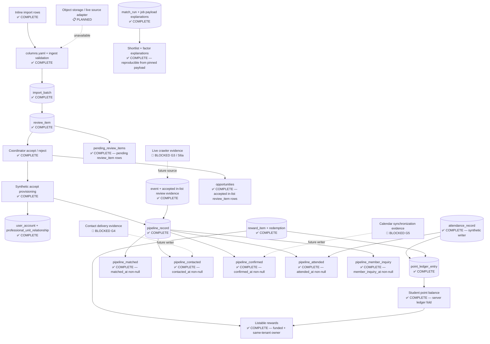

### Owning-query truth

| Read model | Owning evidence | Interpretation |
|---|---|---|
| `pending_review_items` | Pending `review_item` rows joined to `import_batch` by tenant/unit | Empty is a measured zero. |
| `opportunities` | Accepted `review_item` rows whose normalized `category` is in the ratified category list | Import-origin evidence is complete; live crawler evidence is absent. |
| Five pipeline funnel metrics | One `pipeline_record` query per registered timestamp, aggregate = exact returned-row count | `matched` has a synthetic production writer; later stage writers exist and are tested, but live outreach/calendar inputs remain blocked. |
| Student balance | Ordered `point_ledger_entry` rows folded server-side | Attendance with no credit makes balance `unknown`, not zero. |
| Match shortlist | Stored job payload + immutable match-run pins + same CP-SAT solver | If fingerprint/status reconstruction fails, shortlist is unavailable rather than approximated. |
| Event catalog | Presentable `event` rows; withheld unresolved/quarantined counts are returned separately | Fixture extraction only; no live crawl. |

## 3. Release train & gates overlay

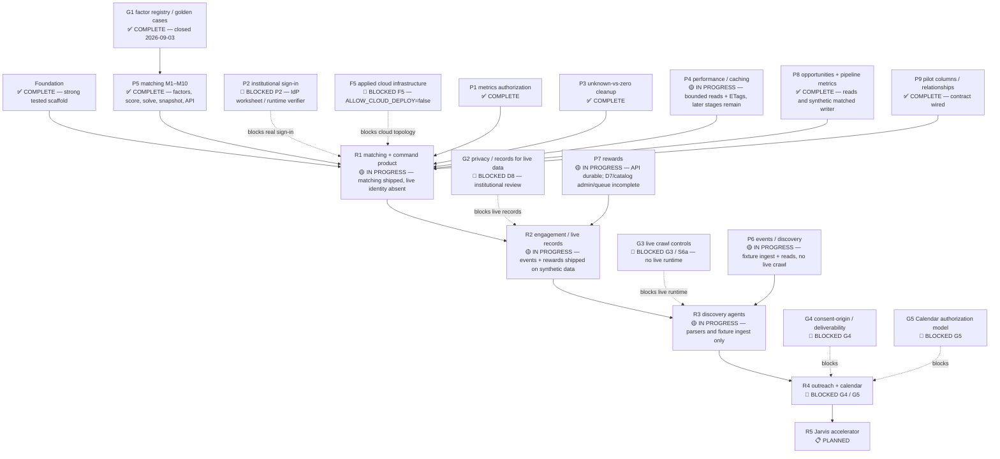

### V1–V8 continuation overlay

```mermaid
flowchart LR
  R0["R0 ratification record<br/>✅ COMPLETE"]
  V1["V1 spend reservation<br/>✅ COMPLETE — synthetic"]
  V2["V2 pilot columns<br/>✅ COMPLETE"]
  V3["V3 event discovery<br/>🟡 IN PROGRESS — fixture-only"]
  V4["V4 metrics authz<br/>✅ COMPLETE"]
  V5["V5 opportunities<br/>✅ COMPLETE"]
  V6["V6 rewards<br/>🟡 IN PROGRESS — shipped API, tentative D7"]
  V7["V7 institutional sign-in<br/>🚫 BLOCKED P2"]
  V8["V8 matching<br/>✅ COMPLETE"]

  R0 --> V1 --> V2 --> V3 --> V4 --> V5 --> V6 --> V7 --> V8
```

## 4. Activity diagrams

### 4.1 Import → quarantine → review → accept → pipeline provision

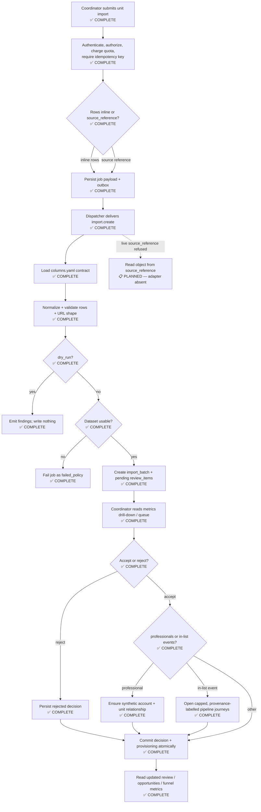

### 4.2 Match run create → score → optimize → persist snapshot

```mermaid
sequenceDiagram
  actor C as Coordinator — ✅ COMPLETE
  participant A as Match-runs API — ✅ COMPLETE
  participant S as Scoring + explanation — ✅ COMPLETE
  participant J as Job/outbox — ✅ COMPLETE
  participant D as Dispatcher — ✅ COMPLETE
  participant W as Worker handler — ✅ COMPLETE
  participant O as CP-SAT optimizer — ✅ COMPLETE
  participant M as match_run store — ✅ COMPLETE

  C->>A: POST candidate evidence, size 2–3, seed
  A->>A: Authorize unit; assert registry ready
  A->>S: Rank topic relevance + travel burden
  S-->>A: Measured and explicitly unscorable candidates
  A->>J: Persist match-run.create payload + explanations
  A-->>C: 202 job id + scored/unscorable counts
  D->>J: Claim outbox
  D->>W: Deliver identifiers
  W->>J: Re-read authoritative payload
  W->>O: Solve deterministic portfolio
  O-->>W: Status, selection, solver/model pins
  W->>M: Insert immutable snapshot
  W->>J: Commit terminal job event
  C->>A: GET persisted run
  A->>M: Read pins and job payload
  A->>O: Reconstruct identical shortlist
  A-->>C: Shortlist + factors, or explicit unavailable reason
```

### 4.3 Metrics read: funnel, opportunities, review queue

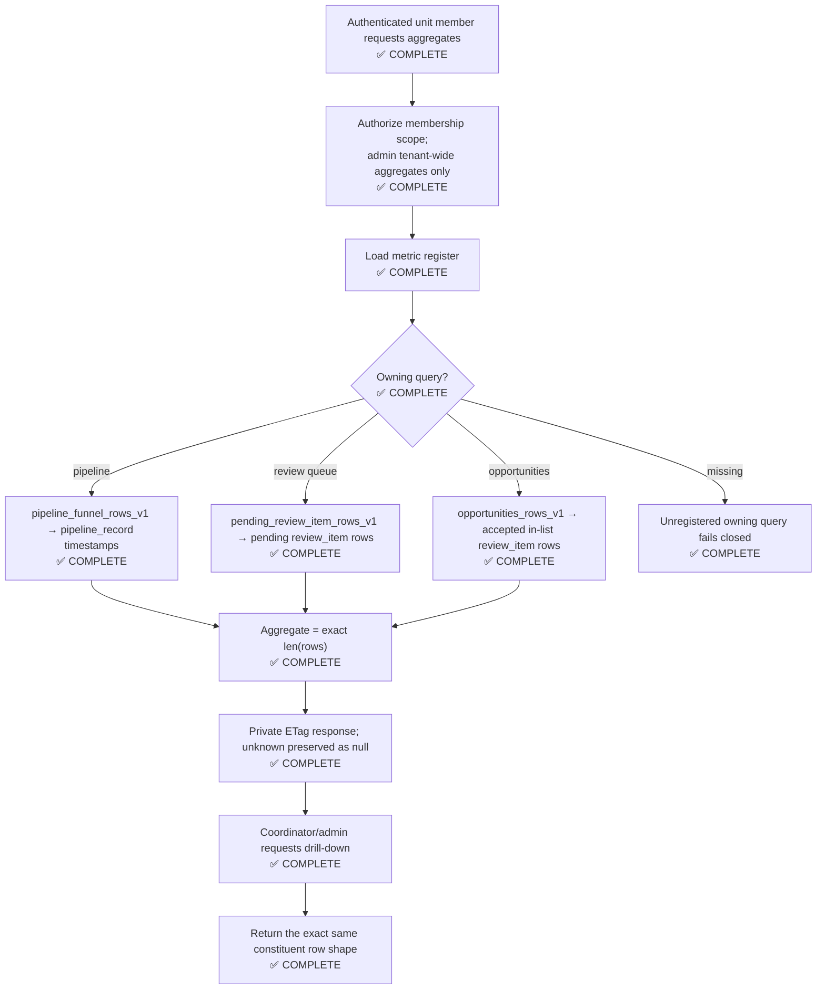

### 4.4 Event fixture ingest → catalog → tag quarantine

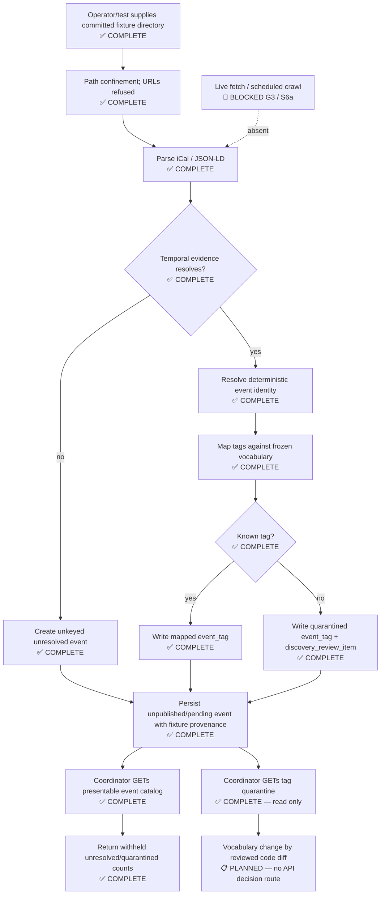

### 4.5 Rewards catalog → redemption → coordinator decision → ledger

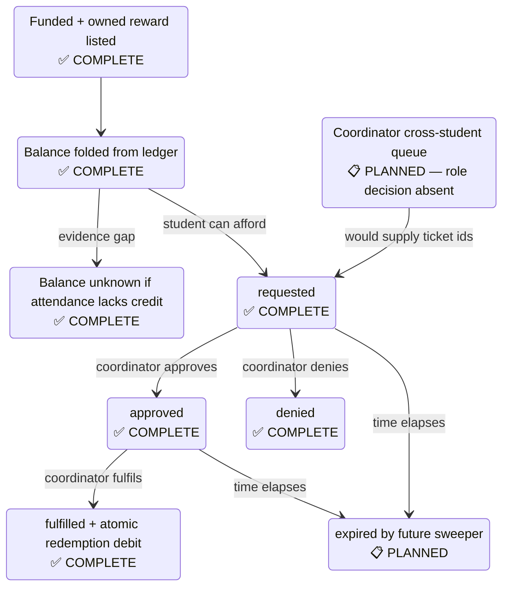

### 4.6 Job command lifecycle: outbox → dispatcher → worker handler

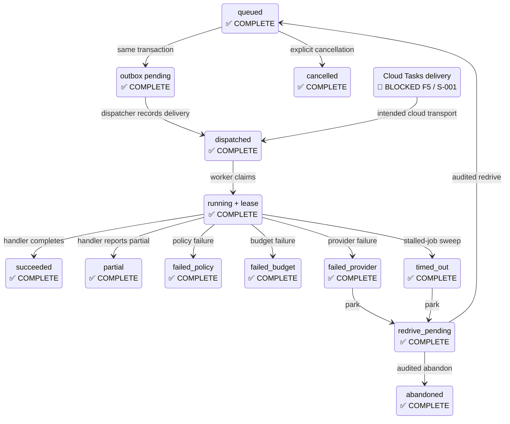

### 4.7 Authentication and authorization

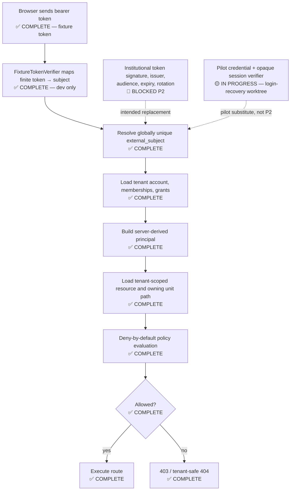

### 4.8 Pipeline stage progression

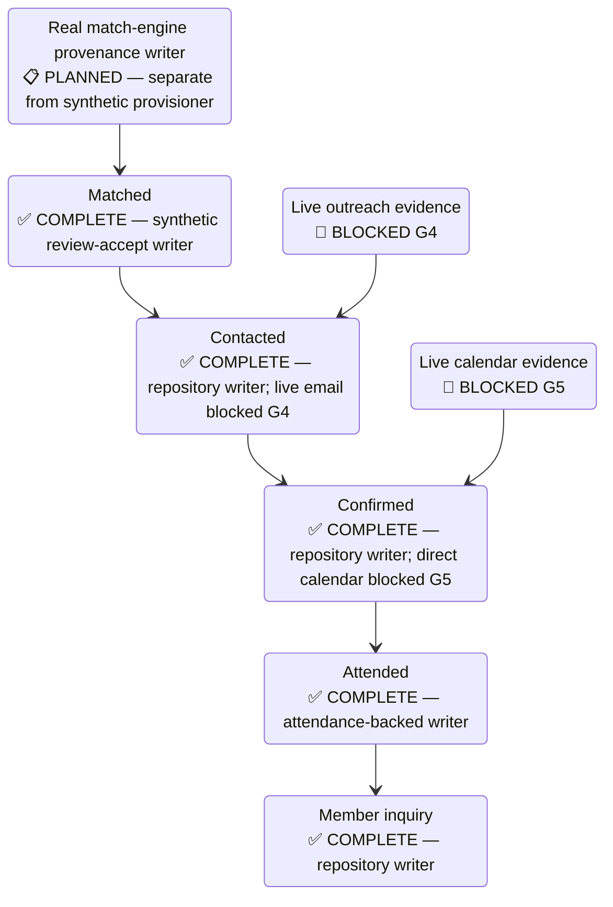

## 5. User interaction diagrams (per persona)

### 5.1 Coordinator / administrator

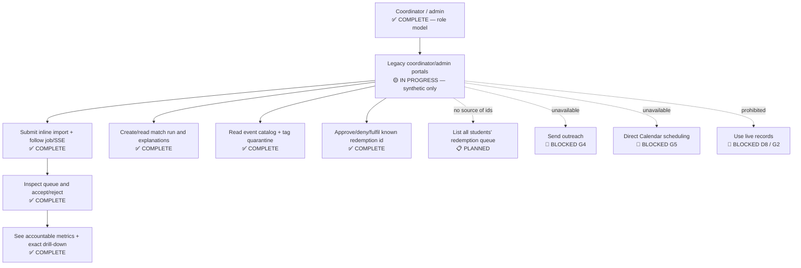

### 5.2 Student

```mermaid
sequenceDiagram
  actor S as Student — ✅ COMPLETE role
  participant P as Legacy student portal — 🟡 IN PROGRESS synthetic
  participant A as Rewards API — ✅ COMPLETE
  participant D as PostgreSQL rewards data — ✅ COMPLETE
  participant C as Coordinator — ✅ COMPLETE decision role
  participant X as Peer connection / disclosure — 📋 PLANNED

  S->>P: Open rewards
  P->>A: GET catalog + own balance
  A->>D: Fold point ledger; select funded/owned items
  D-->>A: Catalog, balance state, own tickets
  A-->>P: Server values; tentative earn-policy flag
  S->>P: Request affordable reward
  P->>A: POST item id only
  A->>D: Create one durable requested ticket
  A-->>P: Redemption snapshot and state
  C->>A: Approve / deny / fulfil known ticket
  A->>D: Transition; debit only on fulfilment
  P->>A: GET own tickets
  A-->>P: Current ticket states
  S-->>X: Events/history/connect remain partial or planned
```

### 5.3 Volunteer / professional

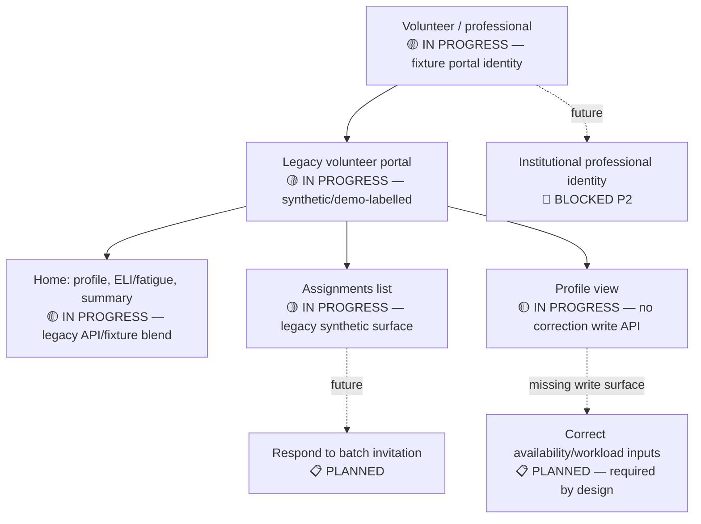

### 5.4 Engineer / operator

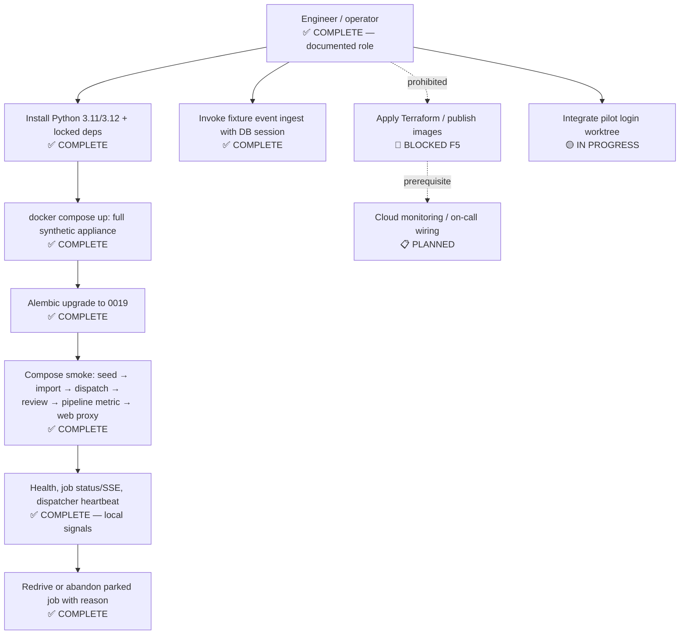

## 6. Deployment topology (local vs cloud — with blockers)

### 6.1 Local synthetic appliance

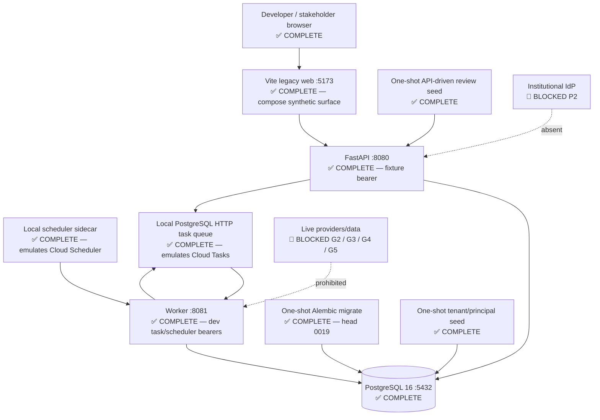

### 6.2 Intended GCP topology versus actual state

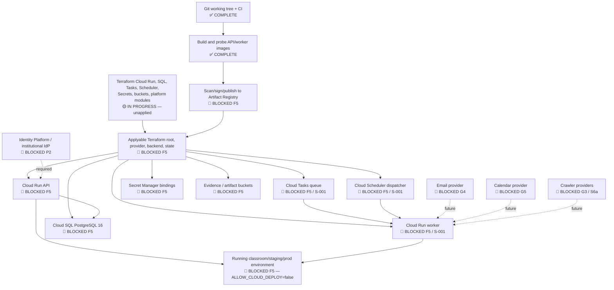

The documented GCE VM + Cloudflare Tunnel path remains a dev-edition hosting workaround, not F5, not an applied Terraform environment, and not institutional deployment.

## 7. Component status matrix

| Layer | Component / capability | Status | Evidence / limitation |
|---|---|---|---|
| Contract | OpenAPI, 18 paths / 19 operations | ✅ COMPLETE | `contracts/openapi/smartmatch.json`; generated drift check in CI. |
| API | Health and unsubscribe | ✅ COMPLETE | `/api/health`, non-mutating `/u/{token}`. |
| API | Principal self-read | ✅ COMPLETE | `routers/me.py`. |
| API | Imports | ✅ COMPLETE | Inline rows command, limits, idempotency, job payload. Object-storage reads remain planned. |
| API | Jobs and resumable SSE | ✅ COMPLETE | PostgreSQL event cursor; bounded reconnect response. |
| API | Redrive and abandon | ✅ COMPLETE | Audited reasons, role gate, quota, idempotency, state CAS. |
| API | Review decisions | ✅ COMPLETE | Conditional pending-only update; accept invokes pipeline provisioning in one transaction. |
| API | Metrics and drill-down | ✅ COMPLETE | Pipeline, review queue, opportunities owning queries; exact-row aggregates and ETags. |
| API | Match runs | ✅ COMPLETE | Create/read operations, explanations, unknown exclusion, durable command. |
| API | Events | ✅ COMPLETE | Presentable catalog and read-only tag quarantine; no crawl trigger. |
| API | Rewards and redemptions | ✅ COMPLETE | Student catalog/self-read/request and coordinator decision. No coordinator queue. |
| API | Engagement router | 📋 PLANNED | Empty APIRouter, no handlers. |
| Auth | FixtureTokenVerifier runtime | ✅ COMPLETE | Finite registered dev tokens only. |
| Auth | Institutional IdP / live JWKS selection | 🚫 BLOCKED P2 | Runtime provider builder refuses live identity. |
| Auth | Pilot password/session login | 🟡 IN PROGRESS | Migration `0020` and related behavior are in `_worktrees/login-recovery`, not main. |
| Authz | Tenant/unit deny-by-default policy | ✅ COMPLETE | Membership, subtree, explicit grants/denies, role-specific route checks. |
| Domain | ELI | ✅ COMPLETE | Hard cap and soft penalty primitives, tested. |
| Domain | Contact confidence / consent | ✅ COMPLETE | Eligibility lifecycle only; no send path. |
| Domain | Import validation | ✅ COMPLETE | Header normalization, quality findings, ratified column contract. |
| Domain | Factor registry | ✅ COMPLETE | Approved version `1.1.1-approved-g1-m6j`; two Stage B factors and availability implemented. |
| Domain | Topic relevance | ✅ COMPLETE | Measured/unknown semantics and golden tests. |
| Domain | Travel burden | ✅ COMPLETE | Straight-line coarse estimate; live route matrix blocked D3. |
| Domain | Scoring / explanations | ✅ COMPLETE | Registry guards, normalized weights, penalty complement, unknown propagation. |
| Domain | Availability eligibility | ✅ COMPLETE | Stage A filter; zero scoring weight. |
| Domain | CP-SAT optimizer | ✅ COMPLETE | OR-Tools, deterministic seed/work limit, solver/model pins. |
| Domain | Event parsing / vocabulary | ✅ COMPLETE | iCal, JSON-LD, temporal precision, deterministic identity, quarantine. |
| Domain | Rewards fold / redemption machine | ✅ COMPLETE | D7 values remain tentative, reported as such by API. |
| Domain | Pipeline invariants and writers | ✅ COMPLETE | Matched/contacted/confirmed/attended/inquiry transitions and tests. |
| Domain | ICS generation | ✅ COMPLETE | Artifact generation only; direct Calendar blocked G5. |
| Domain | Outreach dry run | 🟡 IN PROGRESS | Deterministic artifact path; no email send. |
| Persistence | Migration chain | ✅ COMPLETE | Main head `0019_redemption_durability`. |
| Persistence | Identity/org tables | ✅ COMPLETE | `tenant`, `org_unit`, `user_account`, membership and grants. |
| Persistence | Job/outbox tables | ✅ COMPLETE | Jobs, events, outbox, idempotency, redrive, leases and limits. |
| Persistence | Import/review tables | ✅ COMPLETE | `import_batch`, `review_item`, decision evidence. |
| Persistence | Pipeline tables | ✅ COMPLETE | `professional_unit_relationship`, provenance-labelled `pipeline_record`. |
| Persistence | Event tables | ✅ COMPLETE | `event`, `event_tag`, `discovery_review_item`. |
| Persistence | Match-run snapshots | ✅ COMPLETE | Immutable update trigger, version and solver pins. |
| Persistence | Engagement/rewards tables | ✅ COMPLETE | Attendance, guarded point ledger, rewards, durable redemption. |
| Worker | Dispatcher / reclaim / timeout sweep | ✅ COMPLETE | Scheduled pass and local scheduler are tested. |
| Worker | Import handler | ✅ COMPLETE | Reads authoritative persisted payload and creates review quarantine. |
| Worker | Match-run handler | ✅ COMPLETE | Solves and records immutable snapshot. |
| Worker | Fixture event ingest | ✅ COMPLETE | Direct seam from confined fixtures to persistence; not in command registry. |
| Worker | Live Cloud Tasks/Scheduler identity | 🚫 BLOCKED F5 / S-001 | Dev bearer accepts locally; deployed signature backend absent. |
| Provider | Fixture adapters | ✅ COMPLETE | Classroom/dev isolation and fixture-only inputs. |
| Provider | Object-storage import reader | 📋 PLANNED | `source_reference` live import is refused. |
| Provider | Route matrix | 🚫 BLOCKED D3 | Procurement/provider terms deferred. |
| Provider | Live crawler | 🚫 BLOCKED G3 / S6a | No network fetch runtime or HTTP trigger. |
| Provider | Email/outreach | 🚫 BLOCKED G4 | Consent lifecycle exists; delivery does not. |
| Provider | Calendar | 🚫 BLOCKED G5 | ICS only; no authorization model/API. |
| Frontend | Legacy synthetic portals | 🟡 IN PROGRESS | Coordinator/admin/student/volunteer routes; uneven API backing; synthetic-only authorization. |
| Frontend | Student rewards | ✅ COMPLETE | Server catalog, balance, progress state and durable redemption client path. |
| Frontend | Volunteer portal | 🟡 IN PROGRESS | Profile/assignments remain legacy fixture/API blend; correction writes absent. |
| Frontend | New product UI | 🚫 BLOCKED D-1–D-11 | Part 2 design and generated-client strategy unresolved. |
| Local ops | Compose appliance | ✅ COMPLETE | DB, migrate, seed, API, worker, scheduler, seed-review and web; CI smoke. |
| CI/CD | Verify and image build | ✅ COMPLETE | Tests, migration, OpenAPI, web, security, image probes and compose smoke. |
| CI/CD | Registry publication / release | 🚫 BLOCKED F5 | No image push, target registry, signing or release credential. |
| Infrastructure | Terraform modules | 🟡 IN PROGRESS | Six leaf modules plus platform composition exist; environment configs remain non-applicable. |
| Infrastructure | Applied GCP environment | 🚫 BLOCKED F5 | No provider/backend/root/state/apply; `ALLOW_CLOUD_DEPLOY=false`. |
| Data policy | Synthetic data | ✅ COMPLETE | Authorized development posture and labelled provenance. |
| Data policy | Live student records | 🚫 BLOCKED G2 / D8 | Formal institutional privacy/records review not complete. |
| Future | Jarvis typed-intent accelerator | 📋 PLANNED | R5 concept; no runtime. |

### Source index

- Capability and release framing: `README.md`
- Decision authority: `docs/decisions/pilot-decisions.md`, `docs/decisions/2026-08-31-session-ratification.md`
- P1–P9 and V1–V8 sequencing: `docs/plans/2026-08-28-plan-portfolio-index.md`, `docs/plans/2026-08-31-ratification-and-implementation-report.md`
- Engagement contract: `docs/architecture/engagement-model.md`
- Deployment posture: `docs/operations/deploy-runbook.md`, `docker-compose.yml`
- Frontend constraints: `apps/web/DESIGN.md`
- HTTP contract: `contracts/openapi/smartmatch.json`
- Main database history: `db/migrations/versions/0001_*.py` through `0019_redemption_durability.py`
- API groups: `services/api/smartmatch_api/routers/*.py`
- Domain behavior: `python/smartmatch_domain/smartmatch_domain/`
- Worker command and event ingest: `services/worker/smartmatch_worker/handlers.py`, `services/worker/smartmatch_worker/event_ingest.py`
- Latest historical audit context: `docs/status-report/2026-09-04-audit-status-report.md`
- Worktree-only pilot login: `_worktrees/login-recovery/db/migrations/versions/0020_pilot_login_credentials.py`

