# System and backend maps — 2026-10-09

Point-in-time maps of the repository at commit `d0b05adc` (main, 2026-10-09). They describe what the code does on that commit. They decide nothing and claim no production readiness.

Each map is a self-contained HTML page (open it in a browser) with an exported `.svg` beside it for inline viewing. Made with the diagram-design plugin (default skin). Facts were gathered by five read-only Haiku agents and checked against the code before use; corrections are listed at the end.

## 1. System architecture — who calls whom

[HTML](system-architecture.html). The browser reaches a Vite dev server through a Cloudflare tunnel. Vite proxies `/v1` to one of two processes built from the same API image: `api` (scope `cba`) or `api-exercise` (scope `class_exercise`). Both, and the worker, use one PostgreSQL. The API and worker never import each other; they meet in the `job` and `outbox_record` tables. Providers run as fixtures. Live adapters (Resend email, Cloud Tasks, OIDC/JWKS, paid extraction) are built but not wired, so they are **dormant**.

## 2. Workspace package dependencies

[HTML](package-dependencies.html). Six packages: `smartmatch_api` and `smartmatch_worker` on top, `smartmatch_persistence` and `smartmatch_providers` in the middle, `smartmatch_authz` and `smartmatch_domain` as leaves. `lint-imports` on this commit: 7 contracts kept, 0 broken, over 5 root packages (the worker is not one). Three imports exist that the importing package's `pyproject.toml` does not declare: api → persistence, worker → persistence, persistence → authz.

## 3. Data model — CBA platform (54 tables, clustered)

[HTML](er-cba-platform.html). The 54 tables in `smartmatch_persistence/schema.py`, grouped into eight clusters. Each arrow is one representative foreign key between two clusters, child → parent. Every table except `tenant` and `pilot_login_attempt` carries `tenant_id`, and child keys are composite `(tenant_id, x)`, so tenant isolation is enforced by the schema. The job/outbox cluster is what matching, outreach and import all point at.

## 4. Data model — class exercise (8 tables)

[HTML](er-class-exercise.html). The eight `exercise_*` tables in `smartmatch_persistence/exercise/schema.py`. A dataset owns profiles, events and team workspaces. A workspace owns profile overlays, saved settings and one result run per event. These tables have no `tenant_id` and no foreign key to `user_account` (ADR-0025 D2). Import-linter contract `pyproject.toml:228` enforces the same boundary in code.

## 5. Command, outbox and worker flow

[HTML](worker-job-flow.html). `submit_command` writes the idempotency row, the job and the outbox row in one transaction. On each scheduler tick the dispatcher leases outbox rows with `FOR UPDATE SKIP LOCKED` (60 s lease, 5 attempts, backoff `min(2^n, 300)` s) and hands each one to a task queue. The executor claims the job (10-minute lease), runs its handler and records the outcome. Only the dev loopback queue exists. `providers/registry.py:243` refuses a live Cloud Tasks queue.

## 6. Deployment topology — pilot VM

[HTML](deployment-topology.html). The one real target is a GCE VM. A push to branch `deploy` runs `deploy.yml`, which SSHes over IAP and runs `scripts/vm/deploy.sh`. That script backs up the database, migrates, and runs `docker compose up`, adding the exercise overlay when `.env` holds the workspace secret. Every port binds to `127.0.0.1`; only `cloudflared` reaches them. `infra/terraform` describes a GCP layout that has never been applied.

## Reference tables

### Handlers and job types

| Command type | Handler | Enqueued by | Status |
|---|---|---|---|
| `import.create` | `smartmatch_worker/handlers.py:438` | `routers/imports.py:296` | live |
| `match-run.create` | `handlers.py:1183` | `routers/match_runs.py:1285` | live |
| `outreach.send` | `smartmatch_worker/outreach.py:236` (composed at `main.py:476-510`) | `routers/outreach.py:704`, `cba_invitations.py:1336`, `speaker_portal.py:391` | live, fixture email only |
| `test.noop` | `handlers.py:292` | tests only | test path |
| `extraction.paid_pages` | `paid_extraction.py:218` | nothing | dormant (composed only when all spend ceilings are set) |
| event ingest | `event_ingest.py` | nothing | dormant (not a job type) |

`speaker_contact.create` is **not** a job type. It is only the idempotency scope of `POST /v1/units/{u}/speaker-contacts` (`routers/cba_contacts.py:302`, `:1093`).

### CBA table clusters (54)

| Cluster | Tables |
|---|---|
| Identity & tenancy (8) | tenant, org_unit, user_account, membership, resource_grant, pilot_credential, pilot_session, pilot_login_attempt |
| Jobs, outbox & limits (10) | job, job_event, outbox_record, idempotency_record, redrive_record, tenant_budget, rate_limit_counter, concurrency_lease, spend_ceiling_bucket, spend_reservation |
| Events & hosts (11) | event, event_tag, event_registration, event_manual_detail, event_feedback_qr, event_feedback_qr_open, cba_meeting, host_organization, host_organization_member, discovery_review_item, speaker_request_classification |
| Speakers (4) | speaker_profile, speaker_availability, speaker_availability_window, speaker_portal_invitation |
| Contact & outreach (7) | contact_channel, contact_channel_transition, contact_channel_speaker_choice, outreach_draft, outreach_send, delivery_event, suppression_record |
| Matching (4) | match_run, match_weight_setting, match_weight_setting_revision, professional_unit_relationship |
| Invitations & feedback (3) | cba_invitation_batch, cba_invitation, student_speaker_feedback |
| Attendance, rewards, import (7) | attendance_record, point_ledger_entry, reward_item, redemption, import_batch, review_item, pipeline_record |

Migrations: 46 files, one head, revision `0046_exercise_run_snapshot` (file `0046_exercise_result_run_snapshot.py`). No forward migration drops a table.

### Ports

| Service | Local (`docker-compose.yml`) | VM (`+ .vm.yml`) | Exercise (`+ .exercise.yml --profile exercise`) |
|---|---|---|---|
| db | 127.0.0.1:5432 | same | same |
| api | 127.0.0.1:8080 | same | same |
| worker | 127.0.0.1:8081 | same | same |
| web (Vite) | 127.0.0.1:5173 | same; tunnel target for the pilot host | same |
| api-exercise | not started | not started | 127.0.0.1:8090 |
| web-exercise | not started | not started | 127.0.0.1:5174; tunnel target for the exercise host |

`docker-compose.demo.yml` only changes `web` to `vite build` + `vite preview` on 5173.

## Unverified

1. Cloudflare hostname → port mapping (`pilot.plated.blog` → :5173, `exercise.plated.blog` → :5174) lives in the Cloudflare dashboard, not in git. It is taken from `docs/operations/*`.
2. Reboot risk: `scripts/vm/smartmatch.service:48` runs `up -d --remove-orphans` with the base and vm files only. A reboot may therefore remove `api-exercise` and `web-exercise`. Not reproduced on the VM.
3. Production web serving: only the Vite dev server (`web`) and `vite preview` (demo overlay) exist in git.
4. Cloud Scheduler schedule value: the terraform modules take it as an input, and no environment sets one.

## Haiku facts corrected before drawing

| Claim | Reality (checked) |
|---|---|
| `speaker_contact.create` is enqueued with no handler (orphan job) | It is never submitted as a job. `cba_contacts.py:1093` calls `_idempotency.reserve` only |
| `smartmatch_authz` is imported only by three `smartmatch_domain` modules, and nothing in `services/` imports it | `services/api` imports it in 26 files, `persistence/principals.py:19` imports it, and `smartmatch_domain` imports it in 0 files (the layers contract forbids that) |
