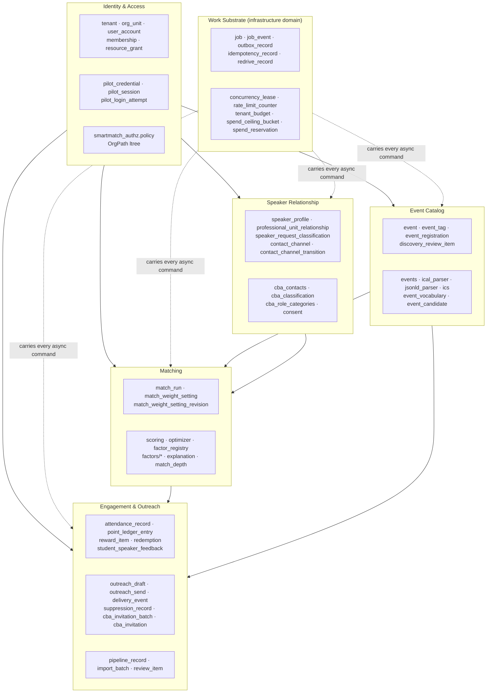

# Domain Model — As Implemented

**Stage 1 §3.** The domain as it exists today, not an idealised rewrite.
Commit `c72dced`.

---

## 1. Modelling style (OBSERVED)

`smartmatch_domain` is a **functional core**: 54 modules, no classes with
behaviour-plus-mutable-state, and no framework anywhere.

| Pattern | Count | Meaning |
|---|---:|---|
| `@dataclass(frozen=True)` value objects | **85** | Immutable values; equality by content |
| `StrEnum` vocabularies | 40+ across 24 modules | Closed vocabularies, serialisable, comparable to their wire form |
| Explicit state machines (`can_transition` / `assert_transition`) | **5** — `consent`, `jobs`, `outreach`, `rewards`, `spend` | Legal transitions declared as data, not scattered `if` statements |
| Pure decision functions | throughout | e.g. `score_candidate`, `apply_availability_filter`, `fold_balance` |

**This is not an anemic domain model.** The audit specifically looked for the
smell (data-only structures with all logic in a service layer) and did not find
it: the rules — eligibility filtering, consent transitions, ledger folding,
scoring, spend refusal — live *in* the domain package, and the persistence and
API layers call into them.

The trade-off is the mirror image: because the domain is pure and storage is
separate, an entity's *identity* lives in `schema.py` while its *rules* live in
`smartmatch_domain`. Reading "everything about a Speaker" therefore means
reading two files. That is the deliberate cost of the purity contract, not an
accident. → `dependency-analysis.md` §1.

---

## 2. Bounded contexts as implemented

The audit derives six contexts from three converging signals: module
clustering in `smartmatch_domain`, table clustering in `schema.py`, and the
`Capability` gate table in `main.py`.

---

## 3. Core concepts

### 3.1 Org unit (`org_unit`) — the universal scope

| Property | Value |
|---|---|
| Kind | **Entity**, hierarchical |
| Owner | Identity & Access |
| Representation | PostgreSQL `ltree` path (ADR-0004) |
| Rules | `smartmatch_authz/policy.py:118 OrgPath` |
| API | `/v1/units/{unit_id}/…` — **the prefix of 46 of 57 published paths** |
| Invariant | Every unit-scoped operation authorizes against the unit's ltree path before touching a row; `units.load_unit_or_404` makes the 404-vs-403 decision once |

**OBSERVED.** The org unit is the single most load-bearing concept in the
system. Multi-tenancy, authorization scope, and URL structure are all the same
tree. `units.MAX_SUBTREE_UNITS` bounds subtree expansion in SQL.

### 3.2 Principal, Membership, Resource grant

| Concept | Kind | Defined | Notes |
|---|---|---|---|
| `Principal` | Value object | `authz/policy.py:205` | Assembled server-side from `user_account` + `membership`; **never** from the request |
| `Membership` | Entity | `authz/policy.py:170`, `schema.py:165` | Role at an `OrgPath`, optionally covering the subtree |
| `ResourceGrant` | Entity | `authz/policy.py:196`, `schema.py:190` | Explicit per-resource grant, the escape hatch from role-only access |
| `AccessDecision` | Value object | `authz/policy.py:239` | `Effect` (deny-by-default) + reason |

**OBSERVED — invariant.** Deny by default. `evaluate()` returns a decision;
`assert_allowed()` raises `AuthorizationError`. `scan_forbidden.py` rule at
line 166 makes it a build failure to read `tenant_id`/`user_id`/`student_id`/
`professional_id` from a request body.

### 3.3 Job (`job`) — the unit of asynchronous work

| Property | Value |
|---|---|
| Kind | **Entity with an explicit lifecycle** |
| Rules | `smartmatch_domain/jobs.py` (128 lines, fan-in 17) |
| Persistence | `job` + `job_event` + `outbox_record` + `idempotency_record` + `redrive_record` |
| States | **12**: `queued`, `dispatched`, `running`, `succeeded`, `partial`, `failed_provider`, `failed_budget`, `failed_policy`, `cancelled`, `timed_out`, `redrive_pending`, `abandoned` |
| Concurrency | lease + generation columns (migration `0004`); CTE claim with `SKIP LOCKED` (ADR-0005) |
| Idempotency | `Idempotency-Key` → `idempotency_record`; deterministic task names (ADR-0007) |

**INFERRED — this is the strongest-modelled concept in the system.** Three
distinct failure modes are separate states (`failed_provider`, `failed_budget`,
`failed_policy`) rather than one `failed` with a message, which means "why did
this fail" is queryable, not greppable. `partial` as a first-class terminal
state is unusual and correct for batch work.

### 3.4 Event (`event`)

| Property | Value |
|---|---|
| Kind | **Entity** with a value-typed time |
| Rules | `domain/events.py` (578 lines), ADR-0010 (temporal model), ADR-0012 (identity + tag vocabulary) |
| Time model | Sum type: `ExactTime` \| `DateOnlyTime` \| `UnresolvedTime`, with `TimePrecision` and `precision_of` / `is_resolved` / `resolved_date` |
| Identity | `EventIdentityKey` + `resolve_identity_key()` — dedupe across ingestion sources |
| Provenance | `EventProvenance` — where this event came from |
| Tag governance | `event_tag` + a **quarantine** for unknown tags, exposed at `GET /v1/units/{id}/tag-quarantine` |

**OBSERVED — exemplary modelling.** Rather than a nullable `start_time` with an
implicit "we don't know" convention, uncertainty is a *type*. A caller cannot
read a time without deciding what to do about `UnresolvedTime`. Ingestion from
iCal (`ical_parser.py`, 557 lines) and JSON-LD (`jsonld_parser.py`, 960 lines)
both produce these types.

### 3.5 Speaker / professional contact

**OBSERVED — terminology hazard, actively managed.** This concept carries the
most overloaded vocabulary in the repository:

| Term | Where | Means |
|---|---|---|
| `speaker_profile` | `schema.py:1961` | The person a student hears from |
| `professional_unit_relationship` | `schema.py:974` | A professional's relationship to a unit |
| `contact_channel` | `schema.py:1565` | An addressable way to reach a person + its consent state |
| "Speaker Connector" | customer §13 | The **role** that maintains the roster |
| "Event Host" | customer §12 | The role that files a Speaker Request |
| `cba_contacts` | domain + persistence + router | The CBA-scoped roster |
| `Specialist` | `apps/web/.../lib/api.ts:1` | **Legacy IA-West term, still in frontend types** |

The repository is aware of this and gates it: `tools/scan_cba_terminology.py`
fails the build when CBA-visible copy still says *IA West*, *Insights
Association*, *chapter*, *Chapter Admin*, *Member Portal*, *volunteer
opportunity*, or *membership/dues*. Critically, the scanner is **scoped** — it
reads the frontend source and a named list of backend files whose string
literals are rendered — so it does not demand renaming the authorization
`membership` row or the `ia_west_legacy` scope that exists precisely because CBA
is the other product.

**RISK (R-06).** `Specialist`, `CppEvent`, `CrawlerEvent` remain as exported TS
interfaces in `lib/api.ts`. They are types, not copy, so the terminology scanner
does not see them. They will be read by the next agent as current vocabulary.

### 3.6 Contact channel + consent — the privacy core

| Property | Value |
|---|---|
| Kind | **Entity with an explicit, escalation-aware state machine** |
| Rules | `domain/consent.py` (303 lines), ADR-0014 (disclosure consent) |
| States | `ContactState` (StrEnum) |
| Source | `ConsentSource` (StrEnum) — how consent was obtained |
| Transitions | `can_transition`, `assert_transition`, `is_escalation` |
| Send gate | `is_send_eligible` / `assert_send_eligible`, raising `ConsentViolationError` |
| Persistence | `contact_channel` + `contact_channel_transition` (migration `0023` — the transition **log**, not just current state) |
| API | `POST …/outreach/contacts/{id}/transitions` and `POST …/speaker-contacts/{pid}/channels/{id}/transitions` |

**OBSERVED — invariant, e2e-verified.**
`tests/e2e/…::test_18_a_contact_without_approved_consent_cannot_be_composed_for`
and `test_21_a_recipient_who_unsubscribes_after_approval_is_not_written_to`.
Consent is checked at composition *and* at send.

**OBSERVED.** `is_escalation` exists as a separate predicate — the model
distinguishes *widening* consent from *narrowing* it, which is the distinction
most consent implementations miss.

### 3.7 Match run

| Property | Value |
|---|---|
| Kind | **Entity — an immutable snapshot of a decision** |
| Rules | `domain/match_run.py`, `domain/scoring.py` (671), `domain/optimizer.py` (371, OR-Tools CP-SAT), `domain/factor_registry.py` (722) |
| Reproducibility | `weights_fingerprint()` + `inputs_fingerprint()` + `MatchRunPins` |
| Persistence | `match_run` (snapshot, migration `0018`), `match_weight_setting` + `_revision` (`0027`), `scoring_mode` (`0032`) |
| Gate | `assert_registry_approved()` — **fails closed** unless `REGISTRY_STATUS == "approved"` |
| Explanation | `domain/explanation.py` (687 lines) — per-factor, accountable |

**OBSERVED — G1 is now CLOSED.** `factor_registry.py:149` reads
`REGISTRY_STATUS = "approved"`, with a named approver at line 154
(`REGISTRY_APPROVER`). The registry also carries `SUPERSEDED_G1_MODEL`,
`SUPERSEDED_REGISTRY_VERSION`, `SUPERSEDED_SCORING_KEYS` — superseded models are
retained rather than deleted, and `docs/architecture/registry-supersession-record.md`
records why.

**OBSERVED — invariant, e2e-verified.** ADR-0011 ("accountable numbers"):
`test_11_no_score_is_presented_as_a_percentage`,
`test_12_an_unknown_factor_is_null_and_a_real_zero_is_zero`.
A score has provenance or it is `null`; it is never fabricated, and `null` is
never rendered as `0`. `scan_forbidden.py:69` makes a hard-coded literal score
assignment a build failure.

**This is the most distinctive design commitment in the codebase.**

### 3.8 Engagement: attendance → points → redemption

| Concept | Kind | Rules | Persistence |
|---|---|---|---|
| `attendance_record` | Entity | `domain/attendance.py`, `domain/checkin.py` | `schema.py:433` |
| `LedgerEntry` / `point_ledger_entry` | **Event-sourced ledger** | `domain/rewards.py:129-248` | `schema.py:481` |
| `RewardItem` | Entity | `rewards.py:301` | `schema.py:543` |
| `Redemption` | Entity + state machine (`RedemptionState`) | `rewards.py:449` | `schema.py:597`, durability in `0019` |

**OBSERVED — invariant (ADR-0013).** Attendance is the *only* input to points.
`main.py`'s router table states it twice, and the registration routes on
`student_events.py` deliberately write `event_registration` and **never**
`attendance_record`.

**OBSERVED — the ledger is append-only, and enforced.** Balance is
`fold_balance(entries)` — derived, never stored. Migration `0014` added a
reversal target; migration **`0015` removed unauthorized ledger reversal**.
Reading those two migrations together: reversal was added, then constrained.

### 3.9 Spend / budget

| Property | Value |
|---|---|
| Kind | Entity + state machine |
| Rules | `domain/spend.py` (670 lines) — `SpendReservationState`, `BucketType`, `RefusalReason`, `Refused`, `SpendReservationReceipt`, `AbandonedReservationSnapshot` |
| Persistence | `tenant_budget`, `spend_ceiling_bucket`, `spend_reservation` (migration `0010`) |
| Invariant | **ADR-0015: charge the quota *before* the refusal.** |

**OBSERVED.** ADR-0015 is a subtle and correct decision: a caller who is
refused still consumes quota, so refusal cannot be used as a free probe. This
is implemented in `dependencies.charge_quota` / `QuotaCharge`
(`dependencies.py:224,245`), not left to each router.

`AbandonedReservationSnapshot` and `spend_sweeper.py` exist for reservations
that are never resolved — see `wip-analysis.md` §4 for the sweeper's status.

### 3.10 Outreach draft → send → delivery

| Concept | Kind | States |
|---|---|---|
| `OutreachTemplate` | Value object, **closed registry** (`get_template(id)`) | — |
| `ComposedDraft` / `outreach_draft` | Entity | `DraftStatus`, `ContentStatus` |
| `outreach_send` | Entity | `SendDisposition` |
| `delivery_event` | Event log | `DeliveryEventType` |
| `suppression_record` | Entity | — |

**OBSERVED — invariant, e2e-verified.**
`test_19_the_send_is_a_command_and_reports_no_status`: the API accepts the
send and returns a job id; it does **not** report delivery. Delivery is a
later `delivery_event`. This is the correct modelling of an operation the
system cannot synchronously know the outcome of.

**OBSERVED.** Templates are a closed registry, so message bodies cannot be
caller-supplied. `EligibilityEvidence` is attached to a draft — the record of
*why* this recipient was writable-to at composition time.

### 3.11 Pipeline record (the S12 funnel)

| Property | Value |
|---|---|
| Kind | Entity with staged progression |
| Rules | `domain/pipeline.py` (371), `domain/metrics.py` (292) |
| Persistence | `pipeline_record` (`0011`), provenance (`0016`) |
| API | `POST …/pipeline-records/{id}/stages`, read via `…/metrics` |

**OBSERVED.** `main.py` classifies `pipeline.router` under `DISCOVERY_METRICS`
with the argument that *"a reader wondering where a non-zero
`pipeline_confirmed` could come from should find the two next to each other"* —
the writer and the reader of the same table are deliberately co-located.

---

## 4. Ambiguous / overloaded terminology (OBSERVED)

| Term | Distinct meanings | Where they collide |
|---|---|---|
| **membership** | (a) authz role assignment `membership`; (b) IA-West chapter dues, a *retired product concept* | `scan_cba_terminology.py` must carve (a) out of its scan explicitly |
| **event** | (a) `event` — a real-world happening; (b) `job_event` — a job lifecycle record; (c) `delivery_event` — an email delivery signal; (d) `contact_channel_transition` — arguably a fourth | Four unrelated things called "event" in one schema |
| **speaker / professional / contact / specialist** | see §3.5 | four names, overlapping referents |
| **review** | (a) `review_item` — import quarantine; (b) `discovery_review_item` — event discovery quarantine | Two tables, two routers-worth of behaviour, one word |
| **match** | (a) `match_run` — the process; (b) `match_weight_setting` — its configuration; (c) `industry_match`/`role_match` — factors | Manageable, but "matching weights" vs "match run" reads as one thing |
| **scope** | (a) `ProductScope` (which product); (b) authorization scope (which units) | `product_scope.py` vs `policy.py` |

**RECOMMENDATION.** Do not rename tables. Do produce a **domain glossary** that
states, per term, which meaning belongs to which context — the cost of these
collisions is paid by every new reader, and a glossary is a one-time payment.
→ Stage 2, `docs/architecture/GLOSSARY.md`, migration increment M1.

---

## 5. Invariants with no identified test protection

The audit cross-referenced stated invariants against `tests/`. Most are
covered. These were **not** matched to a test:

| Invariant | Stated where | Coverage found |
|---|---|---|
| `MaxBodySizeMiddleware` rejects a *lying* `Content-Length` (chunked body over the bound) | `main.py:107` docstring, branch 2 | **UNKNOWN** — no test file name matched; the honest-declaration branch is the obvious one to test and the buffering branch is the subtle one |
| `spend_sweeper` reclaims abandoned reservations | `spend_sweeper.py` | **UNKNOWN** — see `wip-analysis.md` §4 |
| The frontend never renders a `null` score as `0` | ADR-0011 | Backend side is e2e-covered (`test_12`); the **frontend** side has 8 test files, none of which is executed by CI (`repository-inventory.md` §8) |

These are recorded as UNKNOWN rather than as gaps: a matching test may exist
under a name the audit's search did not associate. → `risk-register.md` R-11.

---

## 6. Data ownership — the unanswered question

**OBSERVED.** All 43 tables are defined in one module and there is no statement
anywhere of which context owns which table. In practice ownership is inferable
(§2's clustering), but it is inferred, not declared.

The consequence is concrete: `routers/match_runs.py` both submits a command
*and* writes rows directly (`dependency-analysis.md` §4), and nothing in the
repository says whether the match-run tables are the API's to write or the
worker's. Today both write them.

**RECOMMENDATION.** Declare table ownership per context, as data, and derive
the persistence module layout from it rather than the reverse. This is the
prerequisite for any useful split of `schema.py`. → Stage 2 **AP-03**.
