# Stitch mock-ups: "The invitation desk"

**Status:** mock-ups only. Nothing here is wired into `apps/web`.
The owner has not yet made the build or no-build call.
**Round:** 2026-09-26. 24 images (20 desktop, 4 mobile), all WebP and each 19–227 KB,
plus 24 HTML/Tailwind exports kept for reference in [`assets/stitch/code/`](assets/stitch/code).
**Rules:** [`DESIGN.md`](DESIGN.md) wins over any image, and over the archived prompts.

## 1. How they were made

| Item | Value |
|---|---|
| Tool | Google Stitch remote MCP server (`https://stitch.googleapis.com/mcp`), called over JSON-RPC. The key lives in the user-scope MCP config, never in this repo |
| Model | `GEMINI_3_8_FLASH` (Stitch "Gemini 3.8 Flash", `PRO_AGENT`) for every screen |
| Device types | `DESKTOP` (the archived "1280") and `MOBILE` (the archived "390") |
| Stitch project | Private, owner-only: `projects/4736179568401651070` |
| Design system | Built once from live `DESIGN.md` with `upload_design_md` and `create_design_system_from_design_md` (asset `a4870f122d954bdb8346183743ba5466`). Every screen used it |
| Prompt per screen | The Stitch style preamble and the shared fictional data from the [archived prompt README](../../archive/design/class-exercise/prompts/README.md), then the page's archived Stitch prompt, then the `DESIGN.md` overrides in section 5, then fixed guard rules (no nav bar, photos or people; no invented copy; exact ribbon text; no per-person numbers; data wording) |
| Post-processing | Screenshot scaled to 1280 px wide (desktop) or 780 px, which is 390 at 2x (mobile), saved as WebP q82. HTML saved as-is after a scan for keys and trackers |

**Did the design-system ingest help?** Partly.

1. **What it did well:** every screen used the eggwhite page, white cards, CPP Green actions, the gold-wash ribbon, the Bay-brown control outlines and the 4 px spacing scale. No screen needed a colour fix.
2. **What it got wrong:** it turned the tokens into a Material palette (`primary #00371f`, `background #f8faf5`), so the prompts still had to state each hex.
3. **Fonts:** it recorded the licensed families (Transducer CPP, Proxima Sera, Usual), which a browser cannot load. When a screen did not also load the stand-ins, text fell back to system fonts. See flaws F1 and F2.

**HTML exports:** 0 API keys and 0 trackers. Each file loads only Tailwind from `cdn.tailwindcss.com`, Lucide from `unpkg.com` and Google Fonts. None loads remote images. They are reference only.

## 2. Gallery

Fidelity scale, as in the archived sheet: **High** means the screen follows `DESIGN.md` tokens, type, layout and the prompt's states. **Medium** means it follows the system with a gap, which the note names.
"Archived" is the Claude-authored HTML render of the same prompt, in
[`../../archive/design/class-exercise/assets/generated/claude-html/`](../../archive/design/class-exercise/assets/generated/claude-html).
Every row's tool is **Stitch · `GEMINI_3_8_FLASH`**.

### 2.1 Priority pages (desktop and mobile)

| Image | Device | Prompt | Fidelity | Compared with the archived render |
|---|---|---|---|---|
| 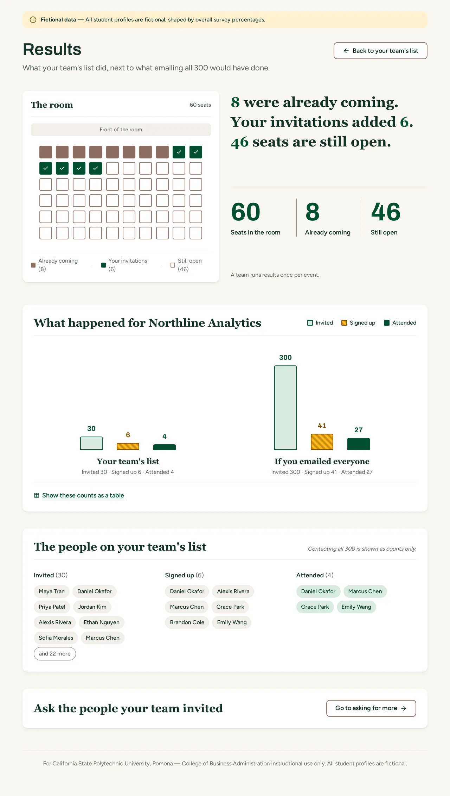 | DESKTOP | [`pages/08-final-setting-and-results.md`](../../archive/design/class-exercise/prompts/pages/08-final-setting-and-results.md) (screen B) | High. Seats show 8 / 6 / 46, the three-line serif headline has green numerals, and the ruled figures band is present. Regenerated once (R1) | [`08-…-1280`](../../archive/design/class-exercise/assets/generated/claude-html/08-final-setting-and-results-1280.webp): same structure. Stitch draws larger seats and a two-row legend, and adds each panel's counts as a caption. It keeps the same shared-axis "sliver" bars (archived flaw 1). It drops the CPP logo placeholder and adds the license line as a footer |
| 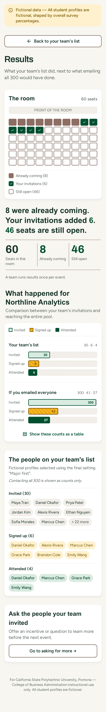 | MOBILE | same | Medium. It has the room, the horizontal bars and the chips. Flaws F1 and F3 remain (R2) | [`08-…-390`](../../archive/design/class-exercise/assets/generated/claude-html/08-final-setting-and-results-390.webp): the Stitch horizontal bars read better than the archived slivers. The archived version keeps the serif headline, which Stitch lost |
| 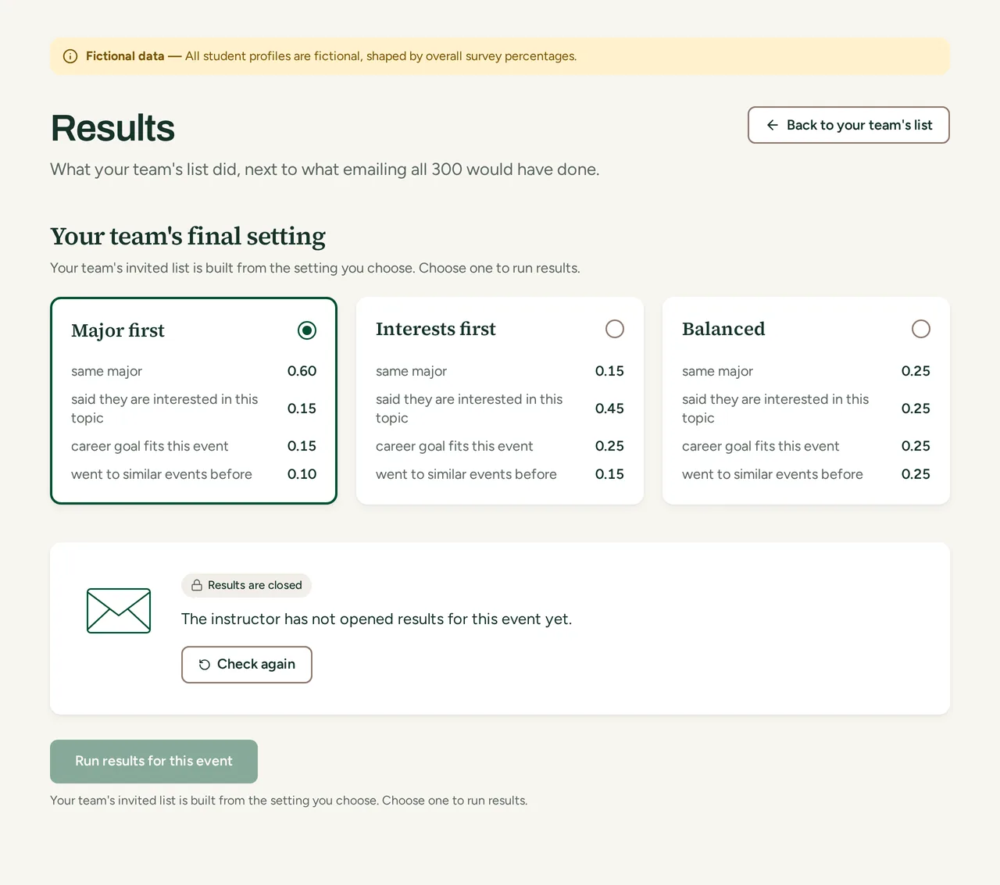 | DESKTOP | same (screen A) | High. The radio cards show weights only, the locked panel is calm, and the disabled run button carries its reason underneath. Regenerated once (R3) | [`08-…-locked-1280`](../../archive/design/class-exercise/assets/generated/claude-html/08-final-setting-and-results-locked-1280.webp): near-identical layout. Stitch repeats the helper line under the button, which matches `aria-describedby` intent |
| 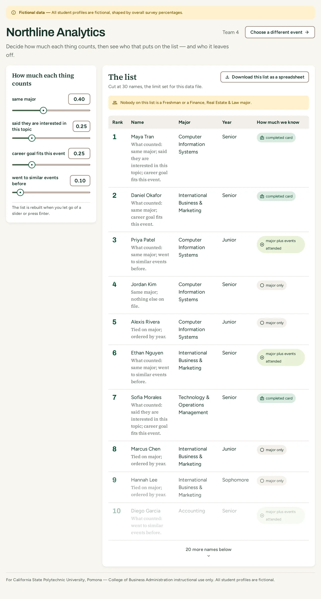 | DESKTOP | [`pages/04-ranked-list-and-sliders.md`](../../archive/design/class-exercise/prompts/pages/04-ranked-list-and-sliders.md) | High. Sliders sit beside the list with number boxes, and the markers use icon plus words. Side margins are 24 px, not 64 px | [`04-…-1280`](../../archive/design/class-exercise/assets/generated/claude-html/04-ranked-list-and-sliders-1280.webp): the Stitch name column is wider, so reason lines wrap to 3–6 lines against the archived 6–12. Stitch fades row 10 as the prompt asked. The archived version shows 12 rows |
| 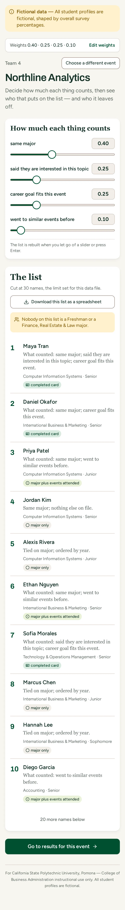 | MOBILE | same | High. It has the compact "Weights 0.40 · 0.25 · 0.25 · 0.10 · Edit weights" bar, stacked rows, and the next-step button | [`04-…-390`](../../archive/design/class-exercise/assets/generated/claude-html/04-ranked-list-and-sliders-390.webp): same content order. Stitch put the sticky bar above the title rather than pinned. The screen was cropped from a desktop-width canvas (F4) |
| 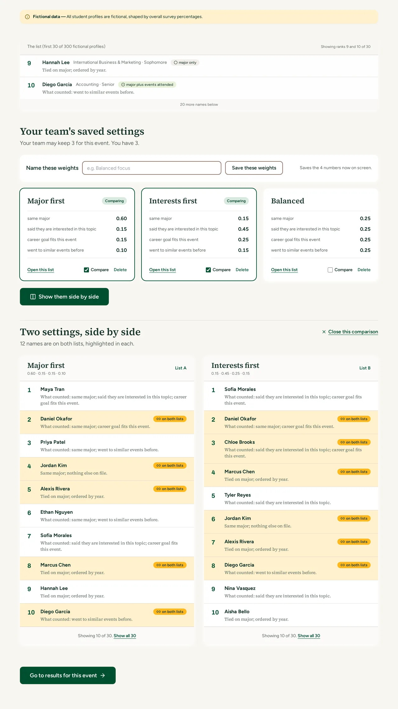 | DESKTOP | [`pages/05-save-and-compare.md`](../../archive/design/class-exercise/prompts/pages/05-save-and-compare.md) | High. Three cards, 2 marked "Comparing", Delete in quiet green (the `DESIGN.md` override), and gold overlap rows. It adds small labels "List A" / "List B" and an input placeholder (F5) | [`05-…-1280`](../../archive/design/class-exercise/assets/generated/claude-html/05-save-and-compare-1280.webp): equivalent. Stitch adds each setting's weights under the list title, which helps comparison |
| 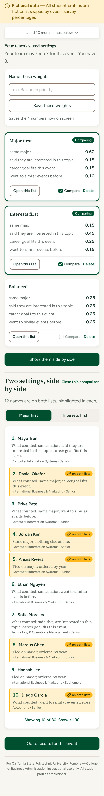 | MOBILE | same | Medium. It has the segmented "Major first \| Interests first" control and the summary above it. The overlap rows carry a left gold stripe, which §6.20 forbids | [`05-…-390`](../../archive/design/class-exercise/assets/generated/claude-html/05-save-and-compare-390.webp): the archived render shows only the compare zone. Stitch shows the whole lower zone (save form, cards, compare) |
| 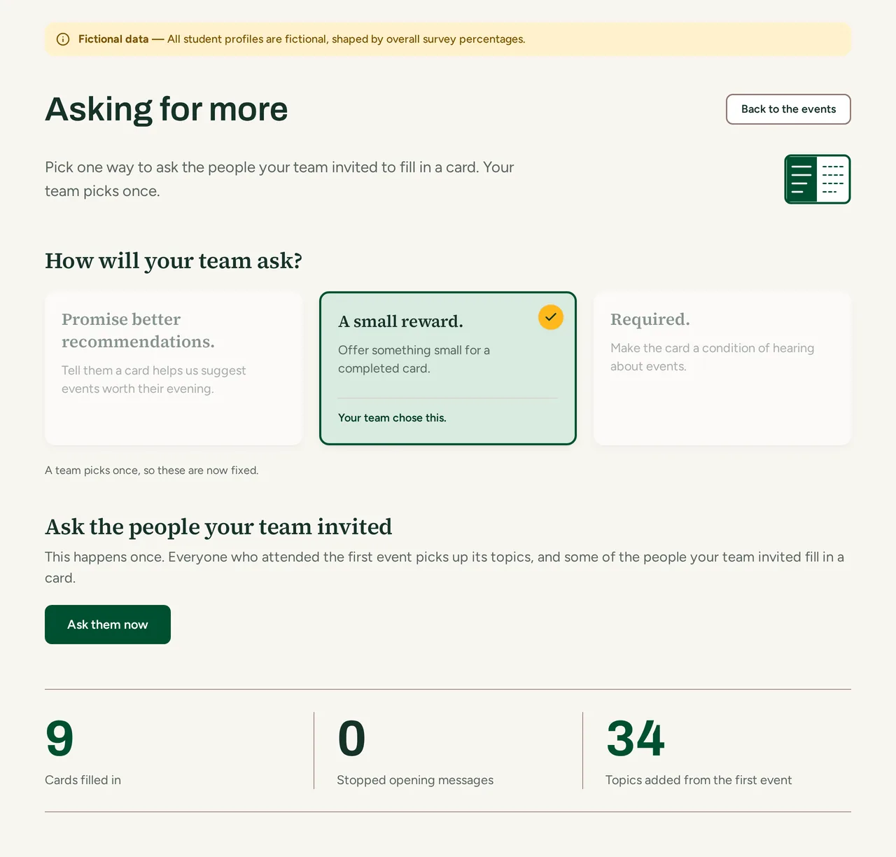 | DESKTOP | [`pages/09-asking-for-more.md`](../../archive/design/class-exercise/prompts/pages/09-asking-for-more.md) | High. The chosen card has the gold seal and the others fade. It has the pictogram beside the lead and the ruled 9 / 0 / 34 band | [`09-…-1280`](../../archive/design/class-exercise/assets/generated/claude-html/09-asking-for-more-1280.webp): same. Stitch adds the half-filled card pictogram that the archived render left out |
| 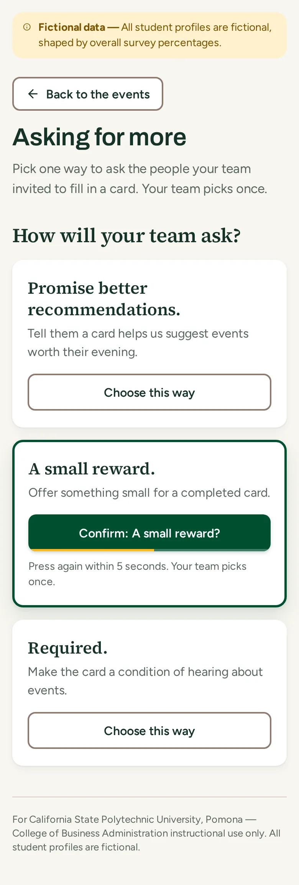 | MOBILE | same, plus the §6.18 inline confirm | High. It shows the "Confirm: A small reward?" button, a half-spent countdown underline, and "Press again within 5 seconds." No pop-up | [`09-…-390`](../../archive/design/class-exercise/assets/generated/claude-html/09-asking-for-more-390.webp): same moment, rendered as tidily. Cropped from a desktop-width canvas (F4) |

### 2.2 Remaining pages (desktop)

| Image | Device | Prompt | Fidelity | Compared with the archived render |
|---|---|---|---|---|
| 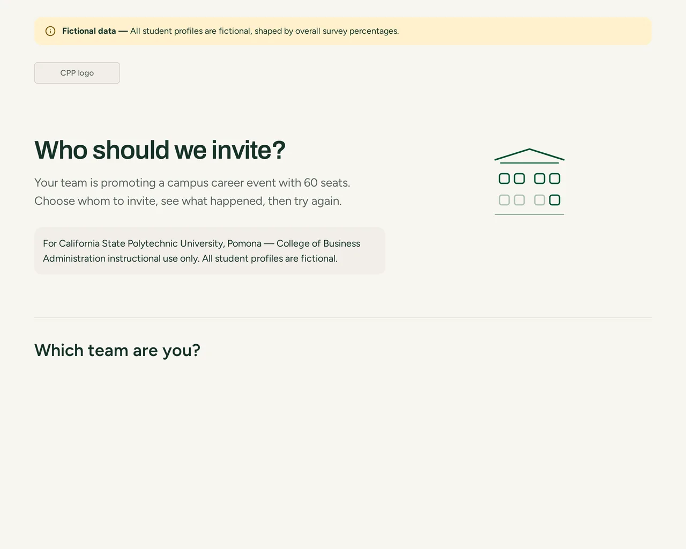 | DESKTOP | [`pages/01-opening.md`](../../archive/design/class-exercise/prompts/pages/01-opening.md) | High. It has "Who should we invite?", the license line in a sunk card, and the lecture-hall pictogram. "Which team are you?" fell back to sans (F2) | [`01-…-1280`](../../archive/design/class-exercise/assets/generated/claude-html/01-opening-1280.webp): same. The Stitch pictogram is simpler |
| 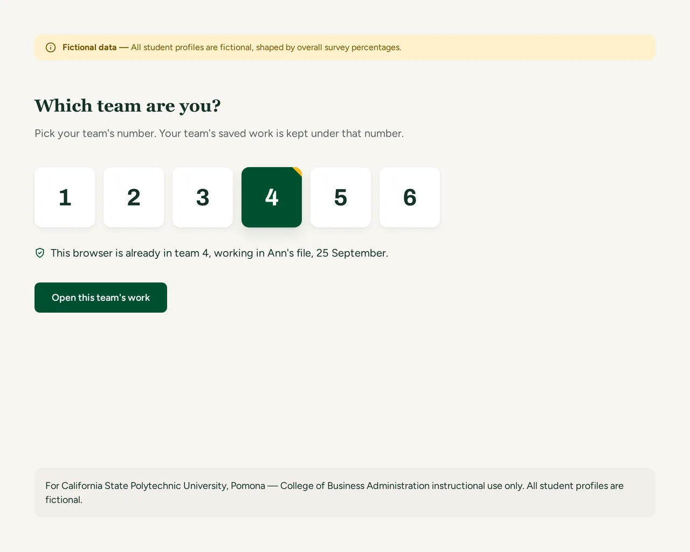 | DESKTOP | [`pages/02-team-entry.md`](../../archive/design/class-exercise/prompts/pages/02-team-entry.md) | High. Six place-card tiles, team 4 in green with the gold notch, and the badge line | [`02-…-1280`](../../archive/design/class-exercise/assets/generated/claude-html/02-team-entry-1280.webp): equivalent |
| 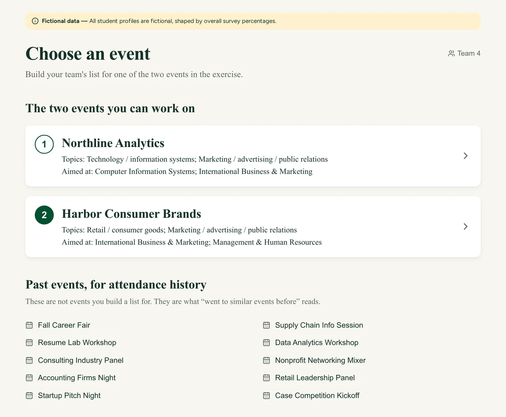 | DESKTOP | [`pages/03-event-picker.md`](../../archive/design/class-exercise/prompts/pages/03-event-picker.md) | Medium. Layout, seals and the past-events list are right, but the title, lead and meta lines render in a Times-like fallback (F1, R4) | [`03-…-1280`](../../archive/design/class-exercise/assets/generated/claude-html/03-event-picker-1280.webp): the archived render has the correct type roles |
| 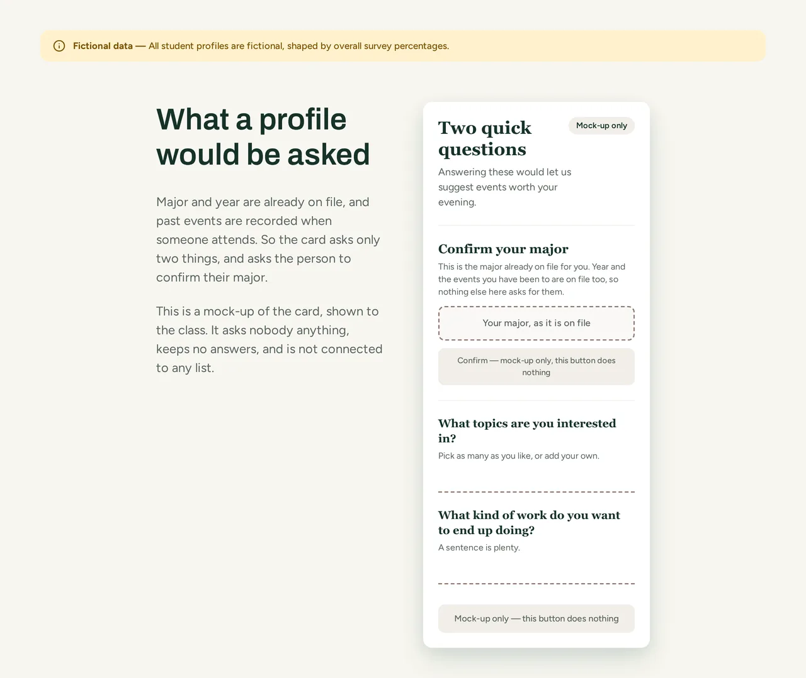 | DESKTOP | [`pages/06-profile-card-mockup.md`](../../archive/design/class-exercise/prompts/pages/06-profile-card-mockup.md) | High. Standard ribbon, the mock-up sentence moved to the caption, 48 px title and no pictogram, all per the `DESIGN.md` overrides | [`06-…-1280`](../../archive/design/class-exercise/assets/generated/claude-html/06-profile-card-mockup-1280.webp): Stitch's inert buttons have a sunk fill, which fixes archived flaw 3 (low contrast) |
| 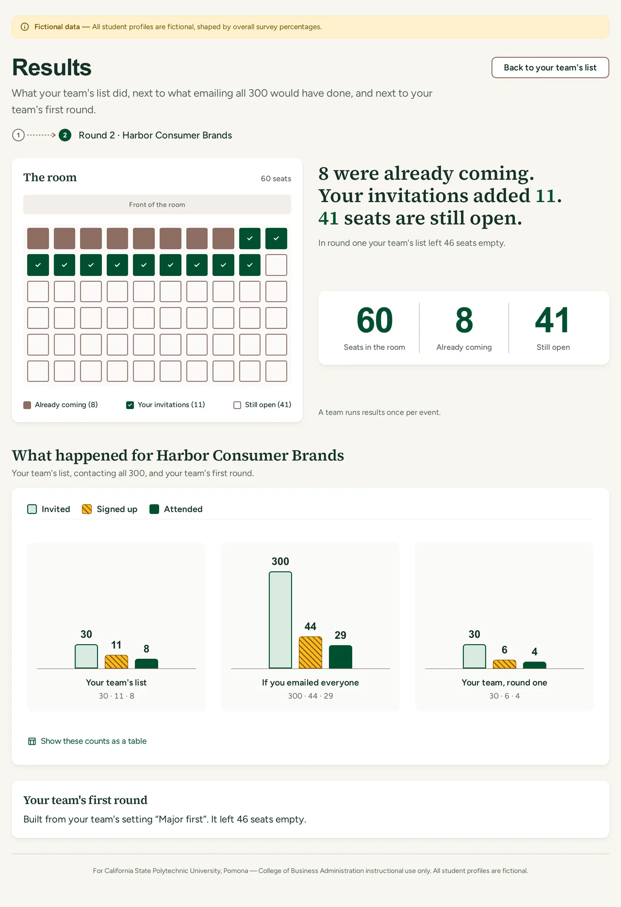 | DESKTOP | [`pages/10-round-two-comparison.md`](../../archive/design/class-exercise/prompts/pages/10-round-two-comparison.md) | Medium. It has the 8 / 11 / 41 room, the round strip and the round-one line. The figures band sits in a card, and the chart panels are cards inside a card (§10) | [`10-…-1280`](../../archive/design/class-exercise/assets/generated/claude-html/10-round-two-comparison-1280.webp): Stitch splits the chart into three panels, so the team's bars are less of a sliver than in the archived render |
| 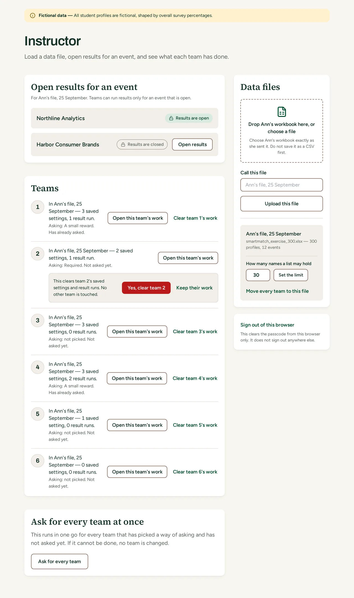 | DESKTOP | [`pages/11-instructor.md`](../../archive/design/class-exercise/prompts/pages/11-instructor.md) (screen B) | Medium. Unlock comes first, data files sit on the right, and the team 2 inline confirm is the only red. Team rows wrap to 3–4 lines | [`11-instructor-1280`](../../archive/design/class-exercise/assets/generated/claude-html/11-instructor-1280.webp): same cramped team rows as archived flaw 2. Stitch's "Clear team N's work" follows the green-quiet override |
| 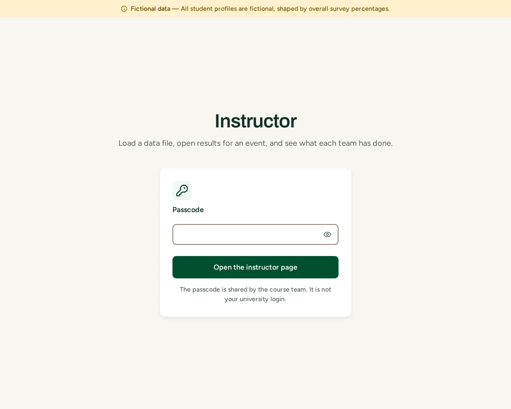 | DESKTOP | same (screen A) | High. Centred 480 px card, key icon, show/hide toggle, and the "not your university login" helper | [`11-instructor-passcode-1280`](../../archive/design/class-exercise/assets/generated/claude-html/11-instructor-passcode-1280.webp): equivalent. Stitch's ribbon runs full-bleed without the card radius |

Not generated: [`pages/07-points-counter.md`](../../archive/design/class-exercise/prompts/pages/07-points-counter.md), deferred by `DESIGN.md` §6.23.

### 2.3 Components (desktop)

| Image | Device | Prompt | Fidelity | Compared with the archived render |
|---|---|---|---|---|
| 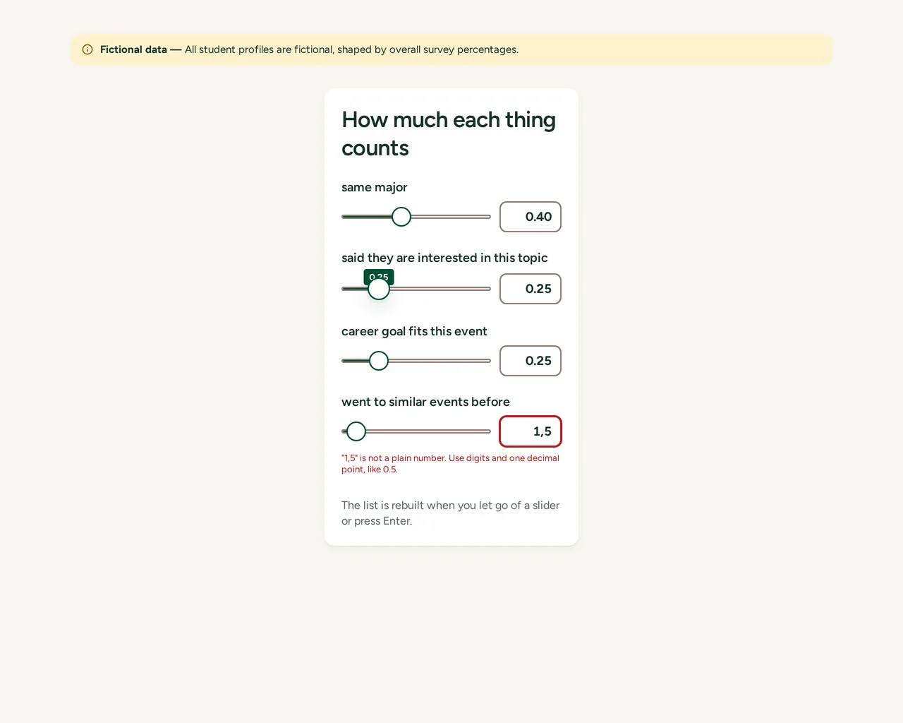 | DESKTOP | [`components/weight-slider.md`](../../archive/design/class-exercise/prompts/components/weight-slider.md) | Medium. Slider plus number box (the owner ruling), the drag bubble and the red invalid field. The bubble clips its "0.25", and the card title is sans, not serif | [`weight-slider-1280`](../../archive/design/class-exercise/assets/generated/claude-html/weight-slider-1280.webp): the archived render shows more states (focus, rebuilding, 390 bar) |
| 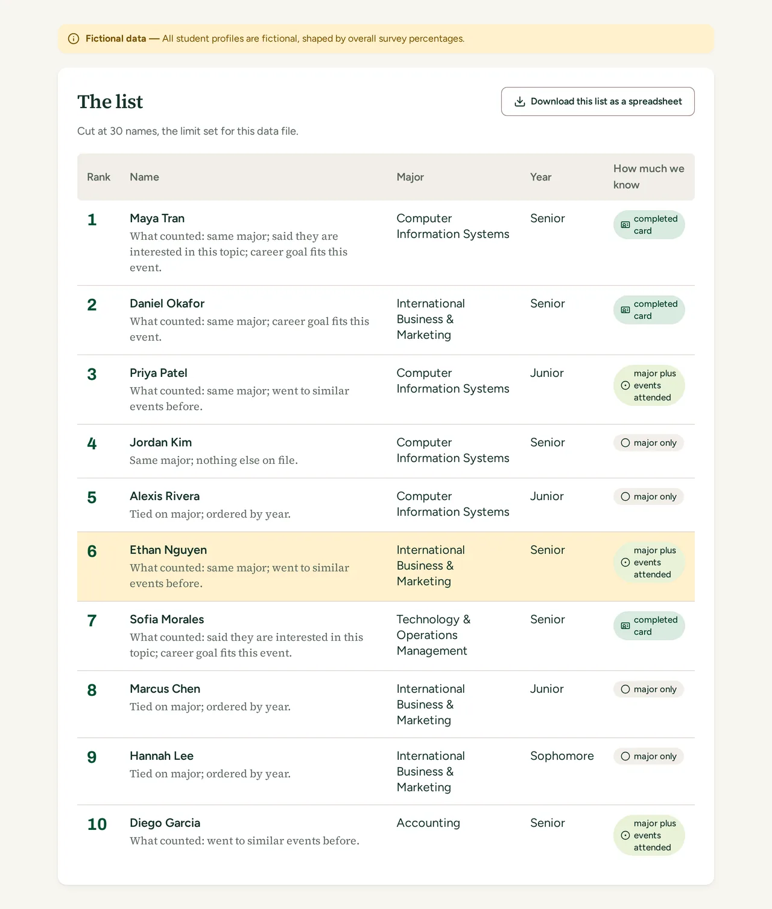 | DESKTOP | [`components/ranked-row.md`](../../archive/design/class-exercise/prompts/components/ranked-row.md) | High. The reason sits under the name, markers use icon plus words, and row 6 has the gold "joined" wash. Marker chips wrap in the narrow last column. Regenerated once (R5) | [`ranked-row-1280`](../../archive/design/class-exercise/assets/generated/claude-html/ranked-row-1280.webp): equivalent after the column fix |
| 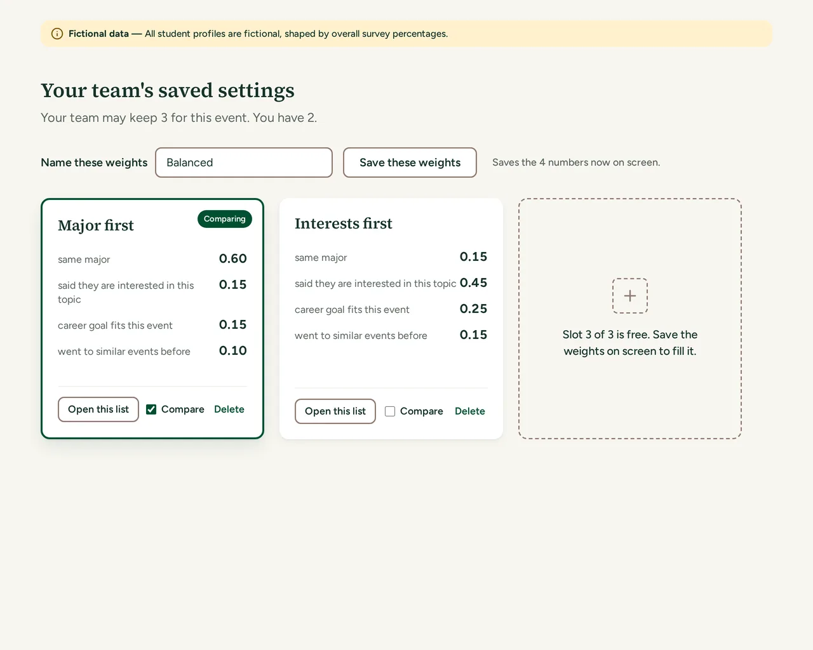 | DESKTOP | [`components/saved-setting-card.md`](../../archive/design/class-exercise/prompts/components/saved-setting-card.md) | High. Weights as numbers only, the "Comparing" outline and chip, a dashed free slot, and Delete in quiet green | [`saved-setting-card-1280`](../../archive/design/class-exercise/assets/generated/claude-html/saved-setting-card-1280.webp): equivalent |
| 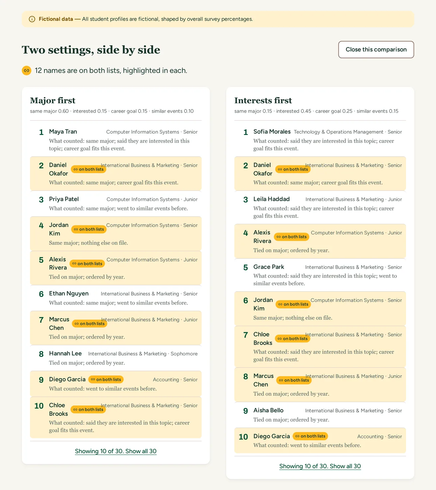 | DESKTOP | [`components/compare-view.md`](../../archive/design/class-exercise/prompts/components/compare-view.md) | Medium. It has the summary sentence, gold overlap rows and "Showing 10 of 30". The "on both lists" chip collides with the major text on wrapped names | [`compare-view-1280`](../../archive/design/class-exercise/assets/generated/claude-html/compare-view-1280.webp): the archived render was rated High with no layout flaw noted |
| 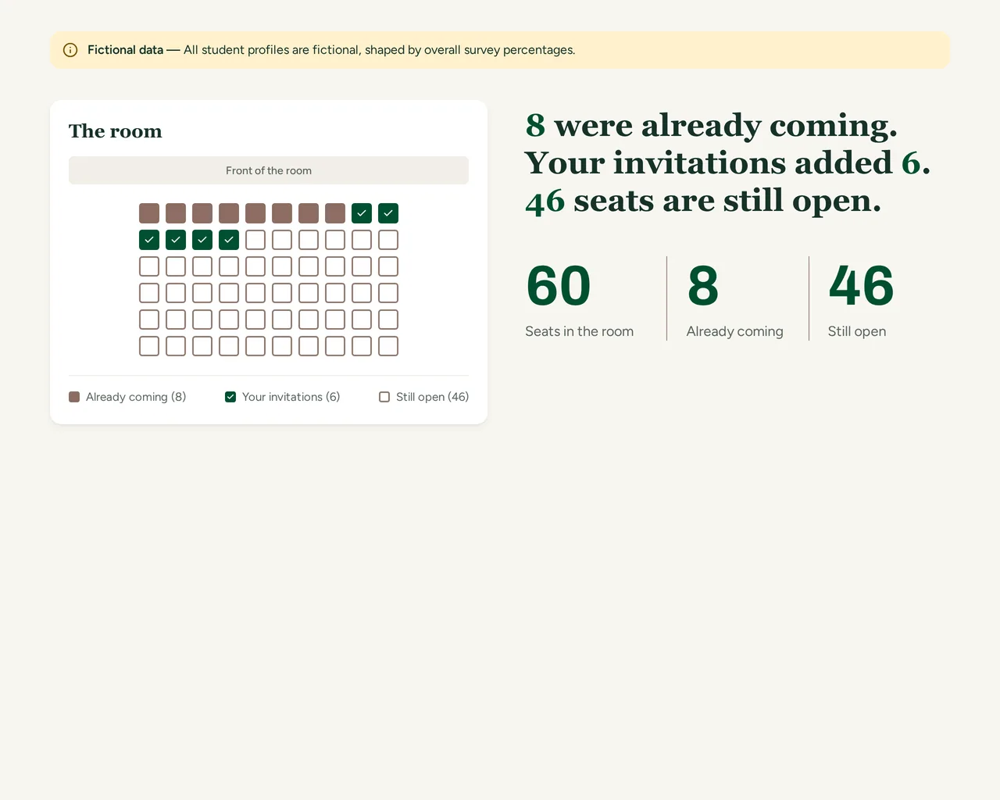 | DESKTOP | [`components/results-reveal.md`](../../archive/design/class-exercise/prompts/components/results-reveal.md) | High. 8 / 6 / 46 seats, a serif headline with green numerals, and a ruled band at display size | [`results-reveal-1280`](../../archive/design/class-exercise/assets/generated/claude-html/results-reveal-1280.webp): equivalent final state. Neither shows motion |
| 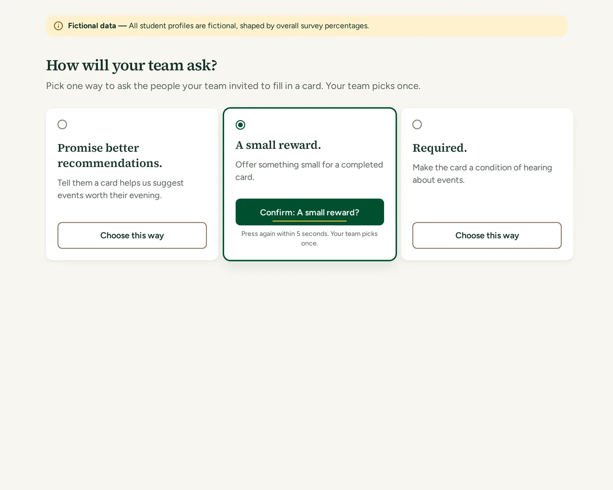 | DESKTOP | [`components/asking-choice-cards.md`](../../archive/design/class-exercise/prompts/components/asking-choice-cards.md) (confirm screen only) | High. The inline "Confirm: A small reward?" with a gold countdown underline and the 5-second helper. No modal | [`asking-choice-cards-1280`](../../archive/design/class-exercise/assets/generated/claude-html/asking-choice-cards-1280.webp): the archived render also shows the chosen state. Stitch shows the confirm moment only |
| 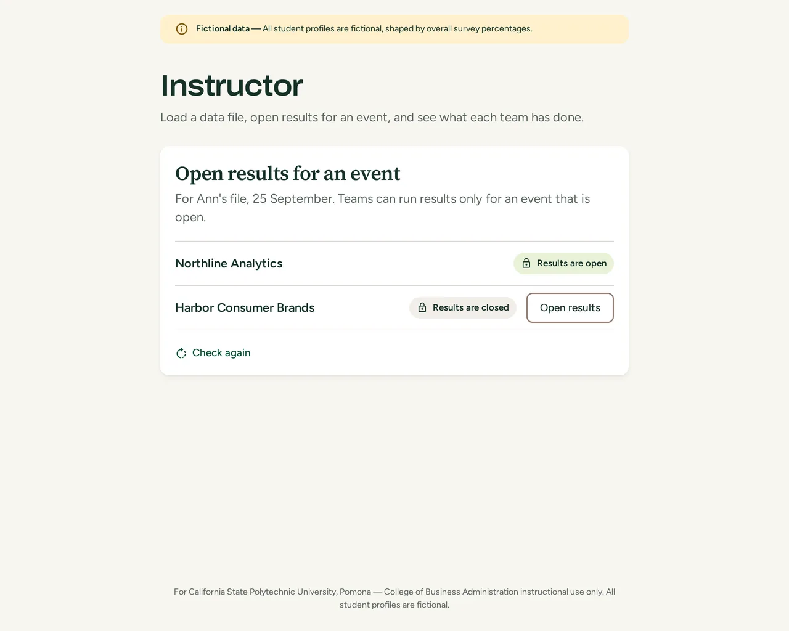 | DESKTOP | [`components/instructor-unlock-panel.md`](../../archive/design/class-exercise/prompts/components/instructor-unlock-panel.md) | Medium. The chips carry icon and words, and nothing is red. The "Results are open" chip uses a closed padlock, where §4 wants `LockOpen` | [`instructor-unlock-panel-1280`](../../archive/design/class-exercise/assets/generated/claude-html/instructor-unlock-panel-1280.webp): the archived render uses the right icons and shows the inline confirm |
| 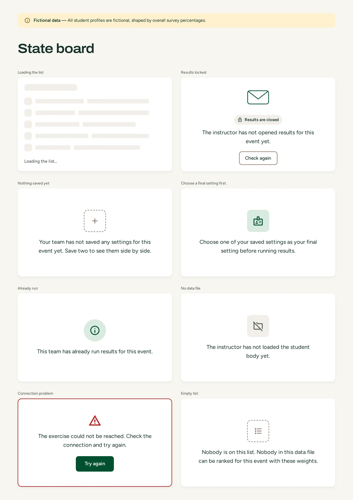 | DESKTOP | [`components/empty-and-loading-states.md`](../../archive/design/class-exercise/prompts/components/empty-and-loading-states.md) | High. Eight states, server sentences verbatim, and only the connection card is red. It adds a "State board" frame title, as the archived render did | [`empty-and-loading-states-1280`](../../archive/design/class-exercise/assets/generated/claude-html/empty-and-loading-states-1280.webp): equivalent |

### 2.4 Flaws kept (none breaks a rejection rule)

| # | Flaw | Where |
|---|---|---|
| F1 | Stand-in fonts did not load; text fell back to Times or Arial | `03-…-desktop`, `08-…-mobile` |
| F2 | One heading in sans where Source Serif 4 was asked for | `01-…-desktop`, `weight-slider-desktop` |
| F3 | Invented sub-lines under 3 headings ("Comparison between your team's invitations and reaching the entire pool.", "Fictional profiles selected using the final setting \"Major first\".", "Offer an incentive or question to learn more before the next event.") and an uppercase "FRONT OF THE ROOM" | `08-…-mobile` |
| F4 | Stitch drew the `MOBILE` screen centred on a 1280-wide canvas; the 390 column was cropped out | `04-…-mobile`, `09-…-mobile` |
| F5 | Small invented labels: "List A" / "List B", "The list (first 30 of 300 fictional profiles)", "Showing ranks 9 and 10 of 30", an input placeholder | `05-…-desktop`, `05-…-mobile` |

## 3. Rejected / regenerated

29 Stitch generations produced 24 kept images. Each image was regenerated at most once, and there was no rate-limit or quota error.

| # | Image | First attempt's fault | Second attempt | Kept |
|---|---|---|---|---|
| R1 | `08-final-setting-and-results-desktop` | Invented 3 sub-lines under section heads (text not in `DESIGN.md`) | Clean | 2nd |
| R2 | `08-final-setting-and-results-mobile` | The same 3 invented lines, uppercase "FRONT OF THE ROOM", sans headline | Worse: dropped the seating chart, put "The room" over an invented line, duplicated "Go to asking for more" | 1st (flaws F1 and F3) |
| R3 | `08-final-setting-and-results-locked-desktop` | Invented card text: "Active choice", "Select setting", "30 invited" | Clean | 2nd |
| R4 | `03-event-picker-desktop` | Title, lead and meta in a Times-like fallback | Same fault, same pixels | 1st (flaw F1) |
| R5 | `ranked-row-desktop` | Name column about 110 px, so reason lines broke one word per line | Readable columns; chips wrap | 2nd |

Checks on all 24 kept images:

- 0 wrong brand colours
- 0 photos or people
- 0 per-person percentages or scores
- 0 "real student", "respondent" or survey-response wording
- Every ribbon reads "Fictional data — All student profiles are fictional, shaped by overall survey percentages."

## 4. `DESIGN.md` vs archived prompt disagreements

12 found. The first 7 were sent to Stitch as overrides, where `DESIGN.md` wins. The last 5 were noted and not applied, because the `DESIGN.md` side is a schematic wireframe or an example rather than a rule.

| # | Archived prompt says | `DESIGN.md` says | Applied? |
|---|---|---|---|
| 1 | Figures-band numerals 64 px (`pages/08`, `pages/10`, `components/results-reveal`) | `--ce-type-display` 72/76 (§3.4, §6.15); 40 px on 390 (§7.8) | Yes |
| 2 | "Delete" is a quiet **red** text button (`pages/05`, `components/saved-setting-card`) | A quiet button is primary-colour text. Red appears only on the destructive confirm inside an inline confirm (§6.3, §6.11) | Yes |
| 3 | "Clear team N's work" is quiet **red** text (`pages/11`) | Same rule, §6.3 | Yes |
| 4 | `pages/06` swaps the ribbon sentence for a mock-up disclaimer | The ribbon text is a fixed constant and never changes (§6.2) | Yes: the disclaimer moved to the caption |
| 5 | `pages/06` puts an ID-card pictogram above the title | No icon or illustration beside a page title (§4, §10) | Yes |
| 6 | `pages/06` title 40 px; phone card 18 px corners | `h1` 48/56 (§3.4); card radius 14 px, and 18 px is for mobile sheets only (§3.6) | Yes |
| 7 | `pages/09` shows only the chosen state | The owner-ruled inline confirm (§6.18, §11 item 3) | Yes: `09-…-mobile` shows the confirm moment |
| 8 | Back button "Back to your team's list" (`pages/08`, `pages/10`) | §7.8 wireframe: "← Back to your list" | No (wireframes are schematic, §7) |
| 9 | Header: secondary button "Choose a different event" (`pages/04`) | §7.4 wireframe: "Team 4 · Choose another →" | No (schematic) |
| 10 | Coverage notice: "…a Freshman or a Finance, Real Estate & Law major." | §6.10 example: "…a Senior or an Accounting major." | No: §9 says to use the README's shared data |
| 11 | Empty compare: "Save two to see them side by side." (`components/empty-and-loading-states`) | §6.11: "Save two settings to see them side by side." | No: rendered as archived. Fix it in the build |
| 12 | Invalid-weight message: "\"1,5\" is not a plain number. Use digits and one decimal point, like 0.5." | §6.6: "Type a number for this weight." or the server's refusal sentence | No: read as the server's refusal |

## 5. Top 3

1. [`assets/stitch/08-final-setting-and-results-desktop.webp`](assets/stitch/08-final-setting-and-results-desktop.webp): the lesson's payoff reads at a glance. The room fills 8 / 6 / 46, the serif headline states the same numbers, and the ruled band repeats them. It is counts only, with no invented copy after the regeneration. Best evidence for the build.
2. [`assets/stitch/05-save-and-compare-desktop.webp`](assets/stitch/05-save-and-compare-desktop.webp): the whole save-and-compare loop fits on one screen. Stitch added each setting's weights under the list title, and the quiet green Delete follows `DESIGN.md`. Gold is used for exactly one job.
3. [`assets/stitch/09-asking-for-more-mobile.webp`](assets/stitch/09-asking-for-more-mobile.webp): the clearest picture of the owner's inline-confirm ruling on a phone. The same button becomes "Confirm: A small reward?" with a half-spent countdown and no pop-up.
