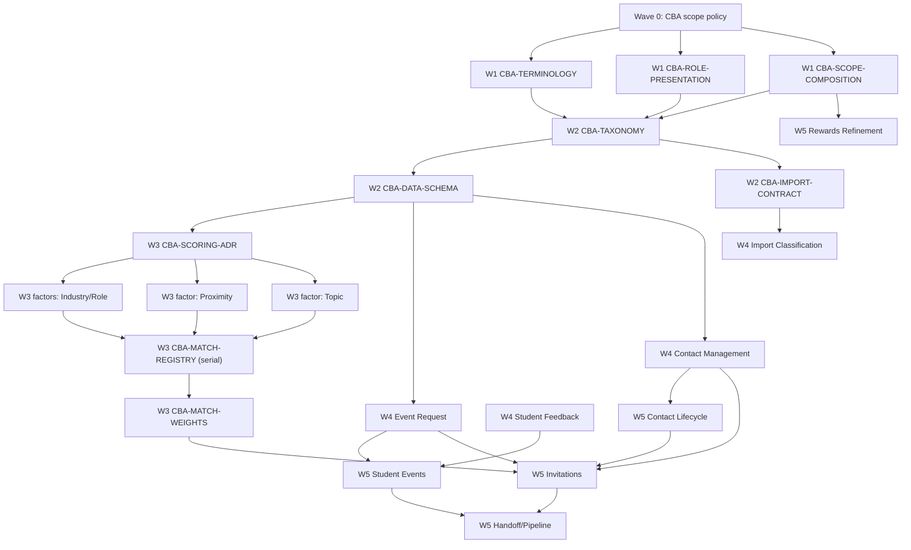

# CBA pivot implementation waves

**Date:** 2026-09-05  
**Status:** planning hypothesis refined from repository evidence; not execution authorization  
**Inputs:** [customer requirements](../product/cba-smart-match-customer-requirements.md), [recon synthesis](2026-09-05-cba-pivot-recon.md), [decision/deferral register](open-questions/cba-phase-deferred.md)

## Refinement decisions

The original Wave 0–5 shape is retained because its dependency direction is sound:

1. **Wave 0 establishes one CBA capability policy before any page or router makes ad-hoc scope choices.**
2. **Wave 1 is migration-free and parallel:** terminology, visible persona mapping, and application of Wave 0’s policy to existing surfaces.
3. **Wave 2 owns taxonomy and schema:** CBA classifications exist before matching and workflow code consumes them.
4. **Wave 3 keeps the registry and approved golden set serial:** factor implementations may be prepared in fenced lanes, but one integration PR owns `factor_registry.py`, scoring composition, registry pins, and CBA golden approval.
5. **Wave 4 adds workflows on the settled data model.**
6. **Wave 5 reuses the shipped G7–G9/G1 architecture** for consent, outreach, calendar, and pipeline instead of rebuilding it.

Corrections to the starting hypothesis:

- Rewards are **not globally gated**. Customer §4 says rewards/points remain; §25 makes refinements and career-readiness wording P2. Wave 0/1 may hide only a demonstrably false, chapter-specific, unfunded, or fake-success affordance. Truthful ledger-backed rewards routes and UI remain available. Wave 5 has a narrow P2 refinement track.
- Current outreach is more complete than the interrupted plan assumed: draft/list/send/read/unsubscribe and worker delivery architecture exist. CBA work extends that consented path with batch invitations and Speaker responses; it does not resurrect legacy cold outreach.
- Current events are persisted and readable for admin/coordinator, but the router is read-only. Event Host Speaker Request creation is a new durable write path; external discovery remains excluded.
- The student Events page currently has neither event rows nor registration/calendar composition. The required target is **browse/agenda first and a month calendar at the bottom of the same Events page**. A calendar must not replace browse content.
- Database role strings (`student`, `coordinator`, `volunteer`, `admin`) are not customer-facing terminology and are not migrated in Wave 1. Visible labels and authorization powers remain separate.
- ADR-0012’s event type/speaker-function tag vocabulary is not the CBA career-role taxonomy. They remain separate versioned vocabularies.

## Dependency and merge map

## Serial resources and merge rules

| Resource | Sole/serial owner |
|---|---|
| CBA capability-policy representation | `CBA-SCOPE-POLICY` defines it; later tracks consume it without inventing alternatives. |
| `db/migrations/versions/*.py` | One migration PR at a time. `CBA-DATA-SCHEMA` owns the first post-0021 revision; later migration owners re-read head and rebase before merge. Never hard-code `0022` without checking current main. |
| `python/smartmatch_domain/smartmatch_domain/factor_registry.py` | `CBA-MATCH-REGISTRY` only during Wave 3. |
| `tests/golden/matching/**` approved CBA set | `CBA-MATCH-REGISTRY` only until registry approval merges. |
| `contracts/openapi/smartmatch.json` | Regenerate, never hand-edit; API PRs merge one at a time and rebase/regenerate. |
| `tests/authz/test_policy_matrix.py` and `tests/authz/test_route_roles.py` | API PRs merge one at a time with their route rows. |
| `apps/web/legacy-frontend/src/lib/api.ts` | Frontend/API client consumers merge serially if they touch this legacy client. Prefer generated-client work when available. |
| `docs/architecture/decisions/` scoring decision | `CBA-SCORING-ADR` lands before any CBA registry merge. |

Every implementation card starts from then-current `origin/main`, has one branch and one PR, writes failing tests first, and respects these serial locks. `make check` remains a required merge gate in a supported environment; local PowerShell agents must also run targeted `python -m pytest ...` and must report that local `make` was unavailable rather than claiming success.

## Wave 0 — scope policy first

### CBA-SCOPE-POLICY

- **Branch:** `feat/cba-scope-policy`
- **Dependencies:** none beyond the documentation package.
- **Precise file fence:** `services/api/smartmatch_api/config.py`, `services/worker/smartmatch_worker/config.py` only if a shared runtime enum is required, a small new shared/config capability module if architecture requires it, frontend environment/capability reader, `services/api/smartmatch_api/main.py`, and targeted tests. No feature implementation, migration, provider, or deployment edits.
- **Read first:** customer §§1, 3–4, 17, 20–22; `services/api/smartmatch_api/config.py`; `services/api/smartmatch_api/main.py`; `apps/web/legacy-frontend/src/app/routes.tsx`; `docs/plans/open-questions/cba-phase-deferred.md`; `tools/env_isolation_check.py`.
- **Deliverables:** one explicit CBA product-phase/capability policy; fail-closed defaults; API composition and frontend navigation can query the same named capability decisions; no role-label/security coupling; documentation of local/default behavior.
- **First failing tests:** `tests/unit/test_cba_scope_policy.py` (planned); extend `tests/unit/test_provider_isolation.py`; extend `tests/unit/test_no_external_calls_on_request_path.py`.
- **Success criteria:** one policy distinguishes CBA scope from deployment `Edition`; external acquisition/cold-unknown-contact/chapter dues are disabled; consented outreach, rewards, event reads, match runs, discovery metrics, and login are not accidentally disabled; live providers/data/deploy stay false.
- **Serial resources:** capability-policy representation and `main.py`.
- **Demo-critical:** **Yes—foundation**, though it adds no user-facing capability.
- **Deferred overlaps:** no branding redesign, no route cleanup, no feature code, no cloud/live enablement.

## Wave 1 — parallel, no migrations

### CBA-TERMINOLOGY

- **Branch:** `feat/cba-terminology`
- **Dependencies:** CBA-SCOPE-POLICY.
- **Precise file fence:** user-facing strings in `apps/web/legacy-frontend/src/app/**`, relevant documentation, fixtures, seeds, and terminology contract tests. Do not alter authz role sets, schema, or APIs.
- **Read first:** customer §4 and §25 terminology list; `apps/web/legacy-frontend/src/app/components/Layout.tsx`; portal layouts; `LandingPage.tsx`; `LoginPage.tsx`; `Opportunities.tsx`; `Dashboard.tsx`; `docs/plans/frontend-broken-buttons.md`.
- **Deliverables:** CBA naming; Student Portal; Connector Dashboard; Speaker Request; remove user-facing IA-West/chapter/member/dues wording where it describes CBA; preserve “Speaker.”
- **First failing tests:** `tests/unit/test_cba_terminology_strings.py` (planned); extend `tests/unit/test_frontend_opportunities_contract.py`; extend `tests/unit/test_frontend_auth_contract.py`.
- **Success criteria:** a scoped scanner finds no prohibited IA-West terms in CBA-visible copy, while historical docs and backend authorization `membership` are excluded deliberately; no behavior changes.
- **Serial resources:** none.
- **Demo-critical:** **Yes.**
- **Deferred overlaps:** CPP green/gold theme, role powers, route gating, matching labels derived from data.

### CBA-ROLE-PRESENTATION

- **Branch:** `feat/cba-role-presentation`
- **Dependencies:** CBA-SCOPE-POLICY.
- **Precise file fence:** `services/api/smartmatch_api/routers/portals.py`, frontend role-label helper/components, portal layouts, seed display metadata if present, portal/auth contract tests. No `membership.role` migration or authz widening.
- **Read first:** customer §§2–3; `routers/auth.py`; `routers/me.py`; `routers/portals.py`; `smartmatch_authz/policy.py`; `LoginPage.tsx`; `principal.ts`; `PortalGate.tsx`; `tests/unit/test_frontend_auth_contract.py`.
- **Deliverables:** map stored roles to visible personas (`student`→Student, event-requesting `volunteer`→Event Host, Connector powers over current `coordinator`/approved admin context, speaker identity where represented); document any admin/coordinator ambiguity; retain one login and backend role derivation.
- **First failing tests:** `tests/contract/test_portals_api.py` (planned); extend `tests/unit/test_frontend_auth_contract.py`; extend `tests/authz/test_route_roles.py` only for regression assertions, not new powers.
- **Success criteria:** visible labels are CBA-correct; login has no role chooser; modifying labels cannot grant API access; stored role strings remain stable unless a later approved migration exists.
- **Serial resources:** portal response contract/OpenAPI if response schema changes.
- **Demo-critical:** **Yes.**
- **Deferred overlaps:** permanent database role renaming and institutional SSO.

### CBA-SCOPE-COMPOSITION

- **Branch:** `feat/cba-scope-composition`
- **Dependencies:** CBA-SCOPE-POLICY.
- **Precise file fence:** `apps/web/legacy-frontend/src/app/routes.tsx`, navigation/layout components, `LandingPage.tsx`, `PipelineFunnelTiles.tsx`, legacy `Outreach.tsx`/`AgenticOutreachPanel.tsx` only to remove CBA reachability, `CrawlerFeed.tsx` only to gate reachability, narrow API router composition only if Wave 0 policy requires it, and tests. Preserve feature code/data.
- **Read first:** customer §§17, 20–22; `cba-phase-deferred.md`; `routes.tsx`; `LandingPage.tsx`; `Outreach.tsx`; `CoordinatorOutreach.tsx`; `PipelineFunnelTiles.tsx`; `DiscoveryFeed.tsx`; `StudentRewards.tsx`; `g3-crawler-decision.md`.
- **Deliverables:** no CBA navigation/claims for scraping, LinkedIn, cold unknown-contact outreach, chapter membership/dues, or `member_inquiry`; preserve R/Y/G feed, consented coordinator outreach, and truthful rewards.
- **First failing tests:** `tests/unit/test_cba_surface_composition.py` (planned); extend `tests/unit/test_frontend_no_fake_success_contract.py`; extend `tests/unit/test_fixture_ingest_wiring.py`.
- **Success criteria:** gated surfaces are unreachable/absent in CBA composition; no code/data deletion; rewards remain when server-backed and truthful; fixture ingest remains test/operator-only.
- **Serial resources:** `routes.tsx`; possibly `main.py` if router composition changes.
- **Demo-critical:** **Yes.**
- **Deferred overlaps:** rewards career-readiness reframing, branding, live providers, renaming historical pipeline schema.

## Wave 2 — taxonomy and schema

### CBA-TAXONOMY

- **Branch:** `feat/cba-taxonomy`
- **Dependencies:** Wave 1 merged.
- **Precise file fence:** new domain modules `python/smartmatch_domain/smartmatch_domain/naics_sectors.py` (planned) and `cba_role_categories.py` (planned), exports, unit tests, and taxonomy docs. No migration, API, UI, or factor registry.
- **Read first:** customer §§7–8; `smartmatch_domain/event_vocabulary.py`; ADR-0012; import-linter rules in `pyproject.toml`.
- **Deliverables:** exact 20 NAICS sector groups/codes; exact 10 CBA role categories; versioned immutable lookups; normalization/validation rules that do not conflate event tags with career roles.
- **First failing tests:** `tests/unit/test_naics_taxonomy.py` (planned); `tests/unit/test_cba_role_categories.py` (planned); extend `tests/unit/test_event_vocabulary.py` to prove separation.
- **Success criteria:** exact counts/names/codes match customer source; unknown values refuse or quarantine per explicit API; no scattered frontend enum.
- **Serial resources:** none.
- **Demo-critical:** **Yes.**
- **Deferred overlaps:** automatic classification, persistence, matching arithmetic.

### CBA-DATA-SCHEMA

- **Branch:** `feat/cba-data-schema`
- **Dependencies:** CBA-TAXONOMY.
- **Precise file fence:** exactly one next-head Alembic revision (planned path, number chosen at branch time), `smartmatch_persistence/schema.py`, professional/event persistence models, migration/schema integration tests. No HTTP/UI/factor registry.
- **Read first:** customer §§7–8, 10–12, 18–19; migration `0012_professional_unit_relationship.py`; migration `0017_event_persistence.py`; migration `0021_outreach_schema.py`; `schema.py`; `professionals.py`; `events.py` persistence; ADR-0010 and ADR-0012.
- **Deliverables:** one primary Industry and Role per speaker/contact; multi-select Industries/Roles per Speaker Request; Topic/profile/prior-talk text; city/ZIP/location and virtual flag; constraints and tenant-scoped FKs; migration downgrade.
- **First failing tests:** `tests/integration/test_cba_classification_schema.py` (planned); extend `tests/integration/test_event_schema_constraints.py`; extend `tests/integration/test_schema_matches_migration.py`.
- **Success criteria:** cardinalities are enforced in DB and persistence; no CBA role taxonomy stored as ADR-0012 event tags; migration is exactly head+1 at merge time.
- **Serial resources:** migration queue and `schema.py`.
- **Demo-critical:** **Yes.**
- **Deferred overlaps:** APIs, classifier inference, matching, feedback schema.

### CBA-IMPORT-CONTRACT

- **Branch:** `feat/cba-import-contract`
- **Dependencies:** CBA-TAXONOMY; coordinate merge with CBA-DATA-SCHEMA.
- **Precise file fence:** `docs/pilot-data/columns.yaml`, `services/worker/smartmatch_worker/column_contract.py`, import-validation fixtures, documentation, and tests. No DDL or contact persistence write.
- **Read first:** customer §§18–19; `columns.yaml`; `column_contract.py`; `handlers.py` import sections; `smartmatch_domain/ingest.py`; consent policy.
- **Deliverables:** declare Name, Company Name, Current Position, Contact Email, Alumni, Graduation Year, Major, Willingness, Past Engagement, primary classifications, Topic/prior-talk text, and city/ZIP; define required/optional and privacy/gate posture; map normalized headers without duplicating names in Python.
- **First failing tests:** extend `tests/unit/test_column_contract.py`; extend `tests/unit/test_import_column_contract_wiring.py`; add `tests/unit/test_cba_import_columns.py` (planned).
- **Success criteria:** customer fields are represented exactly once in YAML; worker fails closed if contract is unavailable; contact email never implies consent.
- **Serial resources:** `columns.yaml`.
- **Demo-critical:** **Partial**—needed for realistic contact intake.
- **Deferred overlaps:** inference/classification execution and manual contact UI.

## Wave 3 — scoring decisions and matching core

### CBA-SCORING-ADR

- **Branch:** `docs/cba-scoring-decisions`
- **Dependencies:** CBA-DATA-SCHEMA.
- **Precise file fence:** `docs/architecture/decisions/` new ADR or accepted amendment, `cba-phase-deferred.md`, and decision-focused documentation/tests only. No runtime code.
- **Read first:** customer §§5, 9–11, 26; ADR-0011; current `factor_registry.py`; `scoring.py`; `explanation.py`; match-run pins/golden tests.
- **Deliverables:** approved decisions for neutral missing-Topic semantics/provenance, exact proximity band values and boundaries, virtual redistribution formula, normalization behavior, serialization/UI labels, registry versioning, and golden cases.
- **First failing tests:** `tests/unit/test_cba_scoring_decision_artifact.py` (planned) to require accepted status and all decision fields; extend `tests/unit/test_gate_decision_artifacts.py`.
- **Success criteria:** OQ-CBA-001, 002, and 004 are answered by an accepted ADR signed by the owner; no implementation branch treats proportional redistribution or `0.5` as customer-confirmed before this merge.
- **Serial resources:** scoring ADR.
- **Demo-critical:** **Hard merge gate for Wave 3 registry.**
- **Deferred overlaps:** implementation and live semantic providers.

### CBA-MATCH-INDUSTRY-ROLE

- **Branch:** `feat/cba-match-industry-role`
- **Dependencies:** CBA-TAXONOMY, CBA-DATA-SCHEMA, CBA-SCORING-ADR.
- **Precise file fence:** planned `factors/industry_match.py`, `factors/role_match.py`, factor exports, and focused unit tests. Do not edit `factor_registry.py`, `scoring.py`, match-run pins, OpenAPI, or approved golden files.
- **Read first:** customer §§5, 7–8; taxonomy modules; `factors/__init__.py`; `topic_relevance.py` as shape only; `scoring.py`.
- **Deliverables:** deterministic speaker-one-primary versus request-multi-select factor scores with accountable basis/provenance and unknown/measured-zero distinctions.
- **First failing tests:** `tests/unit/test_industry_match.py` (planned); `tests/unit/test_role_match.py` (planned).
- **Success criteria:** exact match, nonmatch, invalid taxonomy, missing speaker classification, and empty request sets are explicit; no weight literals.
- **Serial resources:** none.
- **Demo-critical:** **Yes.**
- **Deferred overlaps:** registry wiring and UI.

### CBA-MATCH-PROXIMITY

- **Branch:** `feat/cba-match-proximity`
- **Dependencies:** CBA-DATA-SCHEMA and accepted CBA-SCORING-ADR.
- **Precise file fence:** planned `factors/proximity.py` (or a clearly versioned replacement), location adapter interface if needed, focused tests. Do not edit registry/scoring/golden/OpenAPI.
- **Read first:** customer §§10–11; accepted CBA scoring ADR; `travel_burden.py`; ADR-0011; match-run pin model.
- **Deliverables:** miles from a versioned CPP campus origin; approved 0–25, 25–75, 75+ boundaries/scores; physical and virtual outcomes; accountable coarse/geocoding provenance; no live route provider.
- **First failing tests:** `tests/unit/test_cba_proximity.py` (planned); extend `tests/unit/test_travel_burden.py` only for coexistence/supersession assertions.
- **Success criteria:** exact 25/75 boundaries match ADR; missing location remains honest; virtual result uses the approved exclusion/redistribution policy; no kilometer labels leak into CBA factor output.
- **Serial resources:** proximity formula version.
- **Demo-critical:** **Yes.**
- **Deferred overlaps:** live geocoding/routes and registry wiring.

### CBA-MATCH-TOPIC

- **Branch:** `feat/cba-match-topic`
- **Dependencies:** CBA-DATA-SCHEMA and accepted CBA-SCORING-ADR.
- **Precise file fence:** Topic factor/provider protocol, fixture semantic provider in `python/smartmatch_providers/`, explanation helper, and focused tests. Do not edit registry/scoring/golden/OpenAPI.
- **Read first:** customer §9; accepted CBA scoring ADR; `topic_relevance.py`; `explanation.py`; provider registry/isolation tests; `config.py`.
- **Deliverables:** semantic comparison over event description and speaker Topic/profile/prior-talk evidence; fit score; one-sentence rationale; ADR-approved thin-data behavior; deterministic fixture provider.
- **First failing tests:** `tests/unit/test_cba_semantic_topic.py` (planned); `tests/unit/test_cba_topic_explanation.py` (planned); extend `tests/unit/test_provider_isolation.py`.
- **Success criteria:** fixture output is deterministic; rationale is exactly one sentence under a documented grammar/contract; live provider cannot be selected by default or classroom; unknown/neutral provenance follows ADR.
- **Serial resources:** provider registry if touched.
- **Demo-critical:** **Yes**, but fixture-backed.
- **Deferred overlaps:** live model credentials/provider and registry wiring.

### CBA-MATCH-REGISTRY

- **Branch:** `feat/cba-match-registry-v2`
- **Dependencies:** the three factor tracks and accepted CBA-SCORING-ADR.
- **Precise file fence:** `factor_registry.py`, `scoring.py`, match-run pin/fingerprint code, worker handler wiring, explanation composition, `tests/golden/matching/cba/` (planned), matching unit/contract tests, generated OpenAPI only if response shape changes. No settings persistence.
- **Read first:** customer §§5–11; accepted CBA scoring ADR; all new factors; current registry/scoring/explanation/match-run/worker/API; approved golden tests; ADR-0011.
- **Deliverables:** new approved CBA registry version with Industry .30, Role .25, Topic .15, Proximity .30; four-factor composition; conditional virtual policy; match-run pins; 2–3 shortlist regression; no prominent percentage.
- **First failing tests:** extend `tests/unit/test_factor_registry.py`; add CBA cases to `tests/unit/test_matching_approved_golden.py`; extend `tests/integration/test_match_run_snapshot.py`; extend `tests/contract/test_match_runs_api.py`.
- **Success criteria:** implemented keys exactly match approved CBA keys; physical and virtual weights sum to one under accepted policy; old match runs remain distinguishable; every required golden case is approved and deterministic.
- **Serial resources:** **exclusive Wave 3 owner** of registry and approved golden files; OpenAPI if needed.
- **Demo-critical:** **Yes—core product story.**
- **Deferred overlaps:** weight-management API and live semantic provider.

### CBA-MATCH-WEIGHTS

- **Branch:** `feat/cba-match-weight-settings`
- **Dependencies:** CBA-MATCH-REGISTRY.
- **Precise file fence:** one migration only if persistence is required, matching-settings domain/persistence, Connector GET/PATCH API, policy matrix, regenerated OpenAPI, targeted tests, minimal settings UI only if generated/approved client exists.
- **Read first:** customer §§5, 13 and §25 P1; registry `normalize_weights`; match-run snapshots; API command/read patterns; authz policy; ADR-0011.
- **Deliverables:** one unit-scoped configurable source; defaults to registry weights; validation/normalization/versioning/audit; Speaker Connector can read/update; each match run snapshots applied settings.
- **First failing tests:** `tests/unit/test_cba_weight_settings.py` (planned); `tests/integration/test_cba_weight_settings.py` (planned); `tests/contract/test_matching_weights_api.py` (planned); policy-matrix rows.
- **Success criteria:** no weight literals outside registry/default settings and stored snapshots; updates are tenant-scoped and authorized; invalid/zero-total values refuse; old runs are immutable.
- **Serial resources:** migration queue, OpenAPI, authz matrix.
- **Demo-critical:** **P1/medium.**
- **Deferred overlaps:** complex administration UI and autonomous tuning from feedback.

## Wave 4 — CBA workflows

### CBA-EVENT-REQUEST

- **Branch:** `feat/cba-event-speaker-request`
- **Dependencies:** CBA-DATA-SCHEMA; taxonomy; scope/role presentation.
- **Precise file fence:** event/Speaker Request domain and persistence, durable API command or transactional create path consistent with architecture, authz rows, generated OpenAPI, Event Host UI, targeted tests. No external discovery.
- **Read first:** customer §§12, 22–23; ADR-0010/0012; `routers/events.py`; event persistence/ingest; command pattern; `CoordinatorEvents.tsx`; `Opportunities.tsx`.
- **Deliverables:** Event Host creates a manual Speaker Request with multi-industry/role, description, location, physical/virtual flag; deterministic identity/provenance; Connector can read incoming requests.
- **First failing tests:** `tests/contract/test_speaker_requests_api.py` (planned); `tests/integration/test_speaker_request_persistence.py` (planned); extend `tests/authz/test_policy_matrix.py`.
- **Success criteria:** Host power is server-authorized; duplicate retries are idempotent; no fake UI success; external URLs/crawl are absent; accepted request can become a match-run input.
- **Serial resources:** OpenAPI/authz matrix; migration only if Wave 2 schema proves insufficient.
- **Demo-critical:** **Yes.**
- **Deferred overlaps:** matching execution UI and invitations.

### CBA-CONTACT-MANAGEMENT

- **Branch:** `feat/cba-contact-management`
- **Dependencies:** CBA-DATA-SCHEMA and CBA-TAXONOMY.
- **Precise file fence:** professional/contact create/read/update persistence and API, Connector UI, authz/OpenAPI/tests. Consent state remains in existing consent/contact-channel modules.
- **Read first:** customer §§13, 18–19; `professionals.py`; `routers/imports.py`; `consent.py`; outreach contact-channel schema/repository; policy matrix.
- **Deliverables:** Connector manually adds a contact; reads/manages records; corrects primary Industry/Role with actor/time/provenance; no automatic send eligibility.
- **First failing tests:** `tests/contract/test_cba_contacts_api.py` (planned); `tests/integration/test_cba_contact_corrections.py` (planned); policy-matrix rows.
- **Success criteria:** one-primary constraints hold; corrections are tenant-scoped/audited; a new email remains unsendable until consent lifecycle allows it.
- **Serial resources:** OpenAPI/authz matrix; migration only if Wave 2 omitted necessary audit fields.
- **Demo-critical:** **Yes.**
- **Deferred overlaps:** classification inference and batch invitations.

### CBA-IMPORT-CLASSIFY

- **Branch:** `feat/cba-import-classification`
- **Dependencies:** CBA-IMPORT-CONTRACT, CBA-DATA-SCHEMA, CBA-TAXONOMY, and contact correction API shape.
- **Precise file fence:** import worker handler/classifier protocol, deterministic fixture classifier, review/persistence wiring, import integration tests. No internet/model live calls.
- **Read first:** customer §19; import router/worker/column contract; review/provisioning flow; taxonomy modules; provider isolation; consent.
- **Deliverables:** company/title inference proposes Industry/Role with provenance/confidence; review/accept persists proposals; Connector correction remains authoritative; records become match-eligible only after required review.
- **First failing tests:** `tests/unit/test_cba_contact_classifier.py` (planned); `tests/integration/test_cba_import_classification.py` (planned); extend `tests/integration/test_import_rows.py`.
- **Success criteria:** deterministic fixtures; ambiguous/unknown values are reviewable, never fabricated; email collection does not grant consent; no public network.
- **Serial resources:** worker command registry only if a new command is required.
- **Demo-critical:** **P1/medium.**
- **Deferred overlaps:** live AI classifier.

### CBA-STUDENT-FEEDBACK

- **Branch:** `feat/cba-student-speaker-feedback`
- **Dependencies:** explicit OQ-CBA-003 decision; CBA-DATA-SCHEMA; Event and Student identities.
- **Precise file fence:** decision artifact if still pending (stop after it), then one migration, feedback domain/persistence/API, student submission and Connector read UI, authz/OpenAPI/tests. Do not reuse coordinator match feedback.
- **Read first:** customer §§15–16, 26; OQ-CBA-003; `feedback.py` (contrast only); attendance/event schema; authz policy; ADR-0011.
- **Deliverables:** approved minimal rating schema; student submission tied to attended event/speaker; Connector read; honest empty aggregate; privacy/edit/anonymity behavior from decision.
- **First failing tests:** `tests/unit/test_student_speaker_feedback.py` (planned); `tests/integration/test_student_speaker_feedback.py` (planned); `tests/contract/test_student_feedback_api.py` (planned).
- **Success criteria:** no implementation before OQ approval; only eligible student/event relationships submit; empty feedback is unknown, not zero; Connector access is tenant-scoped.
- **Serial resources:** migration, OpenAPI, authz matrix.
- **Demo-critical:** **P0 but can follow core demo path if decision remains open.**
- **Deferred overlaps:** sophisticated aggregation/recommendation use.

## Wave 5 — preserve and complete the end-to-end path

### CBA-STUDENT-EVENTS

- **Branch:** `feat/cba-student-events-calendar`
- **Dependencies:** CBA-EVENT-REQUEST; feedback contract for final action placement.
- **Precise file fence:** student event/registration reads and command, ICS endpoint using existing calendar facade, Student Events UI, generated OpenAPI/authz/tests. No Google Calendar API.
- **Read first:** customer §15; `StudentEvents.tsx`; `Calendar.tsx`; `calendar_invite.py`; calendar golden/wiring tests; event router/persistence; `frontend-broken-buttons.md` B06–B09.
- **Deliverables:** students browse events, register idempotently, download truthful ICS, and see browse/agenda content followed by a **month calendar at the bottom of the Events page**.
- **First failing tests:** `tests/contract/test_student_events_api.py` (planned); `tests/integration/test_event_registration.py` (planned); extend `tests/unit/test_calendar_invite_wiring.py`; `tests/unit/test_student_events_layout_contract.py` (planned).
- **Success criteria:** calendar DOM/order contract proves it follows browse/agenda; unresolved dates refuse ICS; no toast-only success; student authz cannot read another student’s registrations.
- **Serial resources:** OpenAPI/authz/client.
- **Demo-critical:** **Yes.**
- **Deferred overlaps:** direct Google/Outlook provider authorization and QR check-in.

### CBA-CONTACT-LIFECYCLE

- **Branch:** `feat/cba-contact-lifecycle`
- **Dependencies:** CBA-CONTACT-MANAGEMENT.
- **Precise file fence:** existing consent/contact-channel domain, persistence, unit-scoped transition API, authz/OpenAPI/tests. No invitation templates/UI except minimal contact state.
- **Read first:** `consent.py`; migration 0021; outreach repository; existing outreach contract tests; `r4-outreach-deferred.md`.
- **Deliverables:** Connector creates/transitions contact channels under approved source rules; suppression and illegal transitions remain enforced; CBA roster can become eligible without an invite-to-consent loophole.
- **First failing tests:** extend `tests/unit/test_consent.py`; add `tests/contract/test_contact_lifecycle_api.py` (planned); add `tests/integration/test_contact_lifecycle.py` (planned).
- **Success criteria:** no send without approved active candidate state; transition audit; cross-tenant denial; `.invalid` fixture defaults.
- **Serial resources:** OpenAPI/authz; migration only if current schema is insufficient.
- **Demo-critical:** **Yes for invitations.**
- **Deferred overlaps:** production roster import and self-service opt-in.

### CBA-INVITATIONS

- **Branch:** `feat/cba-speaker-invitations`
- **Dependencies:** CBA-MATCH-REGISTRY/WEIGHTS, CBA-EVENT-REQUEST, CBA-CONTACT-LIFECYCLE.
- **Precise file fence:** consented outreach domain/persistence/worker/API, invitation response endpoints, Connector/Speaker UI, authz/OpenAPI/tests. Legacy `Outreach.tsx` and `/api/data/*` are excluded.
- **Read first:** customer §§6, 13–14; `routers/outreach.py`; worker outreach; consent; match-run read; CoordinatorOutreach; G7 catalog card.
- **Deliverables:** Connector selects/batch-invites shortlist candidates; one durable record per candidate; fixture delivery; Speaker accept/decline; Connector tracks response state.
- **First failing tests:** `tests/contract/test_cba_invitations_api.py` (planned); `tests/integration/test_cba_invitation_batch.py` (planned); extend `tests/integration/test_outreach_handler.py`.
- **Success criteria:** batch is idempotent and partial outcomes explicit; consent is rechecked at delivery; acceptance is distinct from provider delivery; no cold unknown-contact path.
- **Serial resources:** migration if invitation state needs a table, OpenAPI/authz/client.
- **Demo-critical:** **Yes.**
- **Deferred overlaps:** live email provider and external contact acquisition.

### CBA-HANDOFF-PIPELINE

- **Branch:** `feat/cba-confirmed-speaker-handoff`
- **Dependencies:** CBA-INVITATIONS and CBA-STUDENT-EVENTS.
- **Precise file fence:** pipeline stage writer callers/read models, Host handoff UI/API, metric register/drill-down tests. Preserve schema history; no `member_inquiry` writer.
- **Read first:** customer §6/§23; `pipeline.py` domain/persistence; metrics register/router; outreach worker; event request API; pipeline tests.
- **Deliverables:** accepted invitation advances evidence-backed `confirmed`; Event Host sees confirmed speaker; attendance advances `attended`; CBA funnel omits `member_inquiry`.
- **First failing tests:** `tests/integration/test_cba_confirmed_handoff.py` (planned); extend `tests/integration/test_pipeline_record_writers.py`; extend `tests/contract/test_metrics.py`.
- **Success criteria:** every stage has evidence/provenance and idempotency; aggregate equals drill-down; no CBA `member_inquiry` write or label.
- **Serial resources:** metrics register and OpenAPI/authz if new read operation.
- **Demo-critical:** **Yes for full workflow; post-shortlist for early demo.**
- **Deferred overlaps:** a future approved CBA post-event outcome replacing `member_inquiry`.

### CBA-REWARDS-REFINEMENT

- **Branch:** `feat/cba-rewards-refinement`
- **Dependencies:** CBA-SCOPE-COMPOSITION; functional P0/P1 path should take priority.
- **Precise file fence:** rewards user-facing copy/configuration and truthful UI tests; domain/API only for an explicitly approved CBA refinement. No new economy, budget, or branding system.
- **Read first:** customer §§4, 21, 25 P2; rewards router/domain/persistence; `StudentRewards.tsx`; D6 decision; ADR-0011; `apps/web/DESIGN.md`.
- **Deliverables:** preserve working points/rewards; replace only chapter-specific wording; optionally add approved career-readiness wording; hide only a specific unfunded/incomplete control with evidence.
- **First failing tests:** `tests/unit/test_cba_rewards_copy.py` (planned); extend `tests/integration/test_rewards_api.py`; extend `tests/unit/test_rewards_domain.py`.
- **Success criteria:** server-backed catalog/balance/redemption behavior remains; no blanket rewards disable; no client-side point math or unreachable reward promise.
- **Serial resources:** none unless an approved API change requires OpenAPI serialization.
- **Demo-critical:** **No—P2.**
- **Deferred overlaps:** CPP green/gold redesign, budget/economy changes, procurement.

## Demo-critical path

The smallest honest Associate Dean path is:

1. CBA-SCOPE-POLICY.
2. All Wave 1 tracks.
3. CBA-TAXONOMY and CBA-DATA-SCHEMA.
4. CBA-SCORING-ADR, all three factor lanes, then CBA-MATCH-REGISTRY.
5. CBA-EVENT-REQUEST and CBA-CONTACT-MANAGEMENT.
6. CBA-CONTACT-LIFECYCLE and CBA-INVITATIONS.
7. CBA-STUDENT-EVENTS for browse/register/ICS/calendar placement.
8. CBA-HANDOFF-PIPELINE for the full acceptance-to-Host story.

CBA-MATCH-WEIGHTS, import classification, student feedback, and rewards refinement remain required by their P0/P1/P2 priority but need not be falsely presented as complete in an earlier click-through.

## Deferred overlap rules

- An unresolved product choice produces/updates an OQ or ADR and stops that dependent behavior. It does not acquire a “temporary permanent” default.
- No track enables public-internet fetch, LinkedIn, scraping, cold unknown-contact outreach, live identity/provider credentials, or cloud apply.
- No track deletes historical schema/code solely because CBA does not expose it.
- No track ports the legacy Nebiux scoring engine or uses frontend role labels as authorization.
- No track changes calendar placement to a calendar-only Events page; the month view is last, under browse/agenda.
- No track disables all rewards. Narrow gates require a named false/incomplete surface and evidence.

